# Model Complexity Scaling Benchmark

## Purpose

Measures how PyHS3 performance scales as workspace size and model complexity increase.

Unlike the previous benchmarks, which evaluate individual workflow stages in isolation, this benchmark executes the complete benchmark suite across multiple workspaces of increasing complexity and summarizes how initialization time, runtime performance, and memory usage evolve.

---

## Benchmarked Operation

The benchmark executes the selected PyHS3 workflow stages for each workspace and collects performance metrics for every complexity level.

By default, the benchmark includes:

* Workspace Loading
* Model Creation
* Log Probability Construction
* Log Probability Compilation
* Compiled Evaluation
* PDF Evaluation
* NLL Scan

For every workspace, the benchmark reports:

* initialization time;
* runtime performance;
* memory consumption;
* validation results.

### Measurement Strategy

Each workspace is benchmarked independently using identical benchmark settings.

The benchmark aggregates results from all selected workflow stages and computes:

* total setup time;
* compiled evaluation performance;
* PDF evaluation performance;
* NLL scan performance;
* total peak RSS increase.

Each workspace is executed in an isolated process to ensure that measurements are independent and directly comparable across complexity levels.

### Measures

| Included                        | Excluded                            |
| ------------------------------- | ----------------------------------- |
| Total setup time                | Cross-workspace memory accumulation |
| Compiled evaluation performance | Parallel execution effects          |
| PDF evaluation performance      | External framework benchmarks       |
| NLL scan performance            |                                     |
| Total peak RSS delta            |

---

# Benchmark Presets

The benchmark suite provides three predefined execution presets for common benchmarking scenarios.

Using presets simplifies benchmark execution by configuring the most important runtime parameters automatically, allowing users to focus on the desired level of benchmarking rather than individual command-line options.

| Preset | Intended use |
|---------|--------------|
| `smoke` | Fast validation during development and CI |
| `default` | Standard benchmark configuration for routine performance evaluation |
| `full` | Comprehensive benchmarking and detailed performance studies |

Each preset configures:

- the number of timing runs;
- the number of repeated evaluations;
- the number of NLL scan points;
- whether benchmark plots are generated.

For example,

```bash
pixi run benchmark
pixi run benchmark-default
pixi run benchmark-full
```

These presets provide consistent benchmark configurations across developers, CI environments, and future performance regression studies while reducing the amount of command-line configuration required for routine benchmark execution.

---

> **Note**
>
> The benchmark presets are intentionally conservative. They are designed to provide reproducible benchmark configurations suitable for local development, continuous integration, and long-term performance tracking.

---

# Benchmark Overview Plots

## Purpose

Generates publication-quality overview plots from benchmark result files.

Rather than visualizing individual benchmark runs, this utility aggregates results across the benchmark suite and produces high-level summaries that make it easier to compare workflow stages, runtime performance, memory usage, and scaling behavior.

It is intended for performance analysis, benchmarking reports, regression tracking, and publication-quality figures.

---

## Functionality

The overview plot generator can:

- aggregate benchmark results from multiple JSON files;
- normalize results from different benchmark types;
- filter results by benchmark, workspace, target, execution mode, and benchmark configuration;
- generate publication-quality summary plots;
- skip malformed result files automatically;
- optionally fail immediately in strict validation mode.

---

## Command

Generate the default overview plots:

```bash
pixi run plot
```

Generate specific plot groups:

```bash
python -m src.plot_benchmark_overview \
    --plots performance_summary stage_timing stage_memory
```

Generate all available overview plots:

```bash
python -m src.plot_benchmark_overview \
    --plots all
```

---

## Available Plot Groups

| Plot | Purpose |
|------|---------|
| `performance_summary` | High-level performance overview |
| `setup_summary` | Compare setup time across workspaces |
| `evaluation_summary` | Compare evaluation performance |
| `scan_summary` | Summarize NLL scan performance |
| `stage_timing` | Stage-by-stage timing breakdown |
| `stage_memory` | Stage-by-stage memory breakdown |
| `diagnostics` | Diagnostic information and result validation |

---

## Available Arguments

| Argument | Description | Default |
|----------|-------------|---------|
| `--results-dir` | Directory containing benchmark JSON results | `results/` |
| `--plot-dir` | Output directory for generated plots | `plots/benchmark_overview/` |
| `--plots` | Overview plots to generate | `performance_summary stage_timing stage_memory` |
| `--benchmarks` | Filter by benchmark name | all |
| `--workspaces` | Filter by workspace | all |
| `--targets` | Filter by target | all |
| `--modes` | Filter by execution mode | all |
| `--n-runs` | Filter by number of timing runs | all |
| `--n-evaluations` | Filter by evaluation count | all |
| `--n-scan-points` | Filter by scan resolution | all |
| `--include-failed` | Include failed benchmark results | disabled |
| `--strict` | Fail on malformed result files | disabled |

---

## Outputs

Generated overview plots are written to

```text
plots/benchmark_overview/
```

The utility automatically aggregates all compatible benchmark result files found in the selected results directory.

---

## Example Plots

### Performance Summary

Provides a concise comparison of the main benchmark performance metrics across all evaluated workspaces.


---

### Stage Timing Breakdown

Shows how the total runtime is distributed across the major execution stages, making it easy to identify the dominant performance bottlenecks.


---

### Stage Memory Breakdown

Shows the contribution of each workflow stage to the total peak RSS memory usage for every workspace.


---

## Interpretation

Unlike the benchmark-specific plotting utilities, this script provides a unified overview of the complete benchmark suite.

The generated figures are intended for comparing benchmark categories, identifying workflow bottlenecks, tracking performance regressions, and communicating benchmark results in reports or publications.

Because all benchmark results are normalized before plotting, overview figures remain comparable even when benchmark configurations differ.

---

# Cross-framework benchmarks

---

# Cross-Framework Negative Log-Likelihood Scan Benchmark

## Purpose

Measures the performance and numerical agreement of equivalent negative log-likelihood scans across multiple statistical frameworks.

The benchmark compares identical statistical models implemented in:

- PyHS3;
- pyhf;
- RooFit;
- a manual reference implementation.

Unlike the workflow benchmarks, this benchmark focuses on cross-framework behavior rather than the performance of an individual PyHS3 workflow stage.

It evaluates both execution speed and numerical consistency to ensure that optimization efforts preserve the statistical behavior of the model.

---

## Benchmarked Operation

For each framework the benchmark performs:

1. model construction;
2. first (cold) likelihood evaluation;
3. optional warm-up evaluations;
4. repeated negative log-likelihood scan over the parameter of interest;
5. numerical comparison against the manual reference implementation.

Timing and memory measurements are collected independently for each framework.

---

## Validation

In addition to runtime measurements, the benchmark validates that every framework produces statistically equivalent results.

The following quantities are compared against the manual reference implementation:

- NLL scan shape;
- best-fit parameter location;
- constant likelihood offset.

Frameworks are reported as passing validation only if the numerical agreement falls within the configured tolerances.

---

## Outputs

Benchmark results are written to

```text
results/cross_nll_scan/
```

Generated figures are written to

```text
plots/cross_nll_scan/
```

---

## Example Plots

### Runtime Profile

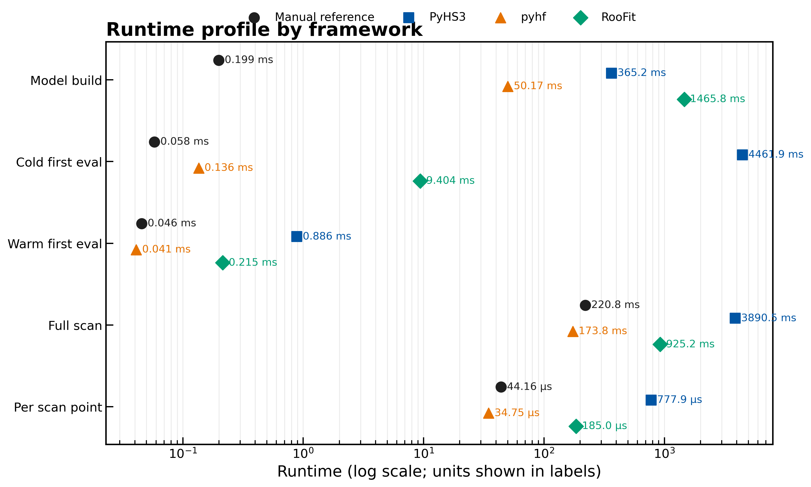

*Compares model construction, first evaluation, and full scan runtime across all supported frameworks.*

---

### Relative Runtime


*Shows framework performance relative to the manual reference implementation.*

---

### Numerical Agreement


*Verifies that all implementations produce equivalent NLL scan shapes within the configured validation tolerances.*

---

### Scan Profile


*Shows the negative log-likelihood scan produced by each framework.*

---

### Memory Profile


*Compares memory consumption during benchmark execution.*

---

## Interpretation

This benchmark serves two complementary purposes.

First, it provides a direct performance comparison between PyHS3 and established statistical frameworks.

Second, it verifies that optimization work does not alter the numerical properties of the likelihood scan.

Together, these measurements make the benchmark suitable for regression testing, optimization studies, and future cross-version performance tracking.

---

# Cross-Framework Model Complexity Scaling Benchmark

## Purpose

Evaluates how model complexity affects the performance and numerical agreement of equivalent statistical models implemented in PyHS3 and RooFit.

The benchmark executes the same workflow on a collection of workspaces with increasing structural complexity, allowing scalability trends to be measured rather than the performance of a single model.

It measures both runtime and memory consumption while verifying that both frameworks continue to produce numerically equivalent negative log-likelihood scans.

---

## Benchmarked Operation

For each benchmark case the workflow performs:

1. model construction;
2. first (cold) likelihood evaluation;
3. repeated warm evaluations;
4. a complete negative log-likelihood scan;
5. numerical comparison between PyHS3 and RooFit.

The benchmark is repeated for multiple workspace configurations representing increasing model complexity.

---

## Validation

For every benchmark case the resulting NLL scans are compared using several numerical agreement metrics, including:

- ΔNLL profile agreement;
- best-fit parameter agreement;
- constant likelihood offset;
- maximum residual between frameworks.

Each benchmark case is reported as successful only if all numerical agreement checks satisfy the configured validation tolerances.

---

## Outputs

Benchmark results are written to

```text
results/cross_model_complexity_scaling/
```

Generated figures are written to

```text
plots/cross_model_complexity_scaling/
```

---

## Example Plots

### Runtime Scaling

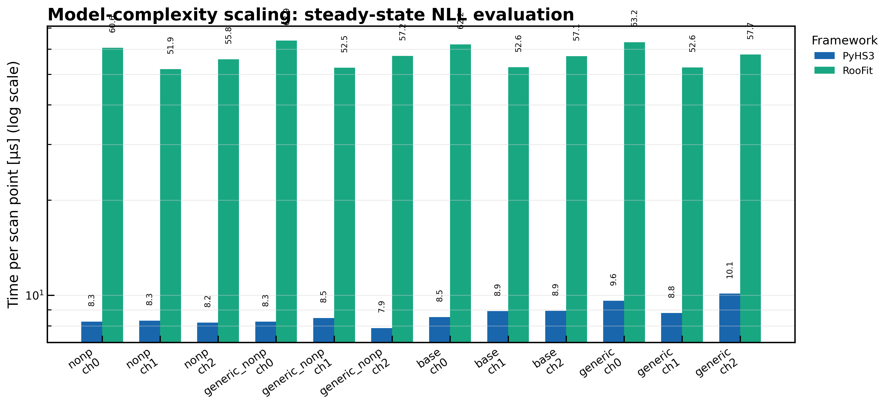

*Shows how steady-state evaluation time changes as model complexity increases.*

---

### Timing Breakdown

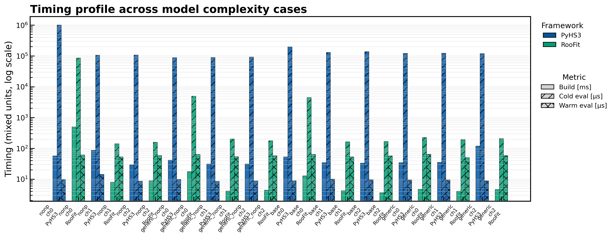

*Compares model construction, cold evaluation, and warm evaluation times across all benchmark cases.*

---

### Memory Scaling

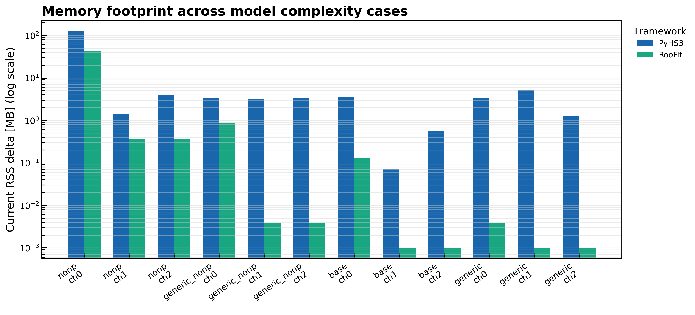

*Illustrates how memory consumption scales with increasing model complexity.*

---

### Numerical Agreement

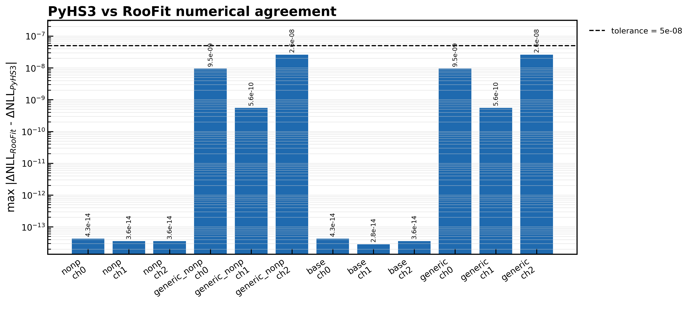

*Verifies that PyHS3 and RooFit remain numerically consistent across all benchmark cases.*

---

### NLL Profile Examples

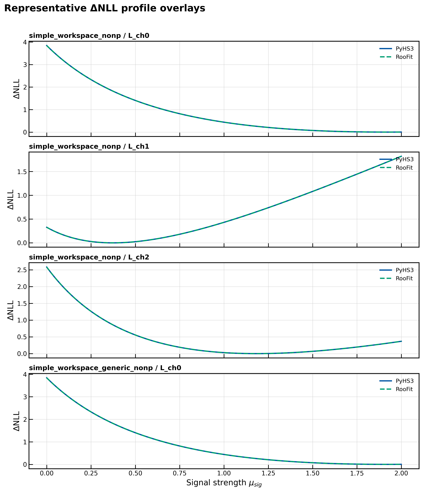

*Example ΔNLL scans demonstrating agreement between PyHS3 and RooFit for representative benchmark cases.*

---

## Interpretation

This benchmark evaluates the scalability of PyHS3 relative to RooFit as statistical models become more complex. It combines runtime, memory usage, and numerical validation to identify performance trends while ensuring that increasing model complexity does not compromise numerical correctness.

---

# Cross-Framework Vectorized PDF Evaluation Benchmark

## Purpose

Evaluates the performance of scalar PDF evaluation across statistical frameworks with different levels of vectorization support.

The benchmark compares equivalent probability density functions implemented in:

- PyHS3;
- numba-stats;
- RooFit;
- zfit.

Unlike the previous benchmarks, this study focuses specifically on PDF evaluation throughput and the impact of native vectorized execution. Since PyHS3 currently evaluates scalar PDFs point-by-point, while numba-stats and zfit provide native vectorized APIs, the benchmark highlights the potential performance gains achievable through future vectorization.

---

## Benchmarked Operation

For each framework the benchmark performs:

1. model setup;
2. cold PDF evaluation;
3. repeated warm PDF evaluations;
4. throughput measurement for increasing numbers of evaluation points;
5. numerical comparison with a reference implementation.

Both execution time and memory consumption are recorded for each framework.

---

## Validation

The evaluated PDF values are compared against a reference implementation to verify numerical correctness.

The benchmark reports:

- maximum absolute difference;
- maximum relative difference;
- numerical agreement status.

Frameworks are considered valid only if all evaluated PDF values satisfy the configured numerical tolerances.

---

## Outputs

Benchmark results are written to

```text
results/cross_vectorized_pdf_evaluation/
```

Generated figures are written to

```text
plots/cross_vectorized_pdf_evaluation/
```

---

## Example Plots

### Throughput Scaling

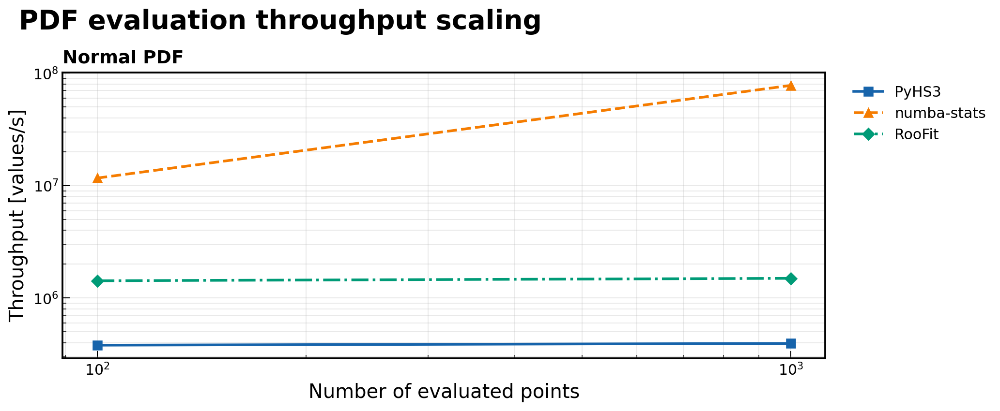

*Compares PDF evaluation throughput as the number of evaluated points increases.*

---

### Time per Value

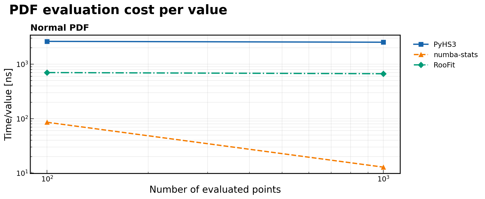

*Shows the average evaluation cost for a single PDF value.*

---

### Numerical Agreement

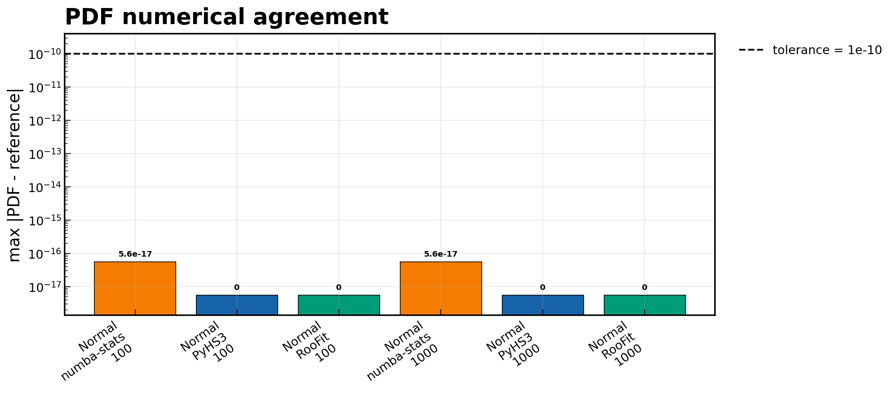

*Verifies that all frameworks produce numerically equivalent PDF values.*

---

### Memory Usage

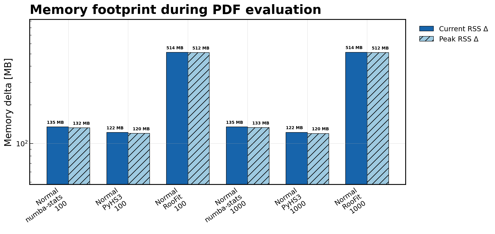

*Compares memory consumption during PDF evaluation.*

---

### Summary Table

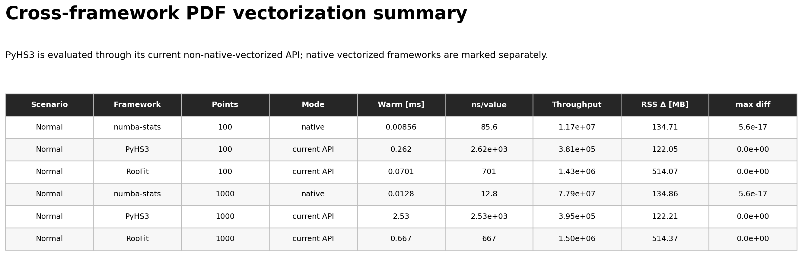

*Summarizes throughput, evaluation latency, memory usage, and numerical agreement for all supported frameworks.*

---

## Interpretation

This benchmark evaluates how native vectorization influences PDF evaluation performance across different statistical frameworks. It provides a baseline for future PyHS3 optimizations by quantifying the performance gap between its current point-wise evaluation strategy and frameworks that support native vectorized execution.

---

# Cross-Framework Scalar PDF Evaluation Benchmark

## Purpose

Evaluates the performance of repeated scalar probability density function (PDF) evaluation across multiple statistical frameworks.

The benchmark compares equivalent probability density functions implemented in:

- PyHS3;
- numba-stats;
- RooFit;
- zfit.

Unlike the vectorized PDF benchmark, every framework performs identical point-by-point PDF evaluations, allowing the overhead of scalar execution to be compared directly.

---

## Benchmarked Operation

For each framework the benchmark performs:

1. model setup;
2. cold first PDF evaluation;
3. repeated scalar PDF evaluations;
4. throughput measurement for increasing numbers of evaluations;
5. numerical comparison with a reference implementation.

Both execution time and memory consumption are recorded throughout the benchmark.

---

## Validation

The computed PDF values are compared against a reference implementation to verify numerical correctness.

The benchmark reports:

- maximum absolute difference;
- maximum relative difference;
- numerical agreement status.

Frameworks are considered valid only if all evaluated PDF values satisfy the configured numerical tolerances.

---

## Outputs

Benchmark results are written to

```text
results/cross_scalar_pdf_evaluation/
```

Generated figures are written to

```text
plots/cross_scalar_pdf_evaluation/
```

---

## Example Plots

### Throughput Scaling

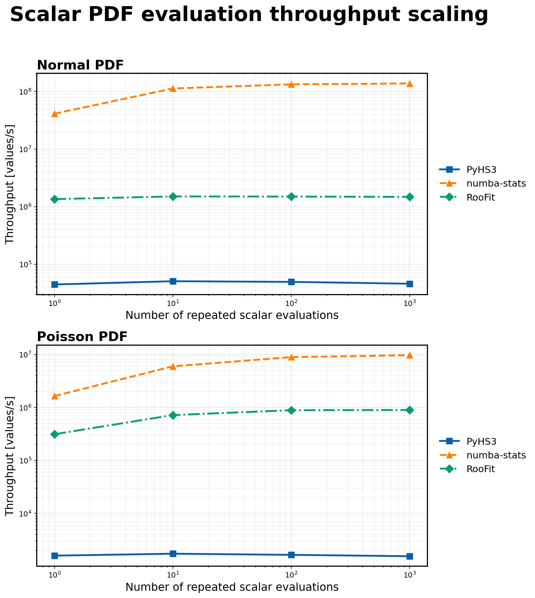

*Compares scalar PDF evaluation throughput as the number of repeated evaluations increases.*

---

### Evaluation Latency

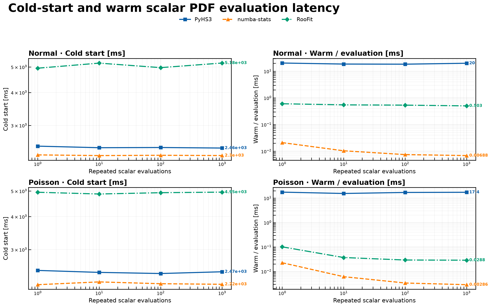

*Compares cold-start latency and steady-state scalar evaluation latency across frameworks.*

---

### Time per Value

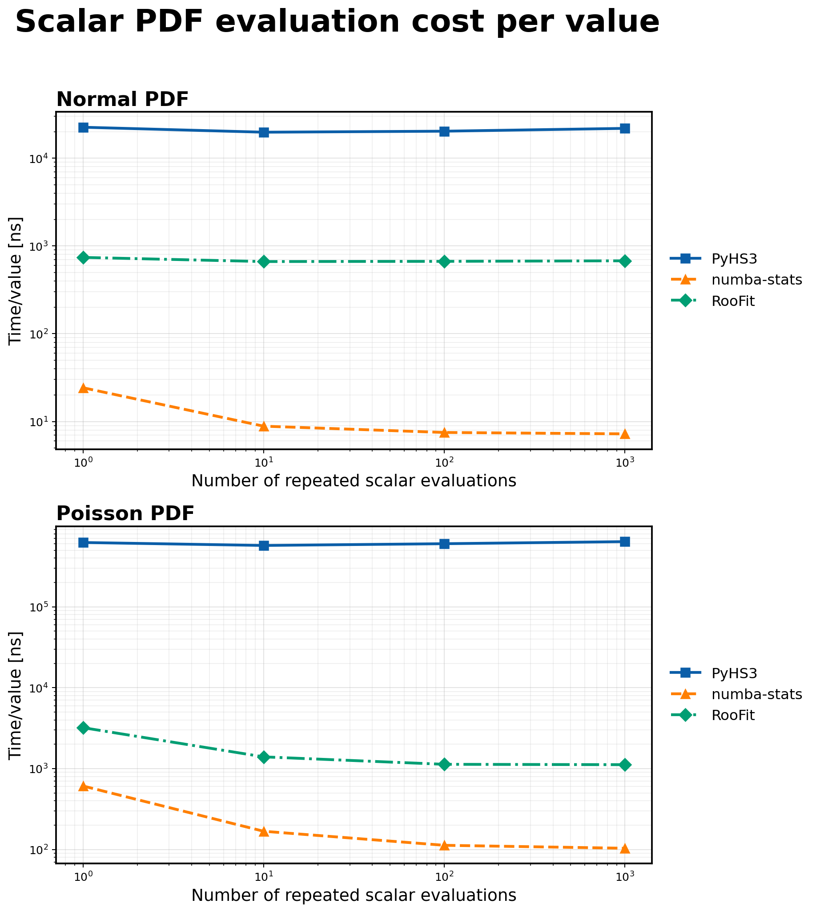

*Shows the average computation time required for a single scalar PDF value.*

---

### Memory Usage

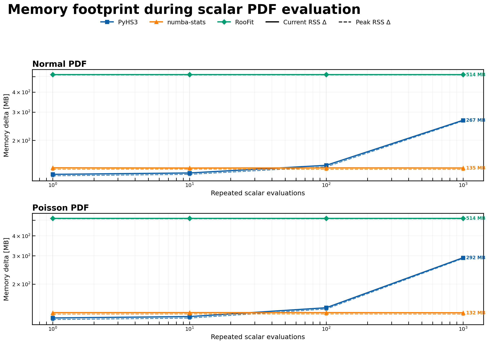

*Compares memory consumption during repeated scalar PDF evaluation.*

---

### Numerical Agreement

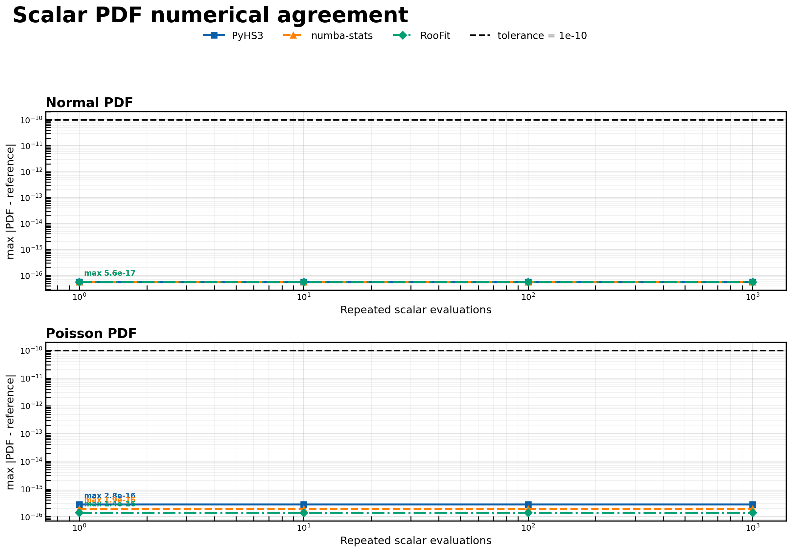

*Verifies that all frameworks produce numerically equivalent scalar PDF values.*

---

### Summary Table

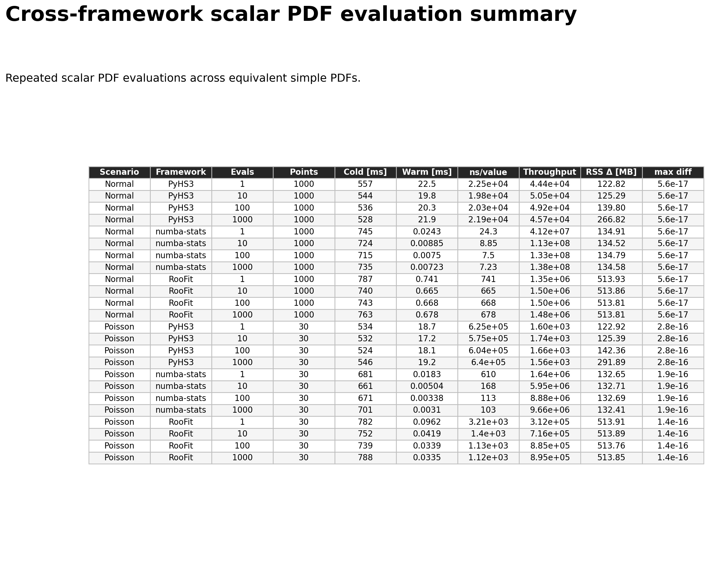

*Summarizes throughput, latency, memory usage, and numerical agreement for all supported frameworks.*

---

## Interpretation

This benchmark isolates the cost of scalar PDF evaluation by ensuring that every framework performs the same point-by-point workload. It provides a fair comparison of scalar execution performance and serves as a baseline for evaluating the impact of future vectorization efforts in PyHS3.

---

# Cross-Framework Binned Likelihood Evaluation Benchmark

## Purpose

Evaluates the performance and numerical agreement of equivalent binned Poisson likelihood models across multiple statistical frameworks.

The benchmark compares identical binned likelihood models implemented in:

- PyHS3;
- pyhf;
- RooFit;
- a manual reference implementation.

This benchmark is the main end-to-end benchmark for binned likelihood evaluation. It includes the most useful setup-cost measurements that were previously reported separately in `model_build_setup_cost`, so the fixed initialization overhead and the steady-state evaluation cost can be interpreted together.

---

## Benchmarked Operation

For each framework the benchmark measures:

1. input loading or equivalent input preparation;
2. model construction;
3. cold first NLL evaluation;
4. optional warm-up evaluations;
5. repeated warm NLL evaluations;
6. memory usage measurement;
7. numerical comparison against the manual reference implementation.

Both raw NLL values and ΔNLL values are validated for numerical agreement.

---

## Validation

The benchmark compares the computed likelihood values against the manual reference implementation.

The following quantities are validated:

- raw NLL value;
- ΔNLL value;
- absolute numerical difference;
- validation status within the configured tolerances.

Frameworks are reported as successful only if both the raw NLL and ΔNLL agree with the reference implementation.

---

## Outputs

Benchmark results are written to

```text
results/cross_binned_likelihood_evaluation/
```

Generated figures are written to

```text
plots/cross_binned_likelihood_evaluation/
```

---

## Example Plots

### Timing Profile

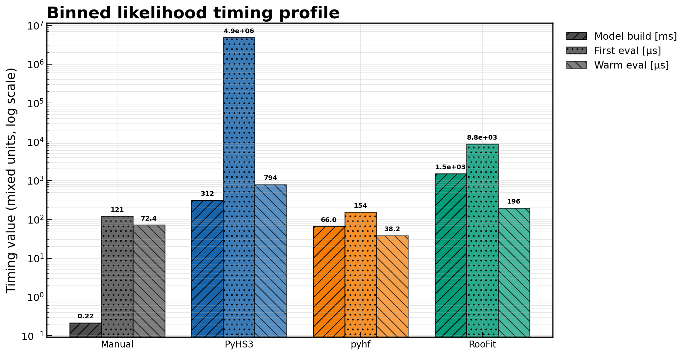

*Compares input loading, model construction, cold evaluation, and warm evaluation time across all supported frameworks.*

---

### Warm Evaluation Performance

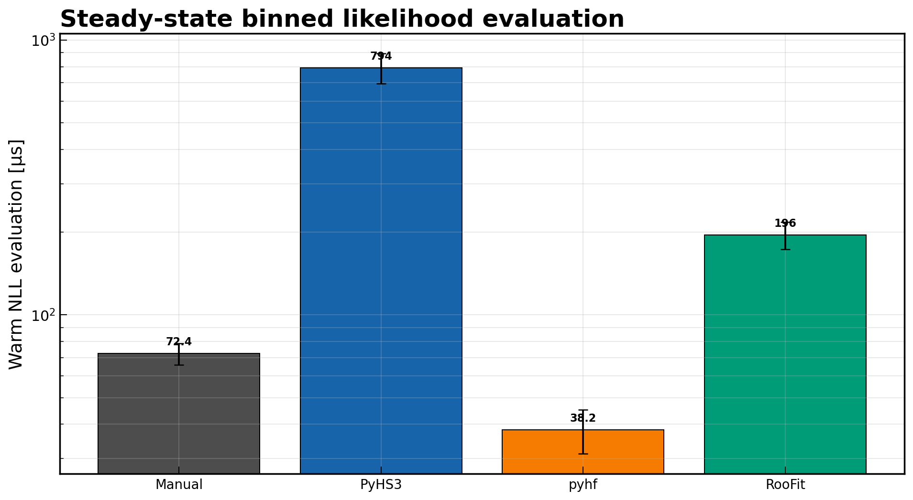

*Shows steady-state performance for repeated binned likelihood evaluation after setup and warm-up.*

---

### Memory Usage

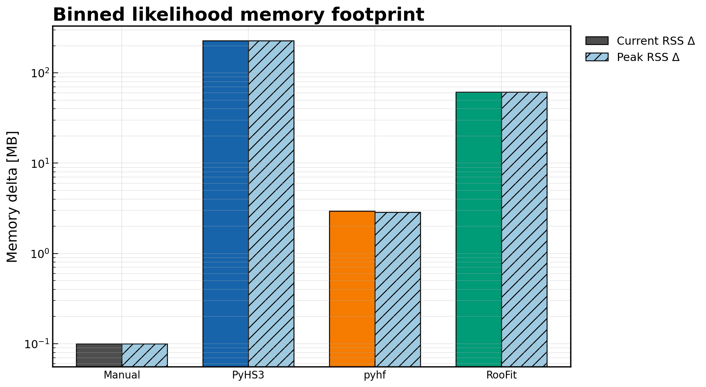

*Compares memory consumption during model construction and likelihood evaluation.*

---

### Numerical Agreement

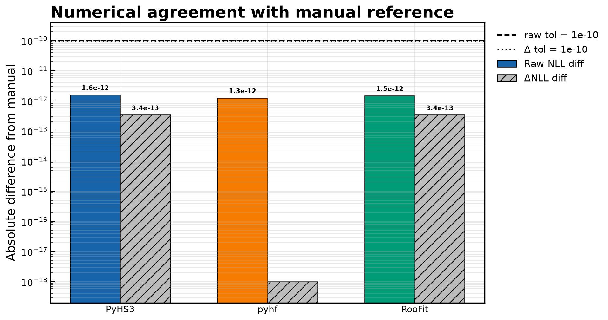

*Verifies agreement of both raw NLL and ΔNLL values with the manual reference implementation.*

---

### Raw NLL Values

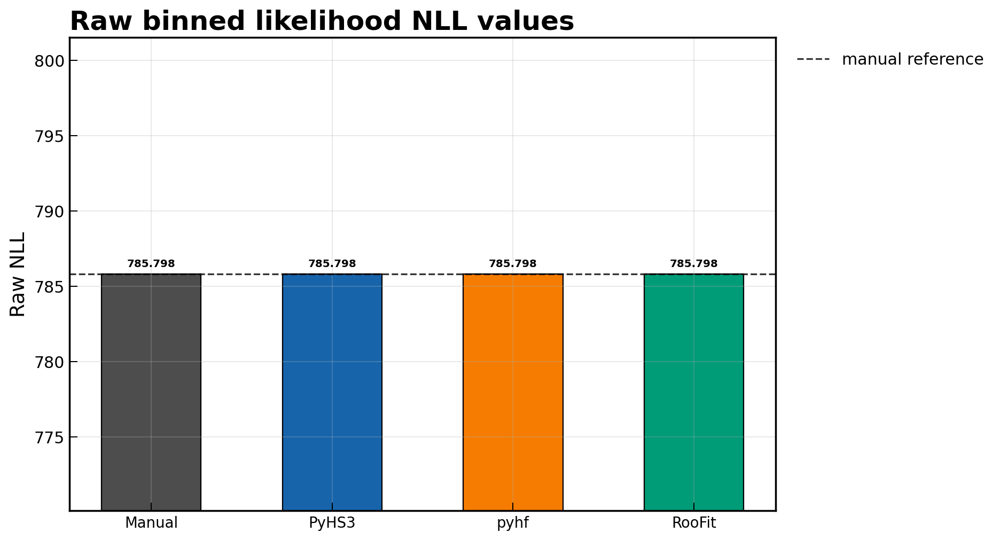

*Compares the negative log-likelihood values produced by each framework.*

---

### Summary Table

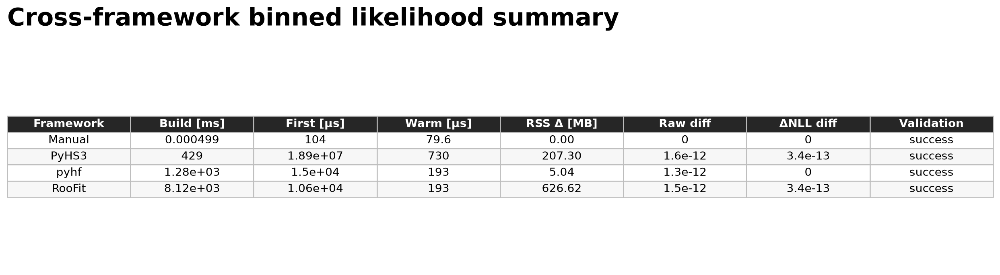

*Summarizes setup timing, evaluation latency, memory usage, numerical agreement, and validation status for all supported frameworks.*

---

## Interpretation

This benchmark evaluates both the setup cost and the numerical correctness of binned Poisson likelihood evaluation across multiple statistical frameworks. It is intended to answer two related questions:

1. how much fixed cost is paid before the first useful likelihood value is available;
2. how fast repeated likelihood evaluation becomes after setup and warm-up.

The former `model_build_setup_cost` benchmark can remain available as an internal diagnostic, but this benchmark should be the primary public benchmark for cross-framework binned likelihood setup and evaluation.

---

# Profiling

In addition to benchmarking, the repository provides profiling support to help identify performance bottlenecks during PyHS3 optimization.

The recommended profiler is **Scalene**, which measures:

- CPU time;
- memory allocations;
- Python vs native execution time;
- line-by-line performance hotspots.

Unlike the benchmark suite, which measures overall performance and tracks regressions, profiling is intended to explain *why* a benchmark is slow and identify where optimization efforts should be focused.

## Running Scalene

Profile an individual benchmark using the corresponding Pixi task.

For example:

```bash
pixi run profile-model-creation
```

or profile a benchmark directly:

```bash
pixi run scalene \
    src/run_model_creation.py \
    --workspaces inputs/simple_workspace_nonp.json
```

Scalene generates an interactive HTML report highlighting CPU and memory hotspots for each line of code.

## Typical Optimization Workflow

The recommended optimization workflow is:

```text
Run benchmark
        |
        v
Measure performance
        |
        v
Profile with Scalene
        |
        v
Identify bottlenecks
        |
        v
Optimize PyHS3
        |
        v
Run benchmarks again
        |
        v
Compare before/after results
```

In this workflow:

- benchmarks quantify performance changes;
- Scalene identifies optimization opportunities;
- the before/after comparison tool verifies that optimizations improve performance without changing numerical behaviour.

---

# Before/After Comparison

The `run_before_after_comparison.py` script compares benchmark results produced before and after changes to PyHS3. It is intended to support the transition from benchmarking to optimization by making it easier to evaluate whether a proposed optimization improves performance while preserving numerical agreement.

The comparison checks:

* wall time changes;
* RSS memory usage changes;
* numerical consistency of benchmark outputs;
* NLL scan shape agreement, when available;
* missing benchmark results between the baseline and optimized runs.

Example usage:

```bash
python benchmarking/scripts/run_before_after_comparison.py \
  --baseline-json benchmarking/results/<baseline-result>.json \
  --optimized-json benchmarking/results/<optimized-result>.json
```

By default, the comparison result is saved to:

```text
benchmarking/results/before_after_optimization/before_after_optimization_result.json
```

The output JSON contains:

```json
{
  "benchmark": "before_after_optimization",
  "baseline_benchmark": "...",
  "optimized_benchmark": "...",
  "n_baseline_results": 0,
  "n_optimized_results": 0,
  "n_compared_results": 0,
  "missing_optimized_results": [],
  "absolute_tolerance": 1e-9,
  "relative_tolerance": 1e-9,
  "comparisons": [],
  "status": "success"
}
```

Each comparison entry contains timing, RSS, numerical, and NLL-shape comparisons for one matched benchmark result.

Typical use case:

1. Run benchmarks on the current PyHS3 version.
2. Apply an optimization.
3. Run the same benchmarks again.
4. Use this script to compare the two result files.
5. Check whether performance improved and numerical agreement was preserved.

## Before/After Optimization Comparison

The before/after comparison tool compares benchmark result JSON files produced before and after PyHS3 optimization changes.

It is intended to support the optimization phase by checking whether a change improves runtime or memory usage while preserving numerical behavior.

The tool compares:

- timing metrics;
- RSS memory metrics;
- numerical agreement;
- NLL scan shape, when available;
- missing or extra benchmark results;
- performance regressions above a configurable threshold.

### Basic usage

```bash
pixi run python src/run_before_after_comparison.py \
  --baseline-json results/memory_scaling/memory_scaling_result.json \
  --optimized-json results/memory_scaling/memory_scaling_result.json
```

This writes the comparison JSON to:

```text
results/before_after_optimization/before_after_optimization_result.json
```

### Generate plots and report

```bash
pixi run python src/run_before_after_comparison.py \
  --baseline-json results/memory_scaling/memory_scaling_result.json \
  --optimized-json results/memory_scaling/memory_scaling_result.json \
  --plots \
  --report
```

This creates:

```text
results/before_after_optimization/
  before_after_optimization_result.json

plots/before_after_optimization/
  before_after_timing_comparison.png
  before_after_rss_comparison.png

reports/before_after_optimization/
  before_after_optimization_report.html
```

### Example plots

#### Timing comparison

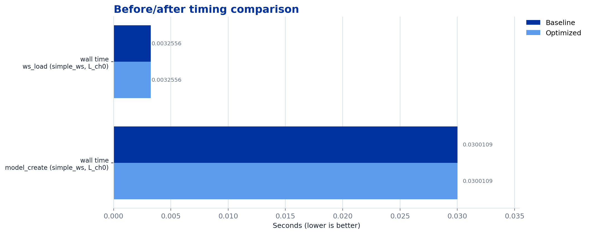

#### RSS memory comparison

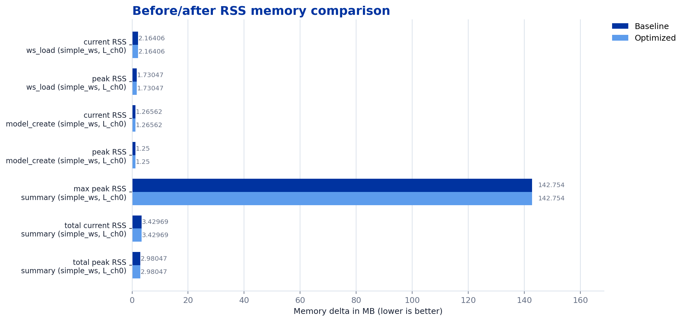

### Report

The HTML report provides an overview of the comparison, including:

- summary status;
- number of matched benchmark results;
- validation status;
- timing and RSS plots;
- detailed comparison tables;
- missing and extra result diagnostics.

Open the report in a browser:

```bash
firefox reports/before_after_optimization/before_after_optimization_report.html
```

or:

```bash
xdg-open reports/before_after_optimization/before_after_optimization_report.html
```

### Interpreting the result

`Status: success` means that:

- at least one matching benchmark result was compared;
- no optimized result is missing;
- numerical agreement was preserved;
- NLL scan shape was preserved, when available;
- no performance regression above the threshold was detected.

`Status: failed` means that at least one of these checks failed.

A performance regression is detected when runtime or memory usage becomes worse by more than the configured threshold.

The default threshold is:

```text
5%
```

It can be changed with:

```bash
pixi run python src/run_before_after_comparison.py \
  --baseline-json results/baseline/memory_scaling_result.json \
  --optimized-json results/memory_scaling/memory_scaling_result.json \
  --regression-threshold-percent 10 \
  --plots \
  --report
```

### Typical optimization workflow

```text
Run baseline benchmarks
        |
        v
Save baseline result JSON files
        |
        v
Apply PyHS3 optimization
        |
        v
Run the same benchmarks again
        |
        v
Run before/after comparison
        |
        v
Inspect JSON, plots, and HTML report
```

Example:

```bash
mkdir -p results/baseline

cp results/memory_scaling/memory_scaling_result.json \
  results/baseline/memory_scaling_result.json

pixi run python src/run_before_after_comparison.py \
  --baseline-json results/baseline/memory_scaling_result.json \
  --optimized-json results/memory_scaling/memory_scaling_result.json \
  --plots \
  --report
```

### Output locations

By default, artifacts follow the same repository layout as the other benchmarks:

| Artifact type | Location |
| --- | --- |
| Result JSON | `results/before_after_optimization/` |
| PNG plots | `plots/before_after_optimization/` |
| HTML report | `reports/before_after_optimization/` |

Custom locations can be provided with:

```bash
pixi run python src/run_before_after_comparison.py \
  --baseline-json results/baseline/memory_scaling_result.json \
  --optimized-json results/memory_scaling/memory_scaling_result.json \
  --output-dir results/custom_before_after \
  --plots-dir plots/custom_before_after \
  --reports-dir reports/custom_before_after \
  --plots \
  --report
```
