# PyHS3 Benchmarks

A dedicated benchmarking, validation, and profiling repository for PyHS3.

This repository provides a collection of reproducible benchmarks for measuring the performance, scalability, memory usage, and numerical correctness of PyHS3 across different stages of the statistical inference workflow.

The benchmark suite is maintained independently from the main PyHS3 repository to support continuous performance tracking, regression detection, optimization studies, and cross-framework comparisons.

The benchmark suite is organized around individual benchmark modules. Each benchmark focuses on a specific stage of the PyHS3 workflow and can be executed independently or as part of the complete benchmark suite.

---

# Goals

The repository is designed to:

* benchmark every major stage of the PyHS3 workflow;
* measure execution time and memory usage;
* study scaling with increasing model complexity;
* validate numerical correctness;
* compare PyHS3 against external statistical frameworks;
* support profiling and optimization work;
* monitor performance changes across PyHS3 versions.

---

## Developing PyHS3 and the Benchmark Suite

The default Pixi environment installs PyHS3 directly from the specified Git revision to ensure reproducible benchmark results.

When actively developing PyHS3 itself, it may be convenient to replace the Git dependency with a local editable checkout.

For example,

```toml
[pypi-dependencies]
pyhs3 = { path = "../pyhs3", editable = true }
```

or

```bash
pixi add --pypi "pyhs3 @ file:///absolute/path/to/pyhs3" --editable
```

This allows changes made to the local PyHS3 source tree to be reflected immediately without reinstalling the package.

For published benchmark results and reproducible performance studies, the Git-based dependency is recommended.

---

## Code Quality

The repository uses `pre-commit` and GitHub Actions to perform lightweight quality checks.

Install the hooks:

```bash
pixi run pre-commit install
```

Run all checks locally:

```bash
pixi run ci
```

The CI workflow automatically runs on every push and pull request. It currently performs lightweight checks including:

- Python syntax compilation
- Ruff linting
- Ruff formatting checks

Heavy benchmark suites (e.g. ROOT and zfit) are intentionally excluded from CI and can be run locally when needed.

---

# Repository Structure

```text
inputs/
├── benchmark_workspaces/
├── scalar_pdf_workspaces/
└── binned_likelihood_models/

src/
├── benchmark scripts
├── workspace generators
├── plotting utilities
└── shared helper functions

tests/
└── unit tests for benchmark scripts and utilities

results/
└── JSON benchmark outputs

plots/
└── generated benchmark figures

reports/
└── benchmark summaries
```

---

# Installation

The recommended way to set up this repository is with Pixi. Pixi creates a reproducible environment, installs the required dependencies, and provides task aliases for common benchmark workflows.

## Recommended setup with Pixi

Install Pixi by following the official installation instructions:

```text
https://pixi.sh/latest/
```

From the repository root, create the environment:

```bash
pixi install
```

This command installs the benchmark environment and generates a `pixi.lock` file. The lock file should be committed so that other users can reproduce the same dependency environment.

## Verify the environment

Run the lightweight smoke check:

```bash
pixi run smoke
```

Run the test suite:

```bash
pixi run test
```

## PyHS3 dependency

The Pixi environment installs PyHS3 directly from the main PyHS3 repository:

```toml
pyhs3.git = "https://github.com/scipp-atlas/pyhs3.git"
pyhs3.rev = "main"
```

The benchmark suite tracks the `main` branch of the PyHS3 repository by default.

Reproducible benchmark environments are ensured through the committed `pixi.lock` file, which records the exact resolved revision of every dependency, including the specific PyHS3 commit used when the environment was created.

When updating the benchmark suite to a newer PyHS3 revision, regenerate and commit the updated `pixi.lock` file so that all developers and CI environments continue using an identical dependency set.

For optimization studies, the tracked PyHS3 revision can be changed to a different branch, tag, or specific commit, allowing benchmark results to be tied to a particular version of the library.

## Optional framework dependencies

Some cross-framework benchmarks require additional frameworks such as ROOT/RooFit or zfit. These are intentionally not part of the minimal Pixi environment yet, because they can make the setup heavier and less portable.

The lightweight environment is intended to support:

* PyHS3 benchmarks;
* pyhf-based binned likelihood comparisons;
* numba-stats PDF comparisons;
* tests;
* input generation;
* plotting;
* smoke checks.

ROOT/RooFit and zfit can be added later as optional environments, separate Pixi features, or documented manual extensions.

## Alternative manual setup

Users who already maintain an existing PyHS3 development environment can still run the benchmark suite manually.

Activate an existing environment:

```bash
conda activate iris-hep
```

Install a local editable copy of PyHS3:

```bash
pip install -e /path/to/pyhs3
```

Example:

```bash
pip install -e /mnt/h/iris-hep/coding/pyhs3
```

Verify that benchmarks use the expected PyHS3 checkout:

```bash
python - <<'PY'
import pyhs3
print(pyhs3.__file__)
PY
```

Using an editable installation ensures benchmark results correspond to the currently checked-out PyHS3 source tree.

---

# Quick Start

Generate benchmark inputs:

```bash
pixi run generate-inputs
```

Validate generated inputs:

```bash
pixi run validate
```

Run a lightweight benchmark configuration:

```bash
pixi run benchmark
```

Run the default benchmark configuration:

```bash
pixi run benchmark-default
```

Generate overview plots:

```bash
pixi run plot
```

For manual environments, the same commands can be run directly with Python, for example:

```bash
python -m src.run_all_benchmarks --preset smoke
python -m src.plot_benchmark_overview
```

---

# Benchmark Inputs

The benchmark suite uses two categories of input models.

The primary benchmark workspaces included in this repository were generated using the [workspace-scripts](https://github.com/scipp-atlas/workspace-scripts) repository, which provides utilities for constructing representative HS3 workspaces for benchmarking and testing. These workspaces are used throughout the workflow benchmarks, including workspace loading, model creation, graph construction, compilation, and execution.

In addition to these reference workspaces, this repository provides generators for creating deterministic benchmark inputs used by specialized benchmarks. These generators ensure that benchmark inputs are reproducible, easy to regenerate, and consistent across repeated experiments.

---

## Generating benchmark inputs

Both generators can be executed together using the Pixi task:

```bash
pixi run generate-inputs
```

Alternatively, each generator can be executed individually:

```bash
python -m src.generate_scalar_pdf_workspaces
python -m src.generate_binned_likelihood_models
```

To verify the generated inputs:

```bash
pixi run validate
```

or individually:

```bash
python -m src.generate_scalar_pdf_workspaces --validate
python -m src.generate_binned_likelihood_models --validate
```

---

# Scalar PDF Workspaces

The scalar PDF workspace generator creates a collection of minimal HS3 workspaces used by the scalar and vectorized PDF evaluation benchmarks.

Each generated workspace contains:

* a single probability distribution;
* the associated parameters;
* domains;
* observed data;
* likelihood definition;
* analysis definition;
* initial parameter point.

The generator currently supports:

* Gaussian;
* Poisson;
* Exponential.

Generated files are written to

```text
inputs/scalar_pdf_workspaces/
├── normal_pdf_workspace.json
├── poisson_pdf_workspace.json
└── exponential_pdf_workspace.json
```

These workspaces are intentionally minimal so that PDF evaluation benchmarks measure framework performance without introducing unnecessary model complexity.

---

# Binned Likelihood Models

The binned likelihood generator creates deterministic counting experiments for benchmarking likelihood evaluation across multiple statistical frameworks.

For every requested number of bins, the generator produces:

* common benchmark inputs;
* an equivalent PyHS3 workspace;
* an equivalent pyhf HistFactory specification.

Generated files are written to

```text
inputs/binned_likelihood_models/
├── common_3bins.json
├── common_30bins.json
├── common_300bins.json
├── pyhf_3bins.json
├── pyhf_30bins.json
├── pyhf_300bins.json
├── pyhs3_3bins.json
├── pyhs3_30bins.json
└── pyhs3_300bins.json
```

The generated datasets currently include benchmark configurations with

* 3 bins;
* 30 bins;
* 300 bins.

The `common_*` files contain the shared signal, background, and observation arrays used to build both framework-specific representations.

Because every framework is generated from the same underlying inputs, cross-framework benchmarks compare numerically equivalent statistical models.

---

# Reproducibility

Both benchmark generators are deterministic.

This guarantees that

* identical benchmark inputs are produced across repeated executions;
* benchmark results remain reproducible;
* regenerated inputs can be compared directly with previously generated benchmark results;
* different frameworks are evaluated using identical statistical models.

---

# Running Benchmarks

The benchmark suite is organized as a collection of independent Python modules. Each module measures a specific stage of the PyHS3 workflow and can be executed individually for focused performance studies or together as part of the complete benchmark suite.

Because benchmark scripts use package-relative imports, they should be executed as Python modules from the repository root.

Use this format:

```bash
python -m src.run_workspace_loading
```

When using Pixi, use:

```bash
pixi run workspace-loading
```

Avoid running benchmark files directly as scripts, for example:

```bash
python src/run_workspace_loading.py
```

Direct script execution can fail with relative import errors.

---

## Running Individual Benchmarks

Individual benchmarks can be executed with `python -m`.

Example:

```bash
pixi run workspace-loading
```

With custom arguments:

```bash
pixi run workspace-loading \
    --workspaces inputs/simple_workspace.json \
    --n-runs 20 \
    --plot
```

Each benchmark provides its own command-line interface through `argparse`. The available arguments for each benchmark are listed in the corresponding benchmark section below.

---

## Running the Complete Benchmark Suite

The repository provides a benchmark runner that executes the supported benchmark modules using predefined benchmark configurations.

For a quick development run:

```bash
pixi run benchmark
```

For the default benchmark configuration:

```bash
pixi run benchmark-default
```

Equivalent manual commands are:

```bash
pixi run python -m src.run_all_benchmarks --preset smoke
pixi run python -m src.run_all_benchmarks --preset default
```

---

## Benchmark Presets

| Preset    | Purpose                | Typical use                         |
| --------- | ---------------------- | ----------------------------------- |
| `smoke`   | Minimal benchmark run  | Quick validation during development |
| `default` | Balanced benchmark run | Routine benchmarking                |
| `full`    | Large benchmark run    | Detailed performance studies        |

---

## Benchmark Outputs

Each benchmark writes its results to the corresponding directory under `results/`.

If plot generation is enabled, figures are written to the corresponding directory under `plots/`.

Scaling benchmarks may also write summary tables to `reports/`.

Generated benchmark outputs are intentionally separated from benchmark code so that results can be compared across PyHS3 versions, commits, and optimization attempts.

---

# Benchmark Categories

The benchmark suite is organized into several categories.

| Category | Benchmarks |
|----------|------------|
| **Workflow** | Workspace Loading, Model Creation, Log Probability Construction, Log Probability Compilation, Compiled Evaluation |
| **PDF** | Scalar PDF Evaluation, Vectorized PDF Evaluation |
| **Likelihood** | NLL Scan, Binned Likelihood Evaluation |
| **Scaling** | Memory Scaling, Model Complexity Scaling |
| **Graph** | Graph Canonicalization, Graph Optimization |
| **Cross-Framework** | RooFit, pyhf (HistFactory), numba-stats |

---

# Available Benchmarks

The following benchmarks are currently implemented in the benchmark suite.

| Benchmark | Category | Module | Purpose |
|-----------|----------|--------|---------|
| Workspace Loading | Workflow | `src.run_workspace_loading` | Benchmark `Workspace.load()` |
| Model Creation | Workflow | `src.run_model_creation` | Benchmark `Workspace.model()` |
| Log Probability Construction | Workflow | `src.run_log_prob_construction` | Benchmark symbolic `model.log_prob` construction |
| Log Probability Compilation | Workflow | `src.run_log_prob_compilation` | Benchmark `jaxify(model.log_prob)` |
| Compiled Evaluation | Workflow | `src.run_compiled_evaluation` | Benchmark execution of compiled computational graphs |
| Scalar PDF Evaluation | PDF | `src.run_pdf_evaluation` | Benchmark repeated scalar PDF evaluation |
| Vectorized PDF Evaluation | PDF | `src.run_pdf_evaluation` | Benchmark repeated vectorized PDF evaluation |
| Negative Log-Likelihood Scan | Likelihood | `src.run_nll_scan` | Benchmark repeated NLL scans |
| Memory Scaling | Scaling | `src.run_memory_scaling` | Measure memory usage across workflow stages |
| Model Complexity Scaling | Scaling | `src.run_model_complexity_scaling` | Study scaling with increasing workspace complexity |
| Graph Canonicalization | Graph | `src.run_graph_canonicalization` | Benchmark PyTensor graph canonicalization |
| Graph Optimization | Graph | `src.run_graph_optimization` | Benchmark PyTensor graph optimization |
| Benchmark Suite | Utility | `src.run_all_benchmarks` | Execute the complete benchmark suite |
| Benchmark Overview | Utility | `src.plot_benchmark_overview` | Generate summary plots from benchmark results |

---

# Benchmark Defaults

Shared benchmark defaults are defined in `src/config.py` and reused across the benchmark suite whenever applicable.

## General Defaults

| Setting | Default |
|----------|----------|
| Workspace | `inputs/simple_workspace_nonp.json` |
| Analysis target | `L_ch0` |
| Execution mode | `FAST_RUN` |
| Timing repetitions | `5` |
| Plot generation | Disabled |

---

## Evaluation Benchmarks

| Setting | Default |
|----------|----------|
| Number of evaluations | `1 10 100 1000 10000` |
| Distribution | `sig_ch0` |

---

## NLL Scan Benchmarks

| Setting | Default |
|----------|----------|
| Scan parameter | `mu_sig` |
| Scan range | `[0.0, 5.0]` |
| Scan points | `101` |

Unless explicitly overridden through command-line arguments, each benchmark uses the defaults relevant to that benchmark.

---

# Benchmark Methodology

All benchmarks follow the same general workflow.

1. Prepare or load benchmark inputs.
2. Perform validation (when applicable).
3. Execute the benchmark repeatedly.
4. Measure execution time.
5. Measure process memory usage.
6. Save benchmark results as JSON.
7. Optionally generate benchmark-specific plots.

Unless explicitly stated otherwise, every benchmark uses the shared defaults defined in `src/config.py`.

---

## Timing Measurements

Execution time is measured over multiple repetitions.

Each benchmark records:

* individual timing samples;
* mean execution time;
* median execution time;
* standard deviation.

Repeating each benchmark several times reduces measurement noise and improves reproducibility.

---

## Memory Measurements

Memory usage is measured using the process Resident Set Size (RSS).

Unless otherwise stated, benchmarks report:

* RSS before execution;
* RSS after execution;
* RSS difference.

The reported values represent process-level memory usage and should be interpreted as approximations rather than exact object memory consumption.

---

## Validation

Whenever possible, benchmark correctness is validated before timing results are recorded.

Typical validation checks include:

* successful workspace loading;
* successful model construction;
* numerical agreement;
* expected graph construction;
* successful compilation.

---

## Reproducibility

Unless explicitly stated otherwise,

- benchmark inputs are deterministic;
- benchmark defaults are fixed;
- benchmark outputs are stored in JSON format.

This makes benchmark runs directly comparable across different PyHS3 revisions.

---

# Benchmark Results

Unless otherwise stated, every benchmark produces one or more of the following outputs.

Results produced by different benchmark runs are intentionally version-independent.

This design allows benchmark results to be reused for visualization, regression detection, and before/after performance comparisons without rerunning the original benchmarks.

It also enables future continuous benchmarking across multiple PyHS3 versions.

## JSON Results

Machine-readable benchmark results stored under

```text
results/
```

These JSON files are used for:

* overview plots;
* regression detection;
* before/after comparisons;
* future optimization studies.

---

## Plots

Benchmark figures are written under

```text
plots/
```

Each benchmark generates plots appropriate for the quantities it measures.

Typical plots include:

* wall time;
* current RSS delta;
* throughput;
* scaling behaviour.

---

## Console Summary

Every benchmark prints a concise execution summary including:

* benchmark configuration;
* timing statistics;
* validation status;
* output locations.

---

> **Note**
>
> Every benchmark can be executed either through its corresponding Pixi task or directly as a Python module.
>
> For example,
>
> ```bash
> pixi run workspace-loading --n-runs 20 --plot
> ```
>
> is equivalent to
>
> ```bash
> python -m src.run_workspace_loading --n-runs 20 --plot
> ```
>
> Pixi tasks are lightweight wrappers around the underlying Python modules, so all command-line arguments supported by a benchmark can also be passed directly to its Pixi task.

---

# Individual Benchmark Documentation

The following sections describe each benchmark in detail, including its purpose, command-line interface, validation procedure, generated outputs, and representative benchmark plots.

---

# Workspace Loading Benchmark

## Purpose

Measures the performance of loading an HS3 workspace into PyHS3.

This benchmark isolates the workspace deserialization stage and evaluates the overhead of constructing the in-memory HS3 representation before any model creation or graph construction takes place.

---

## Benchmarked Operation

The benchmark measures the execution time of

```python
workspace = Workspace.load(workspace_path)
```

Only workspace loading is included in the timed section.

The following stages are intentionally excluded:

- model creation;
- symbolic graph construction;
- graph compilation;
- model evaluation.

---

## Command

Run the benchmark using the predefined Pixi task:

```bash
pixi run workspace-loading
```

Additional command-line arguments can be passed directly to the task.

Example:

```bash
pixi run workspace-loading \
    --workspaces inputs/simple_workspace.json \
    --n-runs 20 \
    --plot
```

Equivalent Python command:

```bash
python -m src.run_workspace_loading
```

---

## Available Arguments

| Argument | Description | Default |
|----------|-------------|---------|
| `--workspaces` | One or more HS3 workspaces to benchmark | `inputs/simple_workspace_nonp.json` |
| `--n-runs` | Number of timing repetitions | `5` |
| `--plot` | Generate benchmark plots | disabled |

---

## Validation

Before recording benchmark results, the benchmark verifies that

- the workspace loads successfully;
- HS3 metadata is available;
- distributions are present;
- likelihoods are present;
- data objects are present;
- domains are present;
- parameter points are present.

---

## Outputs

Benchmark results are written to

```text
results/workspace_loading/
```

Generated figures are written to

```text
plots/workspace_loading/
```

---

## Example Plots

### Wall Time

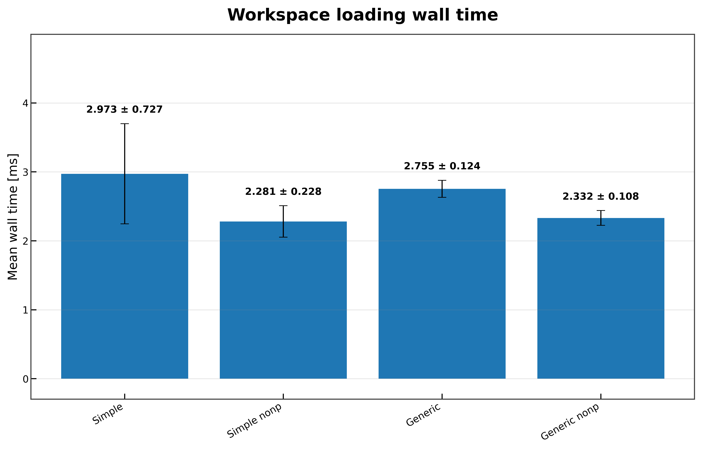

*Shows the average workspace loading time across repeated executions.*

---

### Current RSS Delta

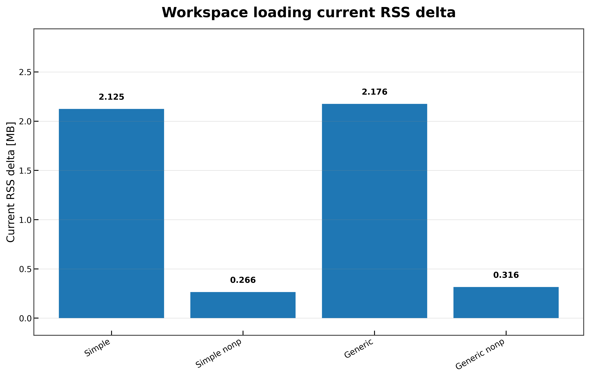

*Shows the increase in process Resident Set Size (RSS) after loading each workspace.*

---

## Interpretation

This benchmark measures the overhead of reading an HS3 workspace and constructing its in-memory representation.

Lower wall times indicate faster workspace deserialization and initialization.

An increase in execution time between PyHS3 revisions may indicate regressions in the workspace loading implementation.

Similarly, larger RSS deltas may indicate additional memory allocations introduced during workspace loading.

---

# Model Creation Benchmark

## Purpose

Measures the performance of constructing a PyHS3 model from a previously loaded HS3 workspace.

This benchmark isolates the model construction stage and evaluates the cost of creating a symbolic statistical model without including workspace loading, graph compilation, or model evaluation.

---

## Benchmarked Operation

The benchmark measures the execution time of

```python
model = workspace.model(
    target,
    progress=False,
    mode=mode,
)
```

Workspace loading is intentionally excluded from the benchmark.

Timing and memory are measured independently:

* repeated model construction is used for timing measurements;
* a single isolated model construction is used for memory measurements.

This approach avoids reporting accumulated memory from repeatedly constructing multiple PyTensor graphs.

Measures

| Included                      | Excluded          |
| ----------------------------- | ----------------- |
| Model construction            | Workspace loading |
| Symbolic model initialization | Graph compilation |
| Analysis initialization       | Model evaluation  |

---

## Command

Run the benchmark using the predefined Pixi task:

```bash
pixi run model-creation
```

Additional command-line arguments can be passed directly to the task.

Example:

```bash
pixi run model-creation \
    --workspaces inputs/simple_workspace.json \
    --targets L_ch0 \
    --modes FAST_RUN \
    --n-runs 20 \
    --plot
```

Equivalent Python command:

```bash
python -m src.run_model_creation
```

---

## Available Arguments

| Argument        | Description                                              | Default                             |
| --------------- | -------------------------------------------------------- | ----------------------------------- |
| `--workspaces`  | One or more HS3 workspace JSON files                     | `inputs/simple_workspace_nonp.json` |
| `--targets`     | Analysis or likelihood targets                           | `L_ch0`                             |
| `--modes`       | PyTensor execution mode passed to `workspace.model(...)` | `FAST_RUN`                          |
| `--n-runs`      | Number of repeated timing runs                           | `5`                                 |
| `--output-dir`  | Directory for JSON benchmark results                     | `results/model_creation/`           |
| `--output-name` | Benchmark result filename                                | `model_creation_result.json`        |
| `--plot`        | Generate benchmark plots                                 | disabled                            |
| `--plot-dir`    | Directory for generated plots                            | `plots/model_creation/`             |
| `--plot-name`   | Wall-time plot filename                                  | `model_creation_wall_time.png`      |

---

## Validation

Before recording benchmark results, the benchmark verifies that

* model construction completed successfully;
* a valid PyHS3 model object was created.

The benchmark also records the resulting model type for reference.

---

## Outputs

Benchmark results are written to

```text
results/model_creation/
```

Generated figures are written to

```text
plots/model_creation/
```

---

## Example Plots

### Wall Time

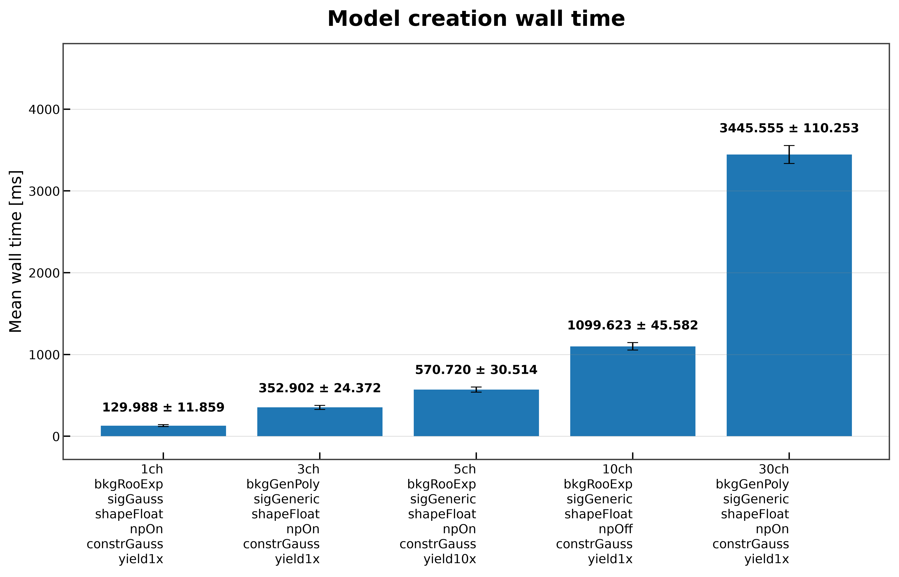

*Shows the average model construction time across repeated executions.*

---

### Current RSS Delta

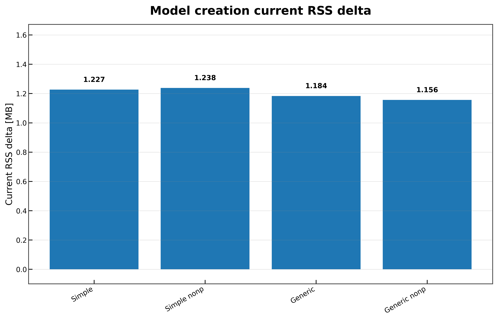

*Shows the additional process memory allocated during a single isolated model construction.*

---

## Interpretation

This benchmark measures the cost of converting an HS3 workspace into a symbolic PyHS3 model.

Lower execution times indicate more efficient model construction.

Because model construction is typically performed only once before repeated evaluations, improvements in this benchmark primarily reduce workflow initialization overhead rather than per-evaluation execution time.

Similarly, larger RSS deltas may indicate additional symbolic objects or intermediate structures being allocated during model construction.

---

# Log Probability Construction Benchmark

## Purpose

Measures the performance of constructing the symbolic log-probability expression from a previously created PyHS3 model.

This benchmark isolates symbolic graph construction and evaluates the cost of building the PyTensor likelihood expression without including workspace loading, model creation, graph compilation, or graph evaluation.

---

## Benchmarked Operation

The benchmark measures the execution time of

```python
log_prob = model.log_prob
```

Accessing `model.log_prob` constructs the symbolic PyTensor expression but does **not** compile or evaluate it.

### Measurement Strategy

Workspace loading and model creation are treated as setup and are intentionally excluded from the timed section.

Timing and memory are measured independently:

* repeated symbolic graph construction is used for timing measurements;
* a single isolated graph construction is used for memory measurements.

This avoids reporting accumulated memory from repeatedly constructing multiple symbolic graphs.

### Measures

| Included                              | Excluded          |
| ------------------------------------- | ----------------- |
| Symbolic log-probability construction | Workspace loading |
| PyTensor graph creation               | Model creation    |
| Graph initialization                  | Graph compilation |
|                                       | Graph evaluation  |

---

## Command

Run the benchmark using the predefined Pixi task:

```bash
pixi run log-prob-construction
```

Additional command-line arguments can be passed directly to the task.

Example:

```bash
pixi run log-prob-construction \
    --workspaces inputs/simple_workspace.json \
    --targets L_ch0 \
    --modes FAST_RUN \
    --n-runs 20 \
    --plot
```

Equivalent Python command:

```bash
python -m src.run_log_prob_construction
```

---

## Available Arguments

| Argument        | Description                                              | Default                             |
| --------------- | -------------------------------------------------------- | ----------------------------------- |
| `--workspaces`  | One or more HS3 workspace JSON files                     | `inputs/simple_workspace_nonp.json` |
| `--targets`     | Analysis or likelihood targets                           | `L_ch0`                             |
| `--modes`       | PyTensor execution mode passed to `workspace.model(...)` | `FAST_RUN`                          |
| `--n-runs`      | Number of repeated timing runs                           | `5`                                 |
| `--output-dir`  | Directory for JSON benchmark results                     | `results/log_prob_construction/`    |
| `--output-name` | Benchmark result filename                                | `log_prob_construction_result.json` |
| `--plot`        | Generate benchmark plots                                 | disabled                            |
| `--plot-dir`    | Directory for generated plots                            | `plots/log_prob_construction/`      |

---

## Validation

Before recording benchmark results, the benchmark verifies that

* the symbolic log-probability expression was successfully constructed;
* the returned object is a valid PyTensor `TensorVariable`;
* the graph can proceed to the compilation stage.

The benchmark also records the symbolic graph type, name, dimensionality, and data type.

---

## Outputs

Benchmark results are written to

```text
results/log_prob_construction/
```

Generated figures are written to

```text
plots/log_prob_construction/
```

---

## Example Plots

### Wall Time

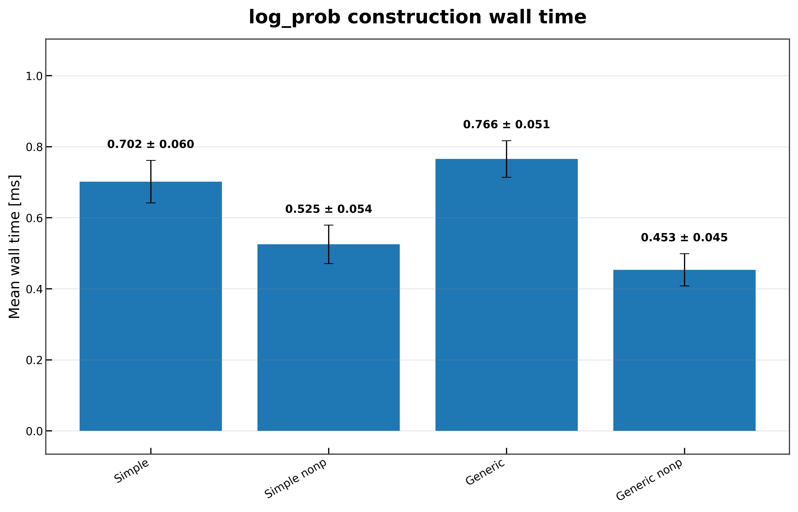

*Shows the average time required to construct the symbolic log-probability graph.*

---

### Current RSS Delta

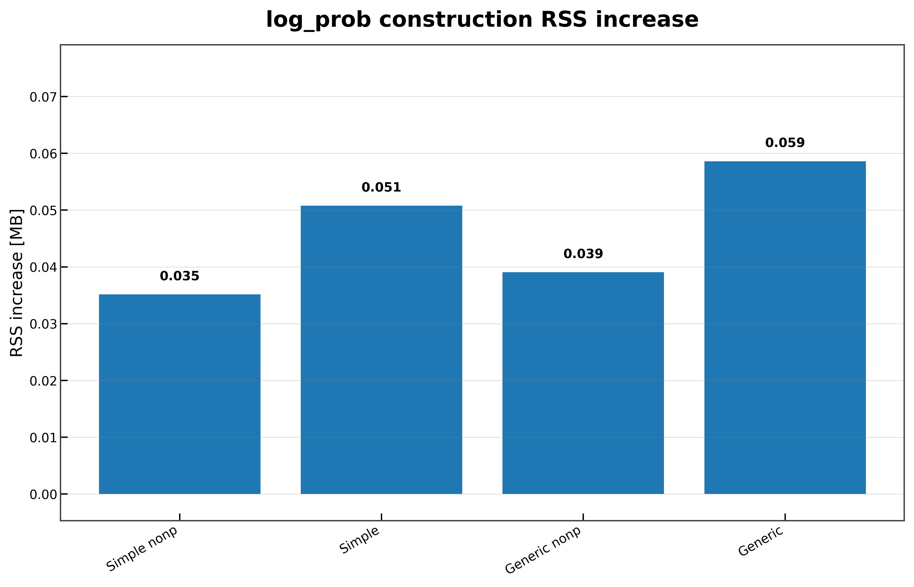

*Shows the additional process memory allocated during a single isolated symbolic graph construction.*

---

## Interpretation

This benchmark measures the cost of building the symbolic PyTensor representation of the likelihood.

Unlike the compilation benchmark, no executable code is generated at this stage. Instead, PyHS3 constructs the symbolic computation graph that will later be optimized and compiled.

Lower execution times indicate more efficient symbolic graph construction, while larger RSS deltas may indicate increased memory usage during graph creation.

Because every subsequent compilation depends on this graph, regressions in this benchmark can directly affect the overall model initialization workflow.

---

# Log Probability Compilation Benchmark

## Purpose

Measures the performance of compiling a symbolic PyTensor log-probability graph into an executable JAX representation.

This benchmark isolates the compilation stage and evaluates the cost of transforming an already constructed symbolic graph into a compiled graph that is ready for repeated execution.

---

## Benchmarked Operation

The benchmark measures the execution time of

```python
compiled = jaxify(log_prob)
```

Compilation transforms the symbolic PyTensor graph into a `JaxifiedGraph` but does **not** execute the compiled graph.

### Measurement Strategy

Workspace loading, model creation, and symbolic graph construction are treated as setup and are intentionally excluded from the timed section.

Timing and memory are measured independently:

- repeated graph compilation is used for timing measurements;
- a single isolated compilation is used for memory measurements.

This avoids reporting accumulated memory from repeatedly compiling multiple graphs.

### Measures

| Included | Excluded |
|-----------|----------|
| JAX graph compilation | Workspace loading |
| Graph transpilation | Model creation |
| JaxifiedGraph construction | Symbolic graph construction |
| | Compiled graph execution |

---

## Command

Run the benchmark using the predefined Pixi task:

```bash
pixi run log-prob-compilation
```

Additional command-line arguments can be passed directly to the task.

Example:

```bash
pixi run log-prob-compilation \
    --workspaces inputs/simple_workspace.json \
    --targets L_ch0 \
    --modes FAST_RUN \
    --n-runs 20 \
    --plot
```

Equivalent Python command:

```bash
python -m src.run_log_prob_compilation
```

---

## Available Arguments

| Argument | Description | Default |
|----------|-------------|---------|
| `--workspaces` | One or more HS3 workspace JSON files | `inputs/simple_workspace_nonp.json` |
| `--targets` | Analysis or likelihood targets | `L_ch0` |
| `--modes` | PyTensor execution mode passed to `workspace.model(...)` | `FAST_RUN` |
| `--n-runs` | Number of repeated timing runs | `5` |
| `--output-dir` | Directory for JSON benchmark results | `results/log_prob_compilation/` |
| `--output-name` | Benchmark result filename | `log_prob_compilation_result.json` |
| `--plot` | Generate benchmark plots | disabled |
| `--plot-dir` | Directory for generated plots | `plots/log_prob_compilation/` |

---

## Validation

Before recording benchmark results, the benchmark verifies that

- compilation completed successfully;
- a valid `JaxifiedGraph` was created;
- the compiled graph can be executed successfully;
- the returned result is finite.

The benchmark also records

- the compiled graph type;
- the number of compiled inputs;
- the input names;
- the validation result type;
- the first evaluated result.

---

## Outputs

Benchmark results are written to

```text
results/log_prob_compilation/
```

Generated figures are written to

```text
plots/log_prob_compilation/
```

---

## Example Plots

### Wall Time

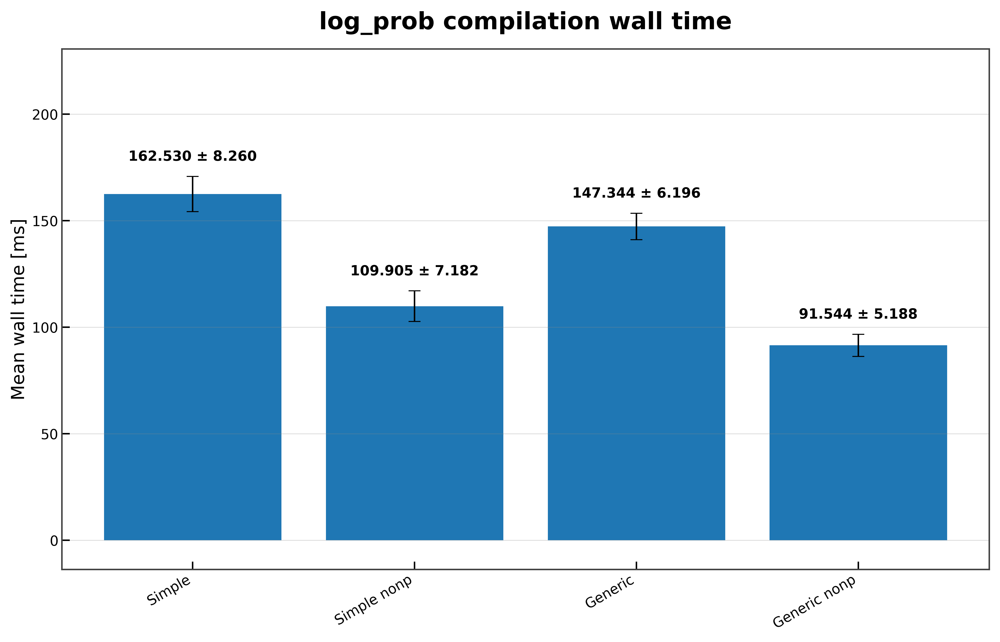

*Shows the average time required to compile the symbolic log-probability graph into a JAX executable graph.*

---

### Current RSS Delta

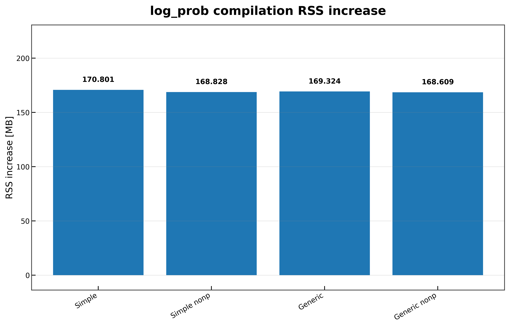

*Shows the additional process memory allocated during a single isolated graph compilation.*

---

## Interpretation

This benchmark measures the cost of converting a symbolic PyTensor graph into an executable JAX representation.

Unlike the previous benchmark, which constructs the symbolic graph, this stage performs graph transpilation and compilation. The resulting `JaxifiedGraph` can then be reused for repeated likelihood evaluations.

Lower compilation times indicate more efficient graph transpilation and shorter model initialization time. Similarly, larger RSS deltas may indicate additional memory required during compilation.

Because graph compilation is typically performed only once per model, improvements in this benchmark primarily reduce startup overhead before repeated evaluations.

---

# Compiled Evaluation Benchmark

## Purpose

Measures the runtime performance of repeatedly executing a compiled PyHS3 log-probability graph.

Unlike the previous benchmarks, which focus on model initialization, this benchmark evaluates the steady-state performance of the compiled graph during repeated likelihood evaluations.

---

## Benchmarked Operation

The benchmark measures repeated execution of

```python
result = compiled(**validation_inputs)
```

where `compiled` is a previously compiled `JaxifiedGraph`.

### Measurement Strategy

Workspace loading, model creation, symbolic graph construction, and graph compilation are treated as setup and are intentionally excluded from the timed section.

Timing and memory are measured independently:

* repeated graph execution is used for timing measurements;
* a single isolated graph execution is used for memory measurements.

This avoids reporting accumulated memory from thousands of repeated graph evaluations.

### Measures

| Included                 | Excluded                    |
| ------------------------ | --------------------------- |
| Compiled graph execution | Workspace loading           |
| JAX execution            | Model creation              |
| Numerical evaluation     | Symbolic graph construction |
| Throughput               | Graph compilation           |

---

## Command

Run the benchmark using the predefined Pixi task:

```bash
pixi run compiled-evaluation
```

Additional command-line arguments can be passed directly to the task.

Example:

```bash
pixi run compiled-evaluation \
    --workspaces inputs/simple_workspace.json \
    --targets L_ch0 \
    --modes FAST_RUN \
    --n-evaluations 1 10 100 1000 10000 \
    --plot
```

Equivalent Python command:

```bash
python -m src.run_compiled_evaluation
```

---

## Available Arguments

| Argument          | Description                                              | Default                             |
| ----------------- | -------------------------------------------------------- | ----------------------------------- |
| `--workspaces`    | One or more HS3 workspace JSON files                     | `inputs/simple_workspace_nonp.json` |
| `--targets`       | Analysis or likelihood targets                           | `L_ch0`                             |
| `--modes`         | PyTensor execution mode passed to `workspace.model(...)` | `FAST_RUN`                          |
| `--n-evaluations` | Numbers of repeated compiled graph evaluations           | `1 10 100 1000 10000`               |
| `--output-dir`    | Directory for JSON benchmark results                     | `results/compiled_evaluation/`      |
| `--output-name`   | Benchmark result filename                                | `compiled_evaluation_result.json`   |
| `--plot`          | Generate benchmark plots                                 | disabled                            |
| `--plot-dir`      | Directory for generated plots                            | `plots/compiled_evaluation/`        |

---

## Validation

Before recording benchmark results, the benchmark verifies that

* the compiled graph executes successfully;
* all evaluation outputs are finite;
* repeated evaluations produce numerically stable results.

The benchmark also records

* the reference output;
* the maximum absolute deviation across repeated evaluations;
* whether all outputs remain numerically stable.

---

## Outputs

Benchmark results are written to

```text
results/compiled_evaluation/
```

Generated figures are written to

```text
plots/compiled_evaluation/
```

---

## Example Plots

### Average Runtime Per Evaluation

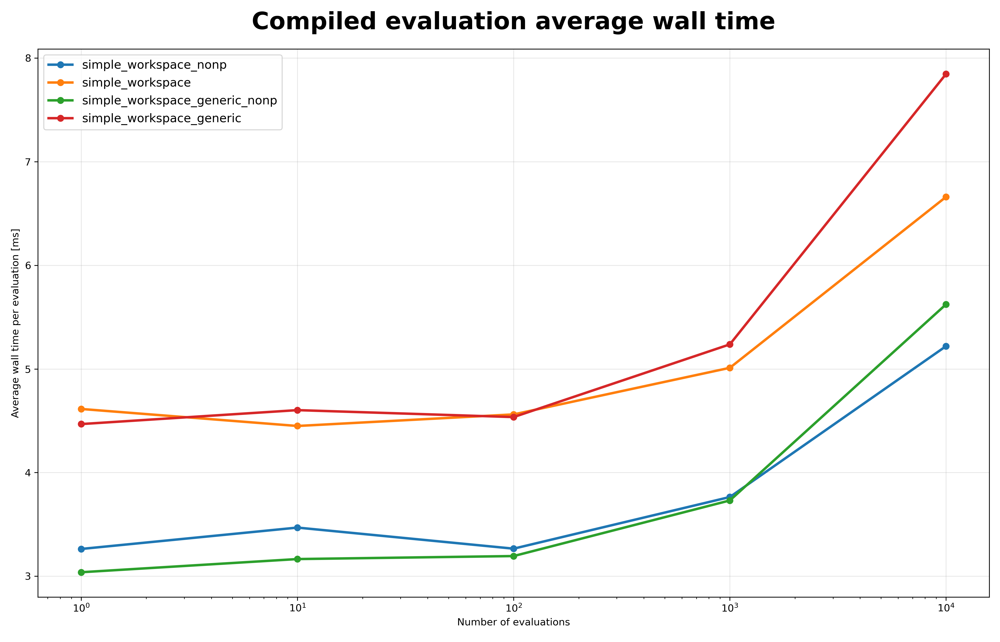

*Shows the average execution time of a single compiled graph evaluation as the number of repeated evaluations increases.*

---

### Throughput

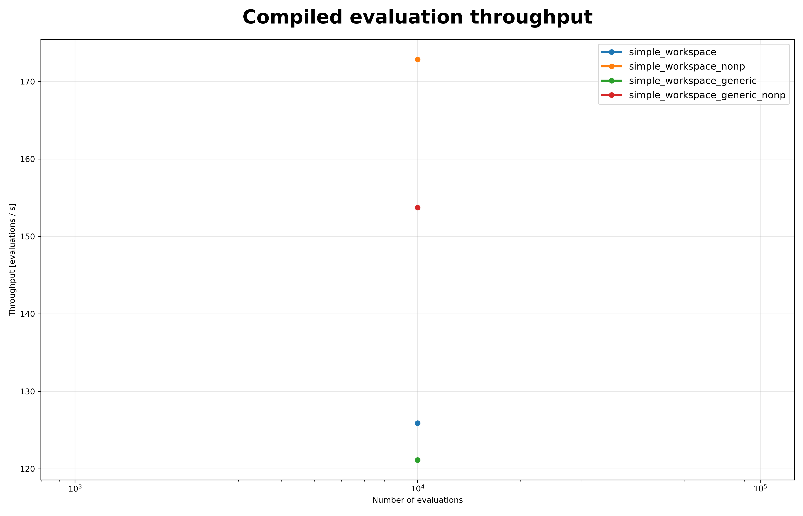

*Shows the sustained evaluation throughput (evaluations per second) during repeated execution of the compiled graph.*

---

## Interpretation

This benchmark measures the steady-state execution performance of an already compiled PyHS3 model.

Unlike the previous benchmarks, which focus on one-time initialization costs, this benchmark evaluates the performance that dominates long-running statistical analyses where the compiled graph is executed many times.

Lower average runtime per evaluation indicates faster numerical execution, while higher throughput reflects more efficient utilization of the compiled JAX graph.

Because compiled graphs are typically reused many times after initialization, improvements in this benchmark directly reduce the cost of repeated likelihood evaluations in real analysis workflows.

---

# PDF Evaluation Benchmark

## Purpose

Measures the runtime performance of repeated probability density function (PDF) evaluation using a PyHS3 model.

This benchmark isolates PDF evaluation and distinguishes between the first ("cold-start") evaluation and subsequent ("warm") evaluations, providing a more realistic view of runtime performance during statistical analyses.

---

## Benchmarked Operation

The benchmark measures repeated execution of

```python
result = model.pdf(distribution, **parameters)
```

where `distribution` is a probability density function defined in the HS3 workspace.

### Measurement Strategy

Workspace loading, model creation, and parameter preparation are treated as setup and are intentionally excluded from the timed section.

The benchmark separates three different performance characteristics:

* **Cold-start runtime** — the first `model.pdf(...)` call, which may include lazy initialization or cache setup.
* **Warm runtime** — repeated PDF evaluations after the first call.
* **Throughput** — sustained evaluation rate during repeated execution.

Timing and memory are measured independently:

* repeated warm evaluations are used for timing measurements;
* a separate isolated benchmark is used for memory measurements.

### Measures

| Included                  | Excluded                    |
| ------------------------- | --------------------------- |
| PDF evaluation            | Workspace loading           |
| Numerical PDF computation | Model creation              |
| Cold-start latency        | Graph compilation           |
| Warm runtime              | Symbolic graph construction |
| Throughput                |                             |

---

## Command

Run the benchmark using the predefined Pixi task:

```bash
pixi run pdf-evaluation
```

Additional command-line arguments can be passed directly to the task.

Example:

```bash
pixi run pdf-evaluation \
    --workspaces inputs/simple_workspace.json \
    --targets L_ch0 \
    --modes FAST_RUN \
    --distributions sig_ch0 \
    --n-evaluations 1 10 100 1000 10000 \
    --plot
```

Equivalent Python command:

```bash
python -m src.run_pdf_evaluation
```

---

## Available Arguments

| Argument          | Description                                              | Default                             |
| ----------------- | -------------------------------------------------------- | ----------------------------------- |
| `--workspaces`    | One or more HS3 workspace JSON files                     | `inputs/simple_workspace_nonp.json` |
| `--targets`       | Analysis or likelihood targets                           | `L_ch0`                             |
| `--modes`         | PyTensor execution mode passed to `workspace.model(...)` | `FAST_RUN`                          |
| `--distributions` | Distribution(s) to evaluate                              | `sig_ch0`                           |
| `--n-evaluations` | Numbers of repeated PDF evaluations                      | `1 10 100 1000 10000`               |
| `--output-dir`    | Directory for JSON benchmark results                     | `results/pdf_evaluation/`           |
| `--output-name`   | Benchmark result filename                                | `pdf_evaluation_result.json`        |
| `--plot`          | Generate benchmark plots                                 | disabled                            |
| `--plot-dir`      | Directory for generated plots                            | `plots/pdf_evaluation/`             |

---

## Validation

Before recording benchmark results, the benchmark verifies that

* the requested distribution exists;
* all PDF evaluations complete successfully;
* all outputs are finite;
* repeated evaluations produce numerically stable results.

The benchmark also records

* the reference PDF value;
* the maximum absolute deviation across repeated evaluations;
* whether all repeated evaluations remain numerically stable.

---

## Outputs

Benchmark results are written to

```text
results/pdf_evaluation/
```

Generated figures are written to

```text
plots/pdf_evaluation/
```

---

## Example Plots

### Average Runtime Per Evaluation


*Shows the average execution time of a single warm PDF evaluation as the number of repeated evaluations increases.*

---

### Throughput


*Shows the sustained evaluation throughput (evaluations per second) during repeated PDF evaluation.*

---

### Cold-Start Runtime

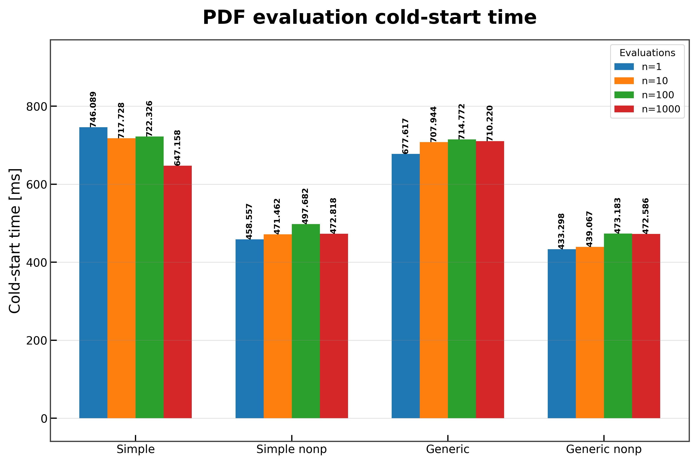

*Shows the latency of the first PDF evaluation, including any one-time initialization or cache setup.*

---

## Interpretation

This benchmark measures the runtime performance of evaluating probability density functions after a model has been constructed.

Unlike the workflow benchmarks, which measure one-time initialization costs, this benchmark focuses on the execution performance that dominates repeated likelihood evaluations in real analyses.

Separating cold-start and warm execution makes it possible to distinguish one-time initialization overhead from sustained runtime performance. Lower warm evaluation times and higher throughput indicate more efficient PDF evaluation, while shorter cold-start latency reflects faster initialization of the evaluation pipeline.

---

# Negative Log-Likelihood (NLL) Scan Benchmark

## Purpose

Measures the performance of scanning the negative log-likelihood (NLL) over a parameter grid using a compiled PyHS3 model.

This benchmark evaluates the cost of repeatedly computing the likelihood while varying a single parameter of interest, closely reflecting workflows commonly used in statistical inference and parameter estimation.

---

## Benchmarked Operation

The benchmark measures repeated execution of a compiled log-probability function while scanning one parameter over a predefined range.

For each scan point, the selected parameter is updated and the corresponding NLL value is computed.

### Measurement Strategy

Workspace loading, model creation, symbolic graph construction, and graph compilation are treated as setup and are intentionally excluded from the timed section.

The benchmark measures:

* execution of the complete NLL scan;
* average runtime per scan point;
* memory usage during the scan.

### Measures

| Included                                | Excluded                    |
| --------------------------------------- | --------------------------- |
| Repeated compiled likelihood evaluation | Workspace loading           |
| Parameter updates                       | Model creation              |
| Full parameter scan                     | Symbolic graph construction |
| Runtime per scan point                  | Graph compilation           |

---

## Command

Run the benchmark using the predefined Pixi task:

```bash
pixi run nll-scan
```

Additional command-line arguments can be passed directly to the task.

Example:

```bash
pixi run nll-scan \
    --workspaces inputs/simple_workspace.json \
    --targets L_ch0 \
    --modes FAST_RUN \
    --scan-parameter mu_sig \
    --scan-min 0.0 \
    --scan-max 5.0 \
    --n-scan-points 101 \
    --plot
```

Equivalent Python command:

```bash
python -m src.run_nll_scan
```

---

## Available Arguments

| Argument           | Description                                              | Default                             |
| ------------------ | -------------------------------------------------------- | ----------------------------------- |
| `--workspaces`     | One or more HS3 workspace JSON files                     | `inputs/simple_workspace_nonp.json` |
| `--targets`        | Analysis or likelihood targets                           | `L_ch0`                             |
| `--modes`          | PyTensor execution mode passed to `workspace.model(...)` | `FAST_RUN`                          |
| `--scan-parameter` | Parameter to scan                                        | `mu_sig`                            |
| `--scan-min`       | Lower bound of the scan range                            | `0.0`                               |
| `--scan-max`       | Upper bound of the scan range                            | `5.0`                               |
| `--n-scan-points`  | Number(s) of scan points                                 | `101`                               |
| `--output-dir`     | Directory for JSON benchmark results                     | `results/nll_scan/`                 |
| `--output-name`    | Benchmark result filename                                | `nll_scan_result.json`              |
| `--plot`           | Generate benchmark plots                                 | disabled                            |
| `--plot-dir`       | Directory for generated plots                            | `plots/nll_scan/`                   |

---

## Validation

Before recording benchmark results, the benchmark verifies that

* the scan parameter exists in the compiled model inputs;
* all computed NLL values are finite;
* the full scan completes successfully;
* the minimum NLL value is identified correctly.

The benchmark also records

* the scan grid;
* the computed NLL values;
* the parameter value corresponding to the minimum NLL;
* the overall NLL range across the scan.

---

## Outputs

Benchmark results are written to

```text
results/nll_scan/
```

Generated figures are written to

```text
plots/nll_scan/
```

---

## Example Plots

### Total Runtime

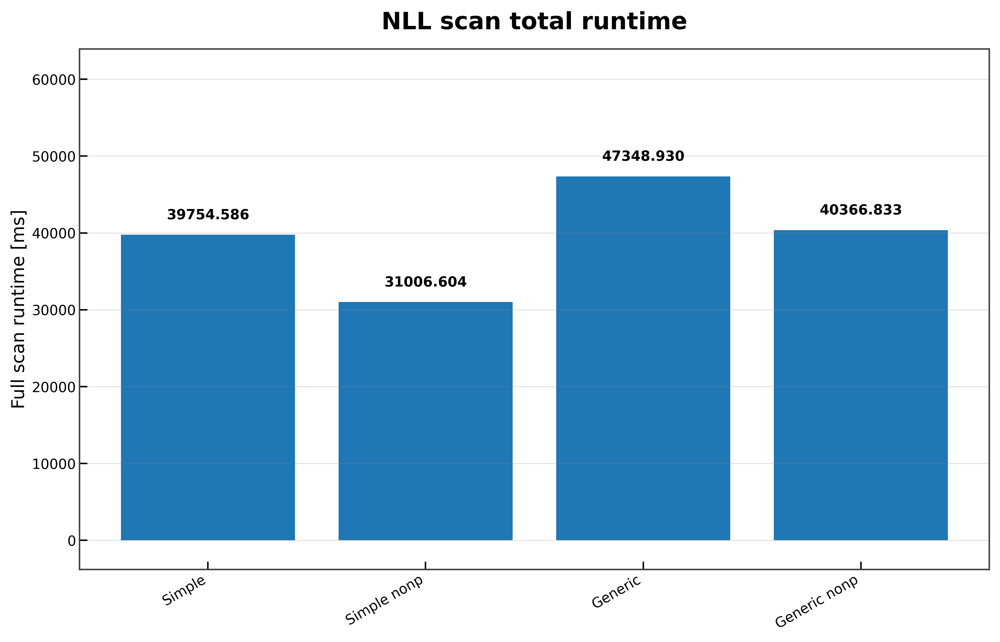

*Shows the total time required to complete the full negative log-likelihood scan.*

---

### Runtime Per Scan Point

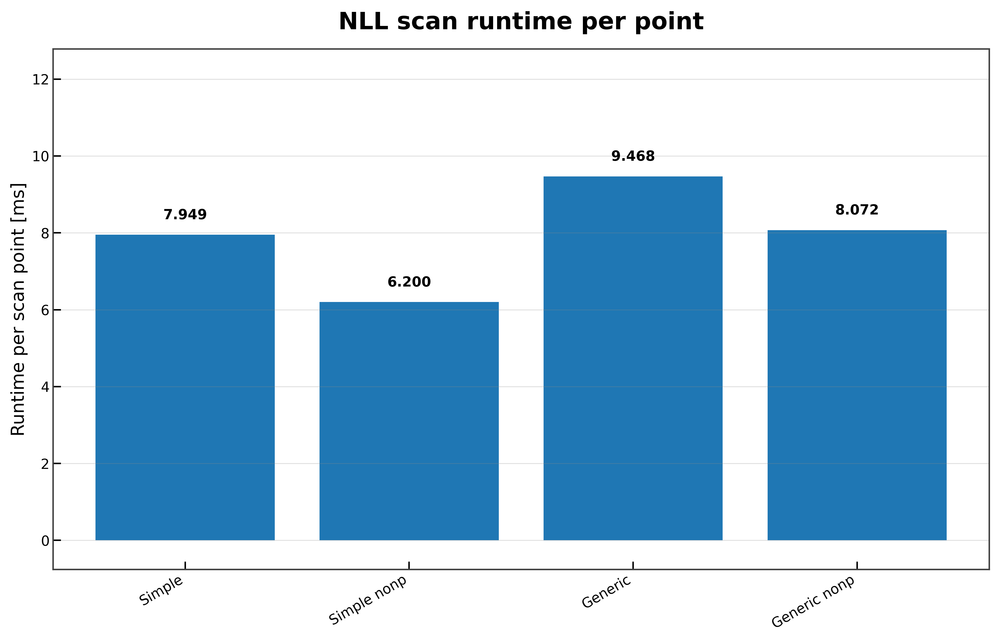

*Shows the average execution time required to evaluate a single scan point.*

---

## Interpretation

This benchmark measures the performance of repeated likelihood evaluations performed during parameter scans.

Unlike the PDF Evaluation benchmark, which repeatedly evaluates the same probability density function using fixed inputs, this benchmark updates the scanned parameter before each evaluation, reflecting a common workflow in statistical fitting and confidence interval estimation.

Lower total runtime reduces the overall cost of parameter scans, while lower runtime per scan point indicates more efficient execution of individual likelihood evaluations.

---

# Memory Scaling Benchmark

## Purpose

Measures memory usage across the complete PyHS3 workflow by executing each benchmark stage in isolation.

Unlike the previous benchmarks, which evaluate the performance of individual operations, this benchmark provides a workflow-level view of memory consumption and identifies which stages contribute most to overall memory usage.

---

## Benchmarked Operation

The benchmark executes each workflow stage independently and records its memory footprint.

Each stage is executed in a separate process to ensure that memory measurements are not affected by allocations performed during previous stages.

By default, the benchmark includes:

* Workspace Loading
* Model Creation
* Log Probability Construction
* Log Probability Compilation
* Compiled Evaluation
* PDF Evaluation
* NLL Scan

### Measurement Strategy

Each workflow stage is executed independently using identical benchmark settings.

For every stage, the benchmark records:

* current RSS before execution;
* current RSS after execution;
* current RSS delta;
* peak RSS before execution;
* peak RSS after execution;
* peak RSS delta.

This isolation prevents memory accumulation across stages and provides directly comparable measurements.

### Measures

| Included                                | Excluded                                |
| --------------------------------------- | --------------------------------------- |
| Current RSS before and after each stage | Memory accumulated from previous stages |
| Peak RSS before and after each stage    | Cross-stage interference                |
| Memory delta for each workflow stage    | End-to-end workflow timing              |

---

## Command

Run the benchmark using the predefined Pixi task:

```bash
pixi run memory-scaling
```

Additional command-line arguments can be passed directly to the task.

Example:

```bash
pixi run memory-scaling \
    --workspaces inputs/simple_workspace.json \
    --targets L_ch0 \
    --modes FAST_RUN \
    --stages all \
    --plot
```

Equivalent Python command:

```bash
python -m src.run_memory_scaling
```

---

## Available Arguments

| Argument           | Description                                              | Default                             |
| ------------------ | -------------------------------------------------------- | ----------------------------------- |
| `--workspaces`     | One or more HS3 workspace JSON files                     | `inputs/simple_workspace_nonp.json` |
| `--targets`        | Analysis or likelihood targets                           | `L_ch0`                             |
| `--modes`          | PyTensor execution mode passed to `workspace.model(...)` | `FAST_RUN`                          |
| `--stages`         | Workflow stages to benchmark (`all` or selected stages)  | `all`                               |
| `--n-runs`         | Number of timing runs for workflow stages                | `5`                                 |
| `--n-evaluations`  | Number of repeated evaluations for runtime stages        | `10000`                             |
| `--distribution`   | Distribution used for PDF evaluation                     | `sig_ch0`                           |
| `--scan-parameter` | Parameter used for the NLL scan                          | `mu_sig`                            |
| `--scan-min`       | Lower bound of the scan range                            | `0.0`                               |
| `--scan-max`       | Upper bound of the scan range                            | `5.0`                               |
| `--n-scan-points`  | Number of scan points                                    | `101`                               |
| `--output-dir`     | Directory for JSON benchmark results                     | `results/memory_scaling/`           |
| `--output-name`    | Benchmark result filename                                | `memory_scaling_result.json`        |
| `--plot`           | Generate benchmark plots                                 | disabled                            |
| `--plot-dir`       | Directory for generated plots                            | `plots/memory_scaling/`             |

---

## Validation

Before summarizing memory usage, the benchmark verifies that

* every selected workflow stage completed successfully;
* all RSS metrics are available for every stage;
* all benchmark stages produced valid benchmark results.

The benchmark also records

* per-stage RSS measurements;
* total current RSS increase across stages;
* total peak RSS increase across stages;
* the maximum peak RSS observed during the workflow.

---

## Outputs

Benchmark results are written to

```text
results/memory_scaling/
```

Generated figures are written to

```text
plots/memory_scaling/
```

---

## Example Plots

### Current RSS Delta

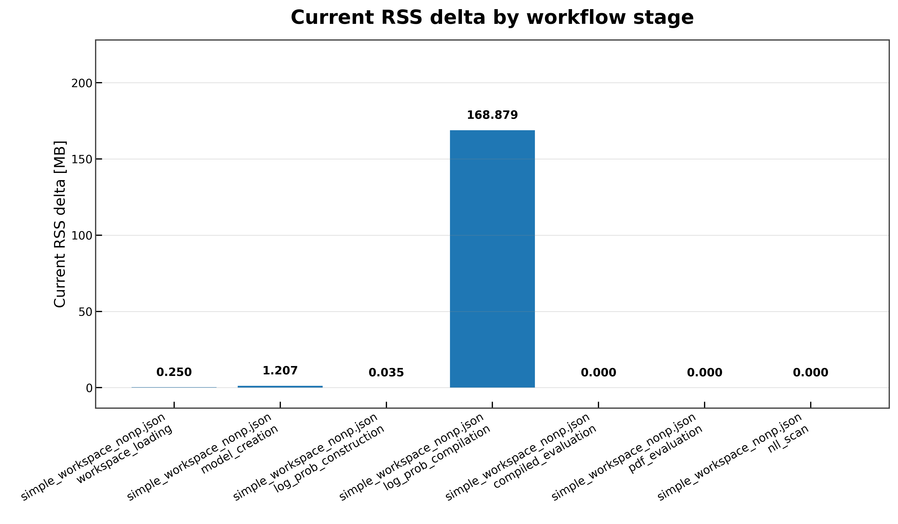

*Shows the increase in current resident memory (RSS) introduced by each workflow stage.*

---

### Peak RSS Delta

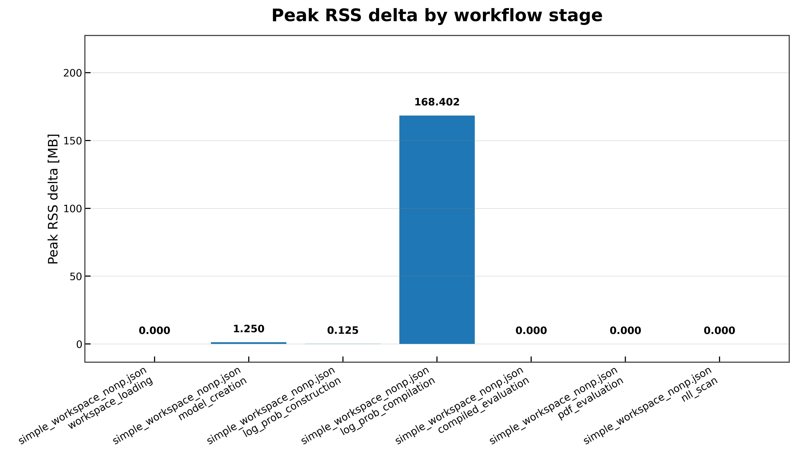

*Shows the additional peak resident memory allocated while executing each workflow stage.*

---

### Peak RSS After Stage

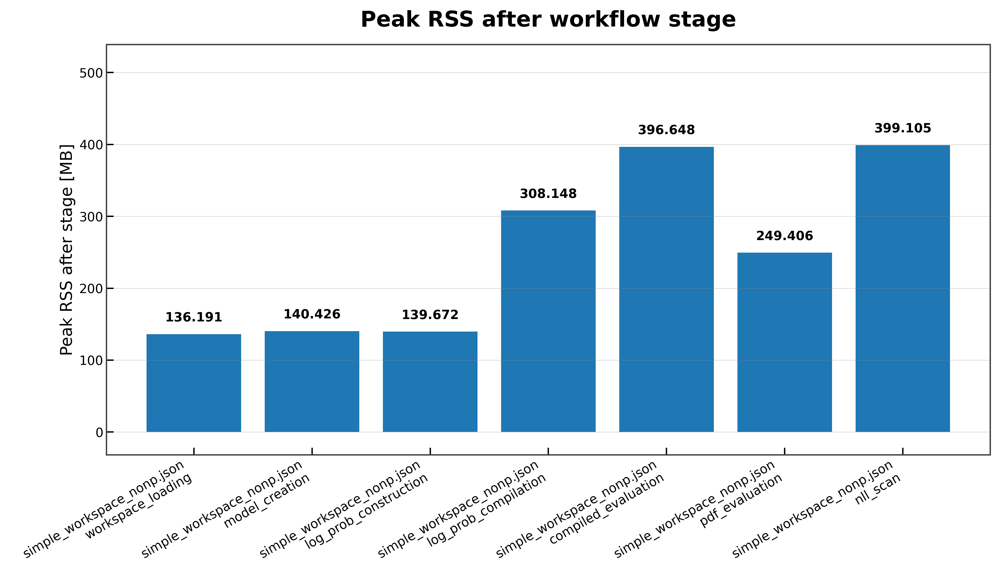

*Shows the peak resident memory observed after each workflow stage has completed.*

---

## Interpretation

This benchmark provides a workflow-level view of memory usage across PyHS3.

Rather than measuring the performance of a single operation, it identifies which stages of the workflow are responsible for the largest memory allocations.

Comparing current RSS delta, peak RSS delta, and peak RSS after each stage helps distinguish temporary memory spikes from persistent memory growth. This information is particularly valuable when identifying opportunities for memory optimization or tracking memory regressions across future PyHS3 versions.

---

# Model Complexity Scaling Benchmark

## Purpose

Measures how PyHS3 performance scales as workspace size and model complexity increase.

Unlike the previous benchmarks, which evaluate individual workflow stages in isolation, this benchmark executes the complete benchmark suite across multiple workspaces of increasing complexity and summarizes how initialization time, runtime performance, and memory usage evolve.

---

## Benchmarked Operation

The benchmark executes the selected PyHS3 workflow stages for each workspace and collects performance metrics for every complexity level.

By default, the benchmark includes:

* Workspace Loading
* Model Creation
* Log Probability Construction
* Log Probability Compilation
* Compiled Evaluation
* PDF Evaluation
* NLL Scan

For every workspace, the benchmark reports:

* initialization time;
* runtime performance;
* memory consumption;
* validation results.

### Measurement Strategy

Each workspace is benchmarked independently using identical benchmark settings.

The benchmark aggregates results from all selected workflow stages and computes:

* total setup time;
* compiled evaluation performance;
* PDF evaluation performance;
* NLL scan performance;
* total peak RSS increase.

Each workspace is executed in an isolated process to ensure that measurements are independent and directly comparable across complexity levels.

### Measures

| Included                        | Excluded                            |
| ------------------------------- | ----------------------------------- |
| Total setup time                | Cross-workspace memory accumulation |
| Compiled evaluation performance | Parallel execution effects          |
| PDF evaluation performance      | External framework benchmarks       |
| NLL scan performance            |                                     |
| Total peak RSS delta            |                                     |

---

## Command

Run the benchmark using the predefined Pixi task:

```bash
pixi run model-complexity-scaling
```

Additional command-line arguments can be passed directly to the task.

Example:

```bash
pixi run model-complexity-scaling \
    --workspaces inputs/workspace_small.json \
                 inputs/workspace_medium.json \
                 inputs/workspace_large.json \
    --stages all \
    --plot
```

Equivalent Python command:

```bash
python -m src.run_model_complexity_scaling
```

---

## Available Arguments

| Argument           | Description                                              | Default                                |
| ------------------ | -------------------------------------------------------- | -------------------------------------- |
| `--workspaces`     | One or more HS3 workspace JSON files                     | `inputs/simple_workspace_nonp.json`    |
| `--targets`        | Analysis or likelihood targets                           | `L_ch0`                                |
| `--modes`          | PyTensor execution mode passed to `workspace.model(...)` | `FAST_RUN`                             |
| `--stages`         | Workflow stages to benchmark (`all` or selected stages)  | `all`                                  |
| `--n-runs`         | Number of timing runs                                    | `5`                                    |
| `--n-evaluations`  | Number of repeated evaluations                           | `10000`                                |
| `--distribution`   | Distribution used for PDF evaluation                     | `sig_ch0`                              |
| `--scan-parameter` | Parameter used for the NLL scan                          | `mu_sig`                               |
| `--scan-min`       | Lower bound of the scan range                            | `0.0`                                  |
| `--scan-max`       | Upper bound of the scan range                            | `5.0`                                  |
| `--n-scan-points`  | Number of scan points                                    | `101`                                  |
| `--output-dir`     | Directory for JSON benchmark results                     | `results/model_complexity_scaling/`    |
| `--output-name`    | Benchmark result filename                                | `model_complexity_scaling_result.json` |
| `--report-dir`     | Directory for CSV summary reports                        | `reports/model_complexity_scaling/`    |
| `--csv-name`       | CSV summary filename                                     | `model_complexity_scaling_summary.csv` |
| `--plot`           | Generate benchmark plots                                 | disabled                               |
| `--plot-dir`       | Directory for generated plots                            | `plots/model_complexity_all_stages/`   |

---

## Validation

Before generating scaling summaries, the benchmark verifies that

* every selected workflow stage completed successfully;
* all runtime and memory metrics were collected;
* compiled evaluation produced finite outputs;
* NLL scans completed successfully with finite likelihood values.

The benchmark also records

* workspace size;
* per-stage benchmark results;
* total setup time;
* total peak RSS increase;
* compiled evaluation validation results;
* NLL scan minima and validation metrics.

---

## Outputs

Benchmark results are written to

```text
results/model_complexity_scaling/
```

CSV summary reports are written to

```text
reports/model_complexity_scaling/
```

Generated figures are written to

```text
plots/model_complexity_all_stages/
```

---

## Example Plots

### Total Setup Time

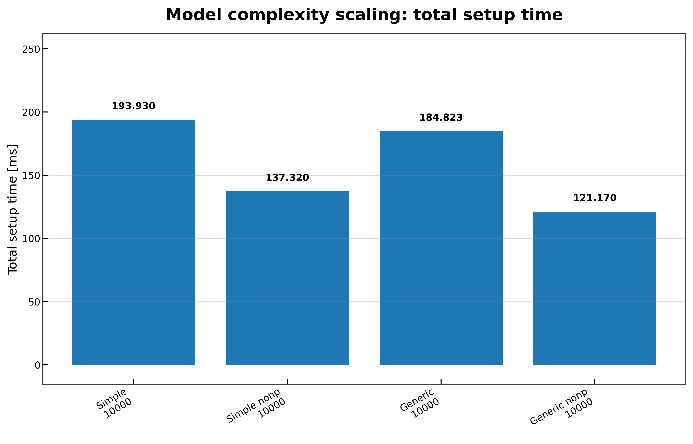

*Shows how total model initialization time scales as workspace complexity increases.*

---

### Compiled Evaluation Time

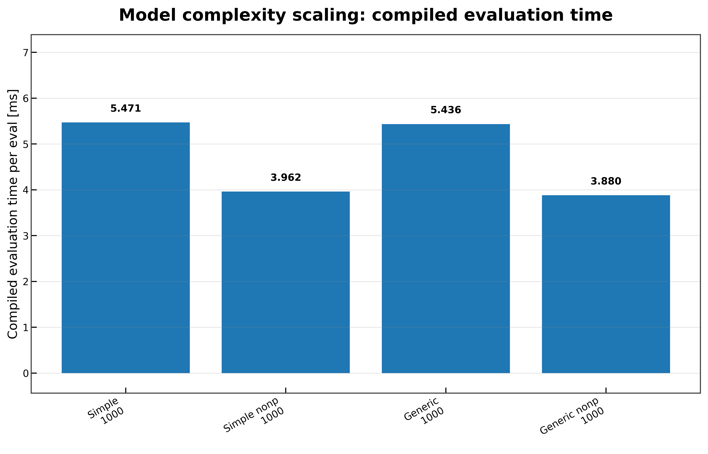

*Shows how compiled graph execution performance changes with increasing model complexity.*

---

### PDF Evaluation Time

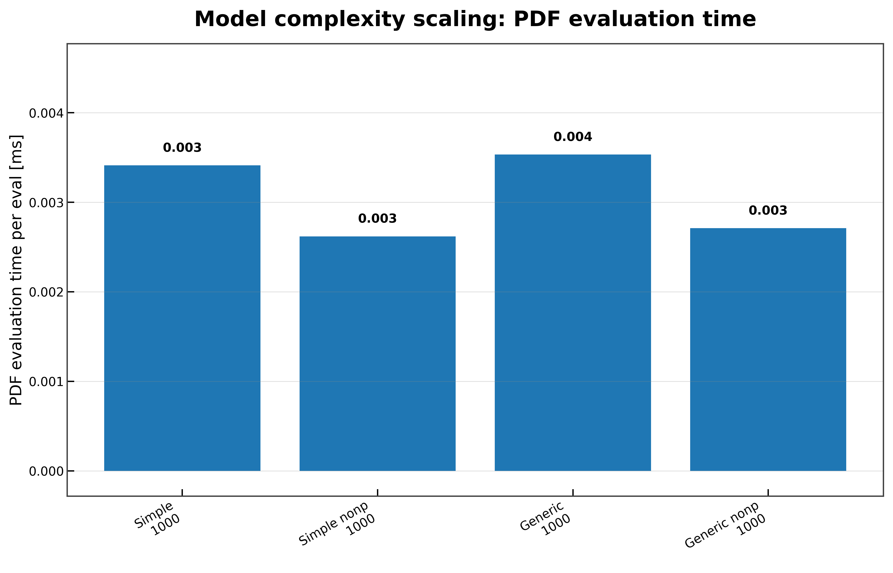

*Shows how PDF evaluation performance scales across increasingly complex workspaces.*

---

### NLL Scan Time

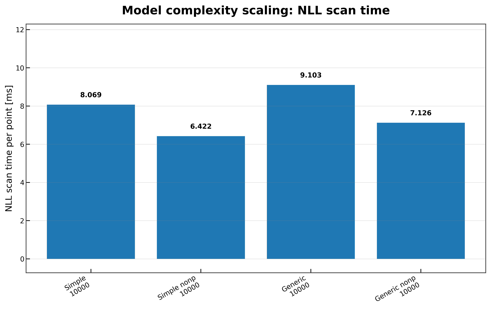

*Shows how the average runtime per NLL scan point changes as model complexity increases.*

---

### Peak RSS Delta

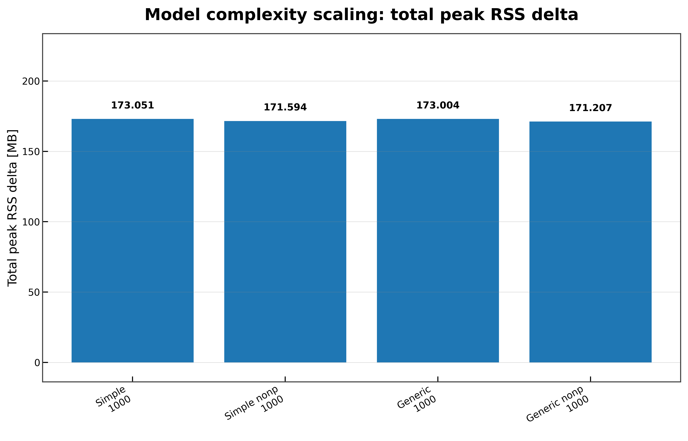

*Shows the total increase in peak resident memory across the complete benchmark workflow.*

---

## Interpretation

This benchmark provides a high-level view of how PyHS3 scales as statistical models become larger and more complex.

Rather than focusing on a single operation, it combines the results of the complete benchmark workflow to identify which aspects of the system scale efficiently and which become potential bottlenecks.

Comparing setup time, runtime performance, and memory consumption across workspaces makes it possible to distinguish initialization costs from steady-state execution costs while also identifying how memory requirements evolve with increasing model complexity.

This benchmark is particularly valuable for evaluating optimization efforts and tracking performance regressions across future PyHS3 revisions.

---

# Graph Canonicalization Benchmark

## Purpose

Measures the performance of PyTensor graph canonicalization for symbolic PyHS3 log-probability graphs.

This benchmark isolates the canonicalization stage and evaluates the cost of applying PyTensor's canonical graph rewrites before graph optimization and compilation.

---

## Benchmarked Operation

The benchmark measures the execution time of

```python
canonicalizer = pytensor.compile.mode.optdb.query("+canonicalize")
canonicalizer.rewrite(fgraph)
```

where `fgraph` is a `FunctionGraph` constructed from the symbolic `model.log_prob` expression.

### Measurement Strategy

Workspace loading, model creation, symbolic log-probability construction, and `FunctionGraph` creation are treated as setup and are intentionally excluded from the timed section.

Timing and memory are measured independently:

* repeated graph canonicalization is used for timing measurements;
* a single isolated canonicalization is used for memory measurements.

This avoids reporting accumulated memory from repeatedly rewriting multiple graphs.

### Measures

| Included                 | Excluded                    |
| ------------------------ | --------------------------- |
| Canonical graph rewrites | Workspace loading           |
| FunctionGraph rewriting  | Model creation              |
| Graph normalization      | Symbolic graph construction |
|                          | Graph optimization          |
|                          | Graph compilation           |
|                          | Graph execution             |

---

## Command

Run the benchmark using the predefined Pixi task:

```bash
pixi run graph-canonicalization
```

Additional command-line arguments can be passed directly to the task.

Example:

```bash
pixi run graph-canonicalization \
    --workspaces inputs/simple_workspace.json \
    --targets L_ch0 \
    --modes FAST_RUN \
    --n-runs 20 \
    --plot
```

Equivalent Python command:

```bash
python -m src.run_graph_canonicalization
```

---

## Available Arguments

| Argument        | Description                                              | Default                                |
| --------------- | -------------------------------------------------------- | -------------------------------------- |
| `--workspaces`  | One or more HS3 workspace JSON files                     | `inputs/simple_workspace_nonp.json`    |
| `--targets`     | Analysis or likelihood targets                           | `L_ch0`                                |
| `--modes`       | PyTensor execution mode passed to `workspace.model(...)` | `FAST_RUN`                             |
| `--n-runs`      | Number of repeated timing runs                           | `5`                                    |
| `--output-dir`  | Directory for JSON benchmark results                     | `results/graph_canonicalization/`      |
| `--output-name` | Benchmark result filename                                | `graph_canonicalization_result.json`   |
| `--plot`        | Generate benchmark plots                                 | disabled                               |
| `--plot-dir`    | Directory for generated plots                            | `plots/graph_canonicalization_simple/` |

---

## Validation

Before recording benchmark results, the benchmark verifies that

* graph canonicalization completed successfully;
* the canonicalized graph contains a valid output;
* the resulting `FunctionGraph` contains valid apply nodes.

The benchmark also records

* graph type;
* number of graph inputs and outputs;
* number of apply nodes before canonicalization;
* number of apply nodes after canonicalization;
* the change in apply node count introduced by canonicalization.

---

## Outputs

Benchmark results are written to

```text
results/graph_canonicalization/
```

Generated figures are written to

```text
plots/graph_canonicalization_simple/
```

---

## Example Plots

### Wall Time

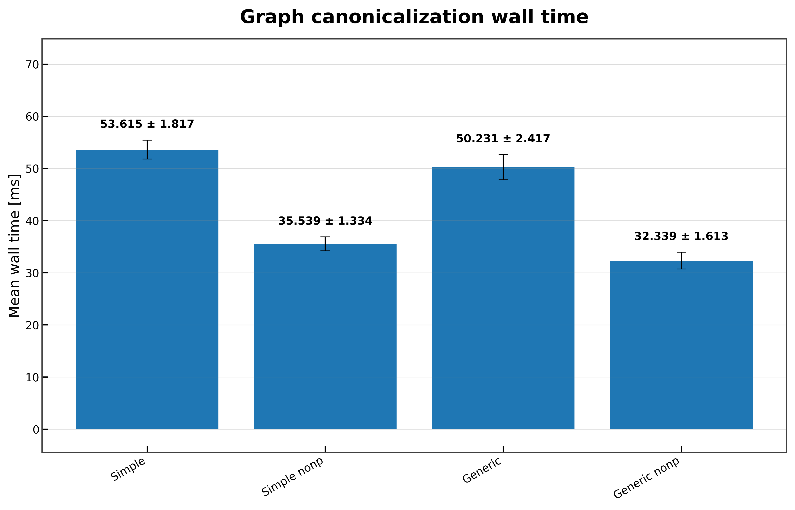

*Shows the average time required to apply PyTensor canonicalization rewrites to the symbolic computation graph.*

---

### Current RSS Delta

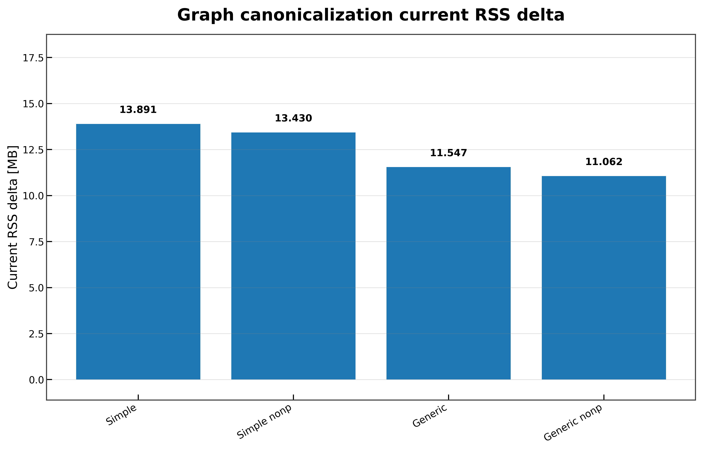

*Shows the additional process memory allocated during a single isolated graph canonicalization.*

---

## Interpretation

This benchmark measures the cost of normalizing symbolic computation graphs before further optimization.

Canonicalization applies a standard set of graph rewrites that simplify equivalent expressions and prepare the graph for later optimization passes. Although this stage does not execute or compile the graph, it can significantly influence the efficiency of subsequent optimization and compilation.

Lower canonicalization times indicate more efficient graph preprocessing, while changes in the number of apply nodes provide insight into how the symbolic graph is transformed prior to optimization.

---

# Graph Optimization Benchmark

## Purpose

Measures the performance of PyTensor graph optimization for symbolic PyHS3 log-probability graphs.

This benchmark isolates the optimization stage and evaluates the cost of applying the PyTensor JAX optimizer to a `FunctionGraph` before compilation and execution.

---

## Benchmarked Operation

The benchmark measures the execution time of

```python
pytensor.compile.mode.JAX.optimizer.rewrite(fgraph)
```

where `fgraph` is a `FunctionGraph` constructed from the symbolic `model.log_prob` expression.

### Measurement Strategy

Workspace loading, model creation, symbolic log-probability construction, and `FunctionGraph` creation are treated as setup and are intentionally excluded from the timed section.

Timing and memory are measured independently:

* repeated graph optimization is used for timing measurements;
* a single isolated graph optimization is used for memory measurements.

This avoids reporting accumulated memory from repeatedly optimizing multiple graphs.

### Measures

| Included                        | Excluded                    |
| ------------------------------- | --------------------------- |
| JAX graph optimization rewrites | Workspace loading           |
| FunctionGraph rewriting         | Model creation              |
| Graph optimization              | Symbolic graph construction |
|                                 | Graph compilation           |
|                                 | Graph execution             |

---

## Command

Run the benchmark using the predefined Pixi task:

```bash
pixi run graph-optimization
```

Additional command-line arguments can be passed directly to the task.

Example:

```bash
pixi run graph-optimization \
    --workspaces inputs/simple_workspace.json \
    --targets L_ch0 \
    --modes FAST_RUN \
    --n-runs 20 \
    --plot
```

Equivalent Python command:

```bash
python -m src.run_graph_optimization
```

---

## Available Arguments

| Argument        | Description                                              | Default                             |
| --------------- | -------------------------------------------------------- | ----------------------------------- |
| `--workspaces`  | One or more HS3 workspace JSON files                     | `inputs/simple_workspace_nonp.json` |
| `--targets`     | Analysis or likelihood targets                           | `L_ch0`                             |
| `--modes`       | PyTensor execution mode passed to `workspace.model(...)` | `FAST_RUN`                          |
| `--n-runs`      | Number of repeated timing runs                           | `5`                                 |
| `--output-dir`  | Directory for JSON benchmark results                     | `results/graph_optimization/`       |
| `--output-name` | Benchmark result filename                                | `graph_optimization_result.json`    |
| `--plot`        | Generate benchmark plots                                 | disabled                            |
| `--plot-dir`    | Directory for generated plots                            | `plots/graph_optimization_simple/`  |

---

## Validation

Before recording benchmark results, the benchmark verifies that

* graph optimization completed successfully;
* the optimized graph contains a valid output;
* the resulting `FunctionGraph` contains valid apply nodes.

The benchmark also records

* graph type;
* number of graph inputs and outputs;
* number of apply nodes before optimization;
* number of apply nodes after optimization;
* the change in apply node count introduced by optimization;
* the optimizer used for rewriting.

---

## Outputs

Benchmark results are written to

```text
results/graph_optimization/
```

Generated figures are written to

```text
plots/graph_optimization_simple/
```

---

## Example Plots

### Wall Time

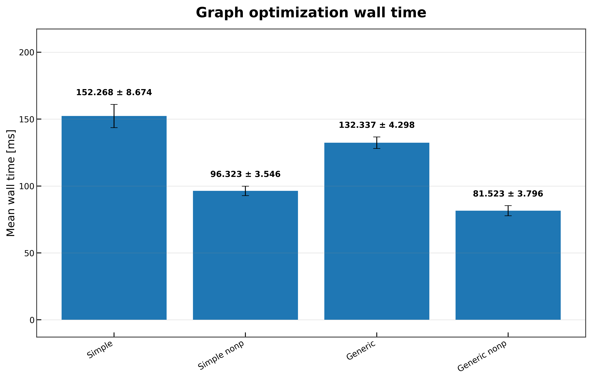

*Shows the average time required to apply the PyTensor JAX optimizer to the symbolic computation graph.*

---

### Current RSS Delta

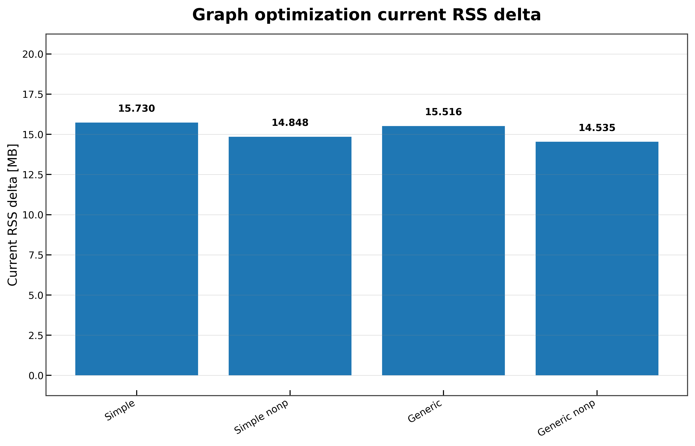

*Shows the additional process memory allocated during a single isolated graph optimization.*

---

## Interpretation

This benchmark measures the cost of optimizing symbolic computation graphs before they are compiled and executed.

Graph optimization applies backend-specific rewrites that can simplify, transform, or restructure the computation graph for more efficient execution. In this benchmark, the optimization pass is the PyTensor JAX optimizer.

Lower optimization times indicate faster graph preprocessing before compilation. Changes in the number of apply nodes provide insight into how strongly the optimizer transforms the symbolic graph.

Because optimization directly affects the structure of the graph passed to later compilation and execution stages, regressions in this benchmark may affect both initialization time and downstream runtime performance.

---

# Benchmark Suite Runner

## Purpose

Runs the complete PyHS3 benchmark suite or a selected subset of benchmarks using a unified command-line interface.

This utility orchestrates benchmark execution, applies predefined benchmark presets, generates summary reports, and provides a consistent entry point for running the benchmark suite.

---

## Functionality

The benchmark suite runner can:

* execute the complete benchmark suite;
* run only selected benchmarks;
* apply predefined benchmark presets;
* generate a machine-readable JSON summary;
* continue execution after failures (optional);
* perform dry-run validation without executing benchmarks.

Supported benchmark categories include:

* Workflow Benchmarks
* PDF Benchmarks
* Likelihood Benchmarks
* Scaling Benchmarks
* Graph Benchmarks

---

## Command

Run the complete benchmark suite:

```bash
pixi run benchmark
```

Run a predefined benchmark preset:

```bash
pixi run benchmark-default
```

Run only selected benchmarks:

```bash
python -m src.run_all_benchmarks \
    --benchmarks workspace_loading model_creation pdf_evaluation_simple
```

Perform a dry run:

```bash
python -m src.run_all_benchmarks \
    --dry-run
```

---

## Available Presets

| Preset    | Purpose                                                           |
| --------- | ----------------------------------------------------------------- |
| `smoke`   | Lightweight validation of the benchmark suite                     |
| `default` | Standard benchmark configuration                                  |
| `full`    | Extended benchmark configuration for detailed performance studies |

---

## Available Arguments

| Argument                | Description                                          | Default                                                |
| ----------------------- | ---------------------------------------------------- | ------------------------------------------------------ |
| `--benchmarks`          | Benchmarks to execute (`all` or selected benchmarks) | `all`                                                  |
| `--preset`              | Benchmark preset (`smoke`, `default`, `full`)        | none                                                   |
| `--n-runs`              | Number of timing repetitions                         | preset dependent                                       |
| `--n-evaluations`       | Number of repeated runtime evaluations               | preset dependent                                       |
| `--n-scan-points`       | Number of NLL scan points                            | preset dependent                                       |
| `--target`              | Analysis target                                      | `L_ch0`                                                |
| `--mode`                | PyTensor execution mode                              | `FAST_RUN`                                             |
| `--no-plot`             | Disable plot generation                              | disabled                                               |
| `--summary-output`      | Output path for the benchmark suite summary          | `results/benchmark_suite/benchmark_suite_summary.json` |
| `--dry-run`             | Validate benchmark commands without executing them   | disabled                                               |
| `--continue-on-failure` | Continue running remaining benchmarks after failures | disabled                                               |

---

## Outputs

The benchmark suite generates

* individual benchmark result files;
* benchmark-specific plots;
* a benchmark suite summary.

The summary report is written to

```text
results/benchmark_suite/benchmark_suite_summary.json
```

and contains

* executed benchmarks;
* execution status;
* benchmark duration;
* executed command;
* return code;
* error information (if any);
* overall suite statistics.

---

## Interpretation

The benchmark suite runner provides a reproducible and configurable way to execute the complete PyHS3 benchmarking workflow.

For routine development, the `smoke` and `default` presets provide convenient entry points, while the `full` preset is intended for more comprehensive performance studies.

The generated JSON summary simplifies automated analysis, CI integration, and longitudinal tracking of benchmark results across different PyHS3 versions and revisions.

---

# Benchmark Presets

The benchmark suite provides three predefined execution presets for common benchmarking scenarios.

Using presets simplifies benchmark execution by configuring the most important runtime parameters automatically, allowing users to focus on the desired level of benchmarking rather than individual command-line options.

| Preset | Intended use |
|---------|--------------|
| `smoke` | Fast validation during development and CI |
| `default` | Standard benchmark configuration for routine performance evaluation |
| `full` | Comprehensive benchmarking and detailed performance studies |

Each preset configures:

- the number of timing runs;
- the number of repeated evaluations;
- the number of NLL scan points;
- whether benchmark plots are generated.

For example,

```bash
pixi run benchmark
pixi run benchmark-default
pixi run benchmark-full
```

These presets provide consistent benchmark configurations across developers, CI environments, and future performance regression studies while reducing the amount of command-line configuration required for routine benchmark execution.

---

> **Note**
>
> The benchmark presets are intentionally conservative. They are designed to provide reproducible benchmark configurations suitable for local development, continuous integration, and long-term performance tracking.

---

# Benchmark Overview Plots

## Purpose

Generates publication-quality overview plots from benchmark result files.

Rather than visualizing individual benchmark runs, this utility aggregates results across the benchmark suite and produces high-level summaries that make it easier to compare workflow stages, runtime performance, memory usage, and scaling behavior.

It is intended for performance analysis, benchmarking reports, regression tracking, and publication-quality figures.

---

## Functionality

The overview plot generator can:

- aggregate benchmark results from multiple JSON files;
- normalize results from different benchmark types;
- filter results by benchmark, workspace, target, execution mode, and benchmark configuration;
- generate publication-quality summary plots;
- skip malformed result files automatically;
- optionally fail immediately in strict validation mode.

---

## Command

Generate the default overview plots:

```bash
pixi run plot
```

Generate specific plot groups:

```bash
python -m src.plot_benchmark_overview \
    --plots performance_summary stage_timing stage_memory
```

Generate all available overview plots:

```bash
python -m src.plot_benchmark_overview \
    --plots all
```

---

## Available Plot Groups

| Plot | Purpose |
|------|---------|
| `performance_summary` | High-level performance overview |
| `setup_summary` | Compare setup time across workspaces |
| `evaluation_summary` | Compare evaluation performance |
| `scan_summary` | Summarize NLL scan performance |
| `stage_timing` | Stage-by-stage timing breakdown |
| `stage_memory` | Stage-by-stage memory breakdown |
| `diagnostics` | Diagnostic information and result validation |

---

## Available Arguments

| Argument | Description | Default |
|----------|-------------|---------|
| `--results-dir` | Directory containing benchmark JSON results | `results/` |
| `--plot-dir` | Output directory for generated plots | `plots/benchmark_overview/` |
| `--plots` | Overview plots to generate | `performance_summary stage_timing stage_memory` |
| `--benchmarks` | Filter by benchmark name | all |
| `--workspaces` | Filter by workspace | all |
| `--targets` | Filter by target | all |
| `--modes` | Filter by execution mode | all |
| `--n-runs` | Filter by number of timing runs | all |
| `--n-evaluations` | Filter by evaluation count | all |
| `--n-scan-points` | Filter by scan resolution | all |
| `--include-failed` | Include failed benchmark results | disabled |
| `--strict` | Fail on malformed result files | disabled |

---

## Outputs

Generated overview plots are written to

```text
plots/benchmark_overview/
```

The utility automatically aggregates all compatible benchmark result files found in the selected results directory.

---

## Example Plots

### Performance Summary

Provides a concise comparison of the main benchmark performance metrics across all evaluated workspaces.

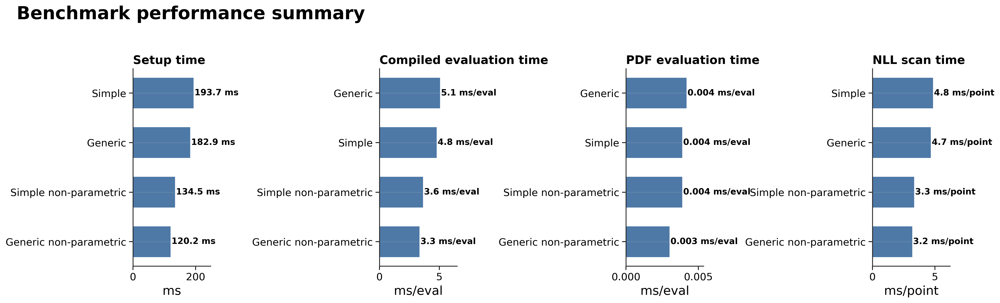

---

### Stage Timing Breakdown

Shows how the total runtime is distributed across the major execution stages, making it easy to identify the dominant performance bottlenecks.

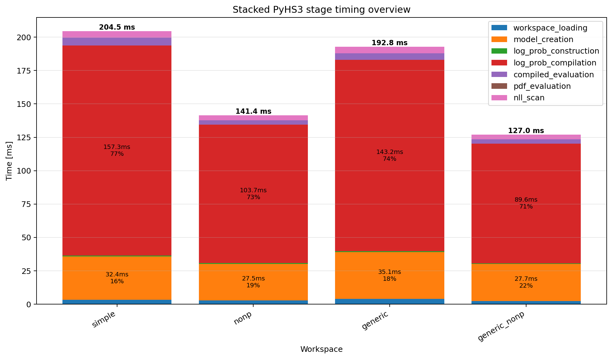

---

### Stage Memory Breakdown

Shows the contribution of each workflow stage to the total peak RSS memory usage for every workspace.

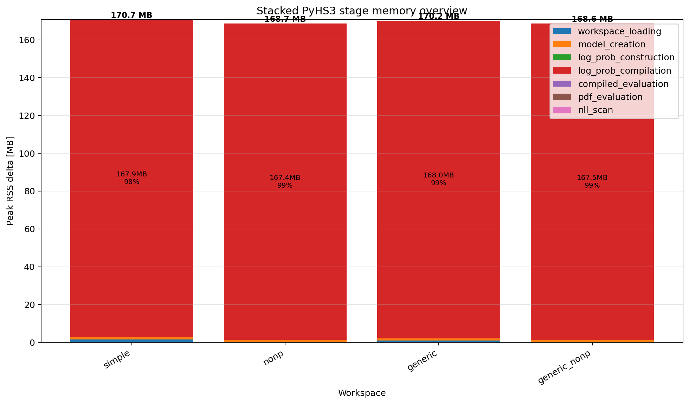


---

## Interpretation

Unlike the benchmark-specific plotting utilities, this script provides a unified overview of the complete benchmark suite.

The generated figures are intended for comparing benchmark categories, identifying workflow bottlenecks, tracking performance regressions, and communicating benchmark results in reports or publications.

Because all benchmark results are normalized before plotting, overview figures remain comparable even when benchmark configurations differ.

---

# Cross-framework benchmarks

---

# Cross-Framework Negative Log-Likelihood Scan Benchmark

## Purpose

Measures the performance and numerical agreement of equivalent negative log-likelihood scans across multiple statistical frameworks.

The benchmark compares identical statistical models implemented in:

- PyHS3;
- pyhf;
- RooFit;
- a manual reference implementation.

Unlike the workflow benchmarks, this benchmark focuses on cross-framework behavior rather than the performance of an individual PyHS3 workflow stage.

It evaluates both execution speed and numerical consistency to ensure that optimization efforts preserve the statistical behavior of the model.

---

## Benchmarked Operation

For each framework the benchmark performs:

1. model construction;
2. first (cold) likelihood evaluation;
3. optional warm-up evaluations;
4. repeated negative log-likelihood scan over the parameter of interest;
5. numerical comparison against the manual reference implementation.

Timing and memory measurements are collected independently for each framework.

---

## Validation

In addition to runtime measurements, the benchmark validates that every framework produces statistically equivalent results.

The following quantities are compared against the manual reference implementation:

- NLL scan shape;
- best-fit parameter location;
- constant likelihood offset.

Frameworks are reported as passing validation only if the numerical agreement falls within the configured tolerances.

---

## Outputs

Benchmark results are written to

```text
results/cross_nll_scan/
```

Generated figures are written to

```text
plots/cross_nll_scan/
```

---

## Example Plots

### Runtime Profile


*Compares model construction, first evaluation, and full scan runtime across all supported frameworks.*

---

### Relative Runtime

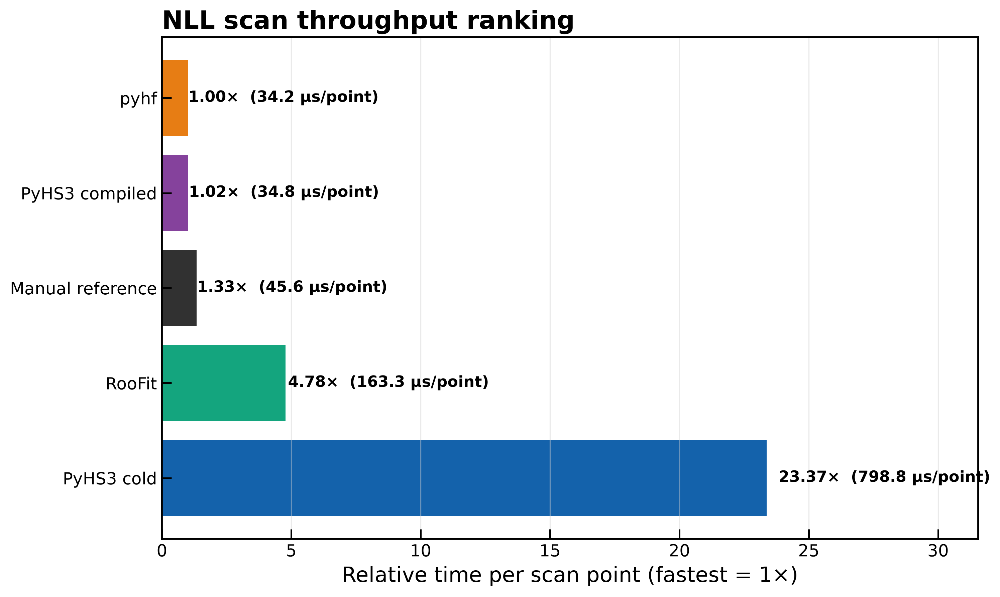

*Shows framework performance relative to the manual reference implementation.*

---

### Numerical Agreement

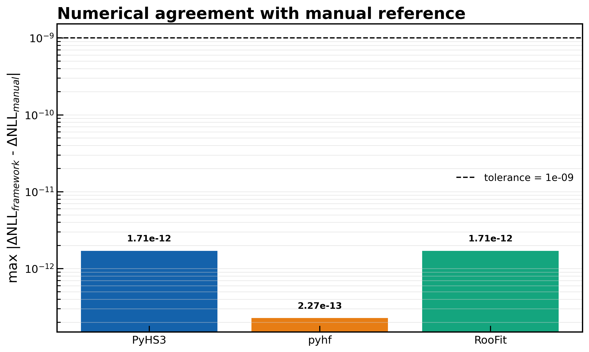

*Verifies that all implementations produce equivalent NLL scan shapes within the configured validation tolerances.*

---

### Scan Profile

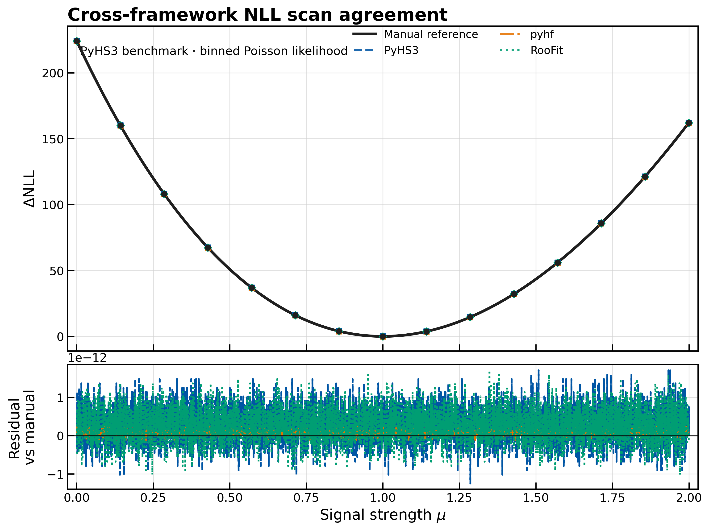

*Shows the negative log-likelihood scan produced by each framework.*

---

### Memory Profile

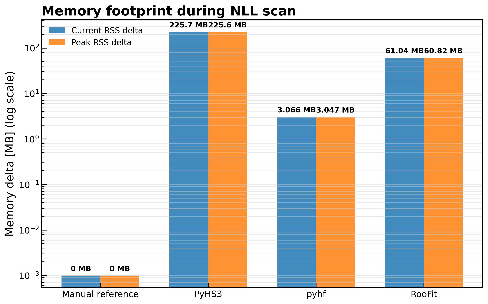

*Compares memory consumption during benchmark execution.*

---

## Interpretation

This benchmark serves two complementary purposes.

First, it provides a direct performance comparison between PyHS3 and established statistical frameworks.

Second, it verifies that optimization work does not alter the numerical properties of the likelihood scan.

Together, these measurements make the benchmark suitable for regression testing, optimization studies, and future cross-version performance tracking.
