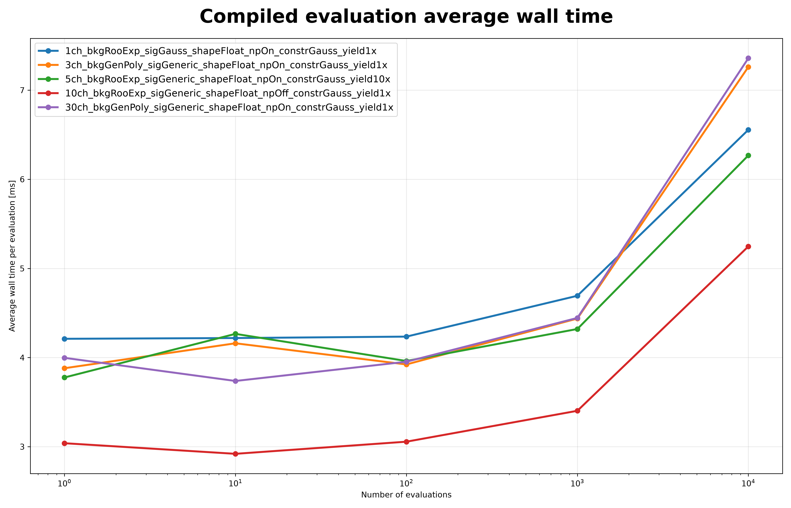
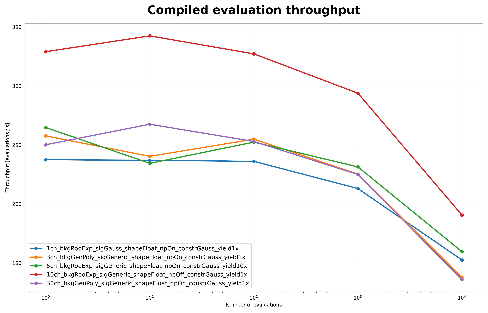

# Compiled Evaluation

On this page, you will learn what the **Compiled Evaluation** benchmark measures, how to run it, and how to interpret its results.

The **Compiled Evaluation** benchmark measures the performance of repeatedly executing an already compiled PyHS3 log-probability graph.

Unlike **Log-Probability Compilation**, this benchmark excludes workspace loading, model creation, graph construction, graph optimization, and compilation. Those stages are performed once during setup. Only execution of the compiled graph is included in the reported measurements.

---

## What This Benchmark Measures

For each benchmark configuration, the benchmark reports

- average wall time per evaluation;
- evaluation throughput;
- current RSS memory increase;
- peak RSS memory increase;
- numerical validation status.

Before timing begins, the benchmark verifies that repeated evaluations produce stable finite outputs.

Details of the measurement methodology are described in **Benchmark Methodology**.

---

## Benchmark Workflow

```text
Workspace
      │
      ▼
Workspace.load(...)
      │
      ▼
Workspace.model(...)
      │
      ▼
model.log_prob
      │
      ▼
Compile Graph
      │
      ▼
Repeated Graph Evaluation
      │
      ├────────► Average Time
      ├────────► Throughput
      ├────────► Memory
      └────────► Validation
      │
      ▼
JSON Report
      │
      ▼
Comparison Plots (optional)
```

Only execution of the compiled graph contributes to the reported benchmark results.

---

## When to Use This Benchmark

This benchmark is useful for

- measuring steady-state compiled execution performance;
- comparing evaluation throughput across benchmark workspaces;
- detecting execution-time regressions;
- evaluating runtime memory usage;
- separating execution costs from compilation overhead.

---

## Running the Benchmark

### Run directly

```bash
pixi run python -m src.run_compiled_evaluation \
    --workspaces \
        inputs/1ch_bkgRooExp_sigGauss_shapeFloat_npOn_constrGauss_yield1x.json \
        inputs/3ch_bkgGenPoly_sigGeneric_shapeFloat_npOn_constrGauss_yield1x.json \
        inputs/5ch_bkgRooExp_sigGeneric_shapeFloat_npOn_constrGauss_yield10x.json \
        inputs/10ch_bkgRooExp_sigGeneric_shapeFloat_npOff_constrGauss_yield1x.json \
        inputs/30ch_bkgGenPoly_sigGeneric_shapeFloat_npOn_constrGauss_yield1x.json \
    --targets L_ch0 \
    --modes FAST_RUN \
    --n-evaluations 1 10 100 1000 10000 \
    --output-dir results/docs_examples/compiled_evaluation \
    --plot \
    --plot-dir docs/assets/plots/compiled_evaluation
```

### Run through the Benchmark Matrix Runner

```bash
pixi run python -m src.run_all_benchmarks \
    --workspaces \
        inputs/1ch_bkgRooExp_sigGauss_shapeFloat_npOn_constrGauss_yield1x.json \
        inputs/3ch_bkgGenPoly_sigGeneric_shapeFloat_npOn_constrGauss_yield1x.json \
        inputs/5ch_bkgRooExp_sigGeneric_shapeFloat_npOn_constrGauss_yield10x.json \
        inputs/10ch_bkgRooExp_sigGeneric_shapeFloat_npOff_constrGauss_yield1x.json \
        inputs/30ch_bkgGenPoly_sigGeneric_shapeFloat_npOn_constrGauss_yield1x.json \
    --benchmarks compiled_evaluation \
    --targets L_ch0 \
    --modes FAST_RUN \
    --n-evaluations 1 10 100 1000 10000 \
    --plot
```

---

## Command-line Arguments

| Argument | Description |
|----------|-------------|
| `--workspaces` | Workspace files to benchmark. |
| `--targets` | Model targets passed to `Workspace.model(...)`. |
| `--modes` | PyTensor compilation modes. |
| `--n-evaluations` | Numbers of repeated compiled graph evaluations. |
| `--output-dir` | Directory for benchmark reports. |
| `--output-name` | Output JSON filename. |
| `--plot` | Generate comparison plots. |
| `--plot-dir` | Directory for generated figures. |

Common benchmark arguments and execution behavior are described in **Benchmark Methodology**.

---

## Generated Outputs

The benchmark produces

```text
results/
└── compiled_evaluation/
    └── compiled_evaluation_result.json
```

and, when plotting is enabled,

```text
docs/
└── assets/
    └── plots/
        └── compiled_evaluation/
            ├── compiled_evaluation_average_time.png
            ├── compiled_evaluation_throughput.png
            ├── compiled_evaluation_current_rss_delta.png
            └── compiled_evaluation_peak_rss_delta.png
```

The report structure and output conventions are documented in **Benchmark Results**.

---

## Results

### Average Evaluation Time



Average execution time remains nearly constant for small and moderate numbers of repeated evaluations.

At very large evaluation counts (10,000 evaluations), execution time increases slightly across all benchmark workspaces, indicating a modest reduction in throughput during long-running evaluation loops.

---

### Evaluation Throughput



Throughput remains largely stable between 1 and 100 evaluations and gradually decreases for larger evaluation counts.

The **10-channel** workspace without nuisance parameters achieves the highest throughput across all tested configurations.

---

### Memory Usage

Current RSS and peak RSS remain effectively unchanged during repeated compiled graph evaluation.

This demonstrates that executing an already compiled graph introduces no measurable additional persistent memory allocation beyond the initial setup and compilation stages.

---

## Implementation Notes

The benchmark includes several implementation choices that improve measurement quality.

- Workspace loading, model creation, graph construction, optimization, and compilation are excluded from the reported timings.
- Repeated evaluations are performed on a single compiled graph.
- Numerical validation is performed before timing begins.
- Memory measurements are collected independently of timing measurements.

The general benchmark methodology is documented in **Benchmark Methodology**.

---

## Limitations

This benchmark measures only repeated execution of an already compiled log-probability graph.

It does **not** measure

- workspace loading;
- model creation;
- graph construction;
- graph canonicalization;
- graph optimization;
- graph compilation;
- PDF evaluation.

These workflow stages are benchmarked separately.

---

## Related Documentation

See also

- **Log-Probability Compilation**
- **PDF Evaluation**
- **NLL Scan**
- **Benchmark Methodology**
- **Benchmark Results**
- **Workspace Lifecycle**
