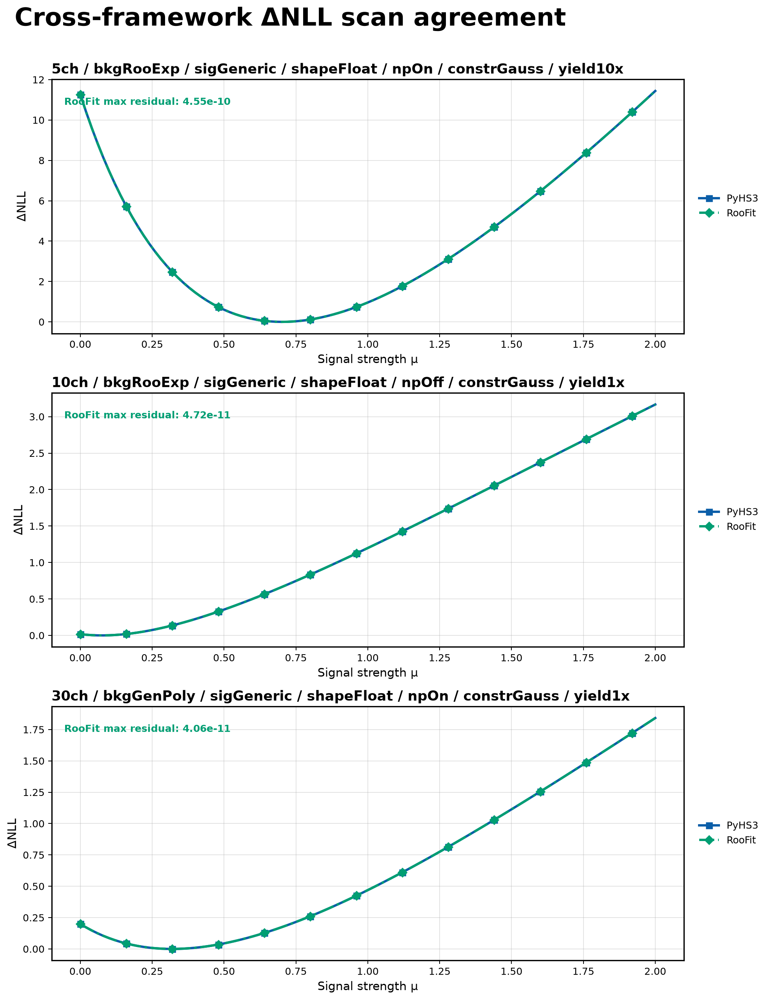
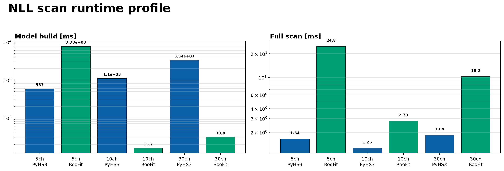
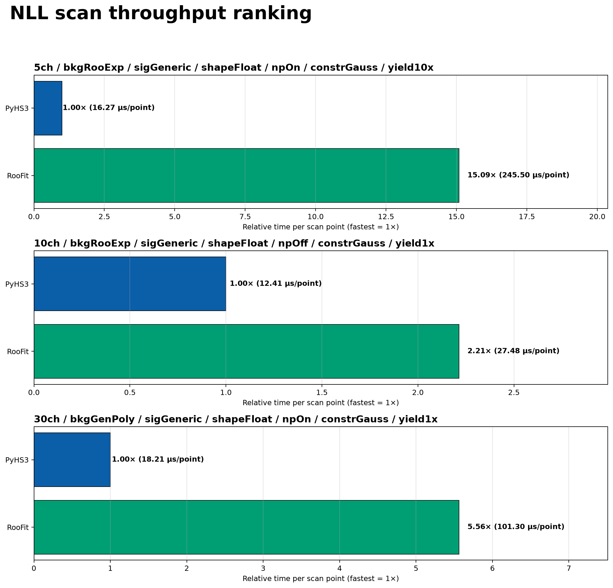
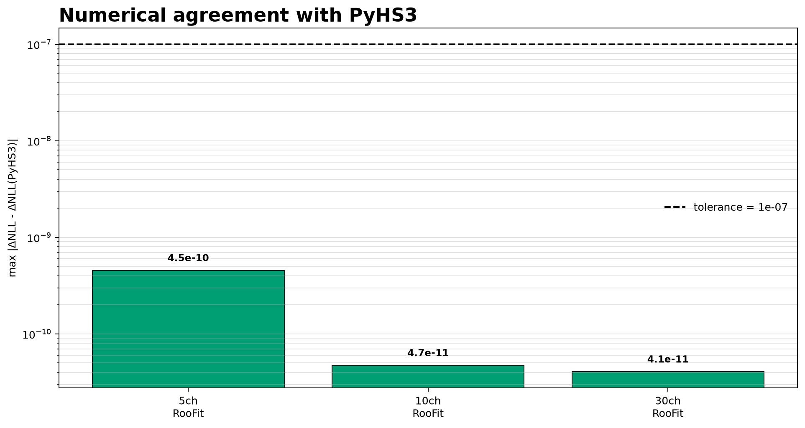
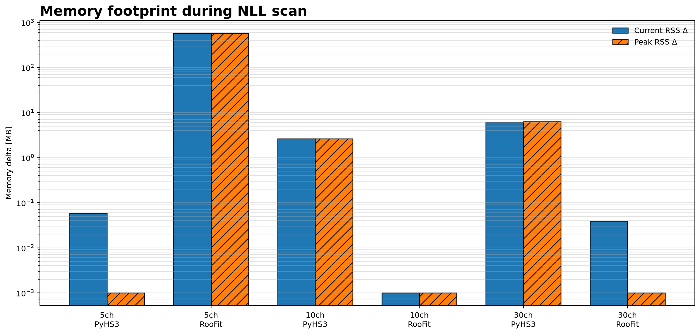

# Cross-framework ΔNLL Scan Benchmark

This benchmark performs an **apples-to-apples numerical and performance comparison** between **PyHS3** and **RooFit** by evaluating the same ΔNLL scan on matching generated workspaces.

Unlike the generic performance benchmarks, this benchmark is designed to verify that both frameworks evaluate **the same statistical model**, using the **same parameter values**, **same observed events**, and **same scan grid** before comparing execution time.

---

## What is compared?

For each workspace, the benchmark

- loads the matching **PyHS3 JSON workspace**;
- loads the corresponding **ROOT RooWorkspace**;
- extracts the identical observed events from the HS3 workspace;
- scans the same POI (`mu_sig`);
- evaluates the normalized PDF at every observed event;
- computes

\[
\mathrm{NLL}(\mu)
=
-\sum_i \log p(x_i \mid \mu)
\]

- converts the result into

\[
\Delta\mathrm{NLL}(\mu)
=
\mathrm{NLL}(\mu)
-
\min_\mu \mathrm{NLL}(\mu)
\]

The PyHS3 ΔNLL curve is used as the numerical reference.

---

## Apples-to-apples methodology

The benchmark intentionally evaluates **exactly the same mathematical quantity** in both frameworks.

For every scan point:

| PyHS3 | RooFit |
|--------|---------|
| evaluates `model.logpdf(...)` | evaluates `pdf.getVal(normSet)` |
| uses the same observed events | uses the same observed events |
| uses identical μ values | uses identical μ values |
| computes `-Σ log(pdf)` | computes `-Σ log(pdf)` |

No framework-specific likelihood builders (`createNLL()`) are used, since those may introduce additional extended or constraint terms depending on the workspace implementation.

Instead, both frameworks evaluate the normalized PDF directly, producing an equivalent unbinned likelihood calculation.

---

## Validation

For every workspace the benchmark verifies

- identical ΔNLL minimum;
- identical ΔNLL shape;
- maximum point-by-point residual;
- numerical agreement within tolerance.

The default tolerances are

```
maximum ΔNLL residual < 1e-7
minimum position agreement < 1e-12
```

---

## Default benchmark inputs

```
inputs/
├── 5ch_bkgRooExp_sigGeneric_shapeFloat_npOn_constrGauss_yield10x.json
├── 10ch_bkgRooExp_sigGeneric_shapeFloat_npOff_constrGauss_yield1x.json
└── 30ch_bkgGenPoly_sigGeneric_shapeFloat_npOn_constrGauss_yield1x.json
```

with the corresponding ROOT workspaces

```
inputs/
├── 5ch_bkgRooExp_sigGeneric_shapeFloat_npOn_constrGauss_yield10x.root
├── 10ch_bkgRooExp_sigGeneric_shapeFloat_npOff_constrGauss_yield1x.root
└── 30ch_bkgGenPoly_sigGeneric_shapeFloat_npOn_constrGauss_yield1x.root
```

---

## Running the benchmark

Single workspace

```bash
pixi run python -m src.run_cross_nll_scan \
    --workspaces inputs/5ch_bkgRooExp_sigGeneric_shapeFloat_npOn_constrGauss_yield10x.json \
    --frameworks pyhs3 roofit \
    --analysis L_ch0 \
    --poi mu_sig \
    --mode FAST_RUN \
    --mu-min 0.0 \
    --mu-max 2.0 \
    --n-points 101 \
    --output-dir results/docs_examples/cross_nll_scan \
    --plot-dir docs/assets/plots/cross_nll_scan
```

Multiple workspaces

```bash
pixi run python -m src.run_cross_nll_scan \
    --workspaces \
        inputs/5ch_bkgRooExp_sigGeneric_shapeFloat_npOn_constrGauss_yield10x.json \
        inputs/10ch_bkgRooExp_sigGeneric_shapeFloat_npOff_constrGauss_yield1x.json \
        inputs/30ch_bkgGenPoly_sigGeneric_shapeFloat_npOn_constrGauss_yield1x.json \
    --frameworks pyhs3 roofit \
    --analysis L_ch0 \
    --poi mu_sig \
    --mode FAST_RUN \
    --mu-min 0.0 \
    --mu-max 2.0 \
    --n-points 101 \
    --output-dir results/docs_examples/cross_nll_scan \
    --plot-dir docs/assets/plots/cross_nll_scan
```

---

## Generated plots

### Cross-framework ΔNLL agreement

Shows the ΔNLL curves produced by both frameworks.



---

### Runtime profile

Separately reports

- model construction time;
- full ΔNLL scan time.



---

### Relative throughput

Ranks frameworks according to scan throughput (μs per scan point).



---

### Numerical agreement

Reports the maximum residual with respect to the PyHS3 reference.

The dashed line indicates the validation tolerance.



---

### Memory footprint

Reports the current and peak RSS increase during the benchmark.



---

## Output

The benchmark stores

```
results/docs_examples/cross_nll_scan/
└── cross_nll_scan_result.json
```

which contains

- benchmark configuration;
- scan grid;
- timing measurements;
- memory measurements;
- ΔNLL curves;
- numerical validation;
- summary status.

---

## Interpretation

A successful benchmark reports

```
Status: success
Validated: N / N
```

meaning that

- both frameworks produced identical ΔNLL minima;
- ΔNLL curves agree within numerical precision;
- both implementations evaluated the same statistical quantity.

Any validation failure indicates a genuine numerical disagreement rather than a performance difference.
