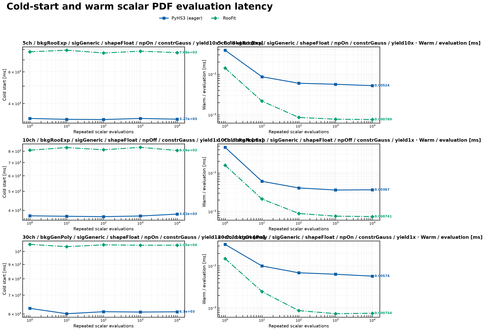
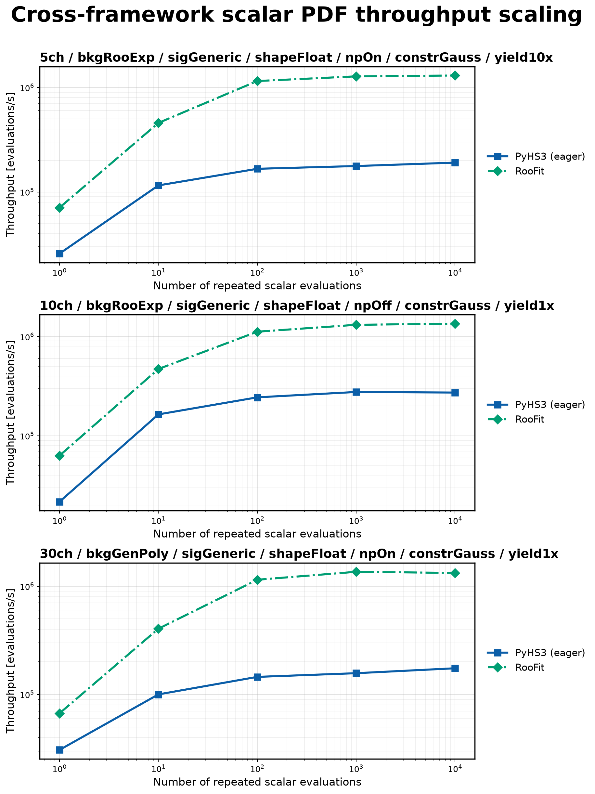
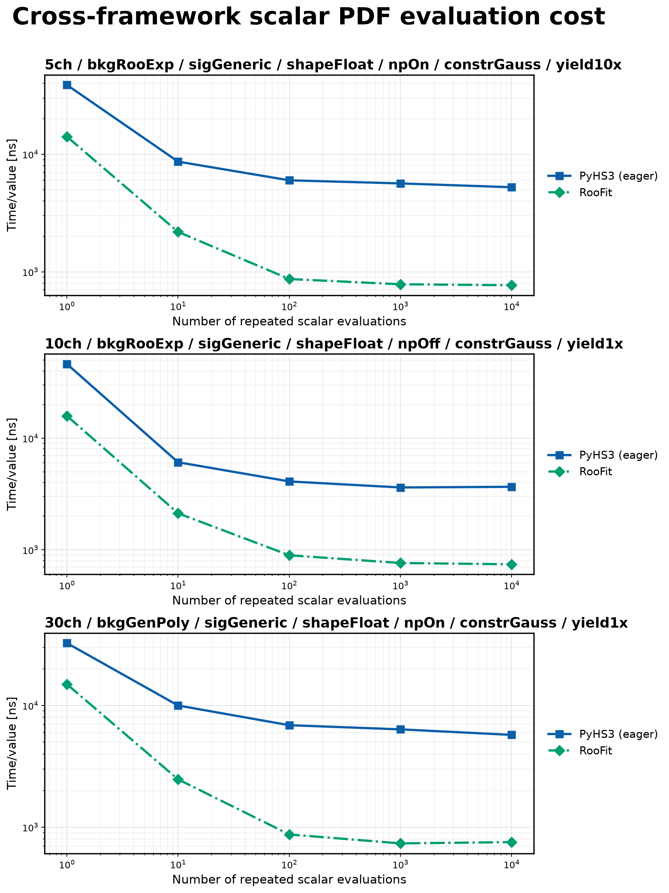
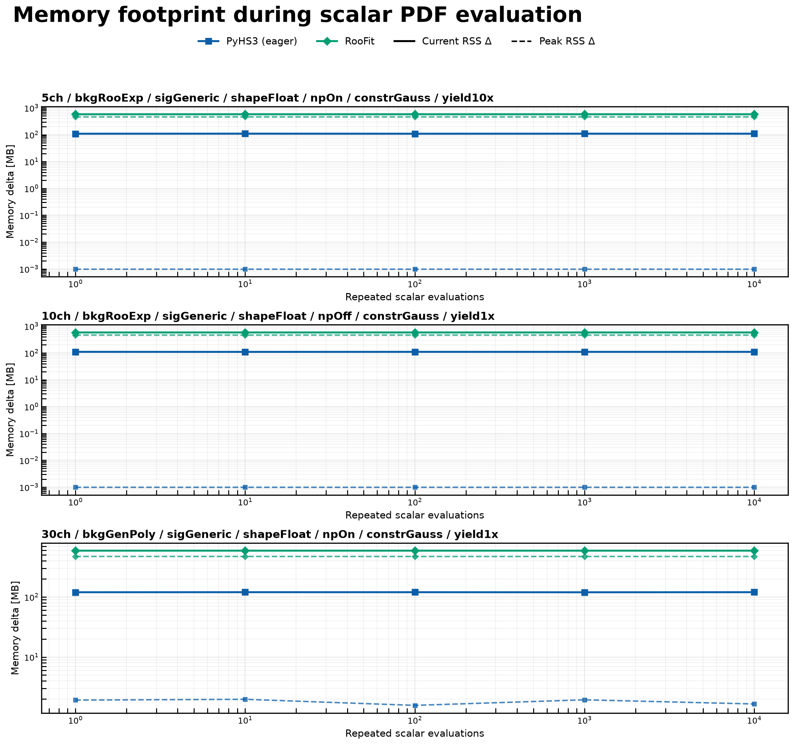
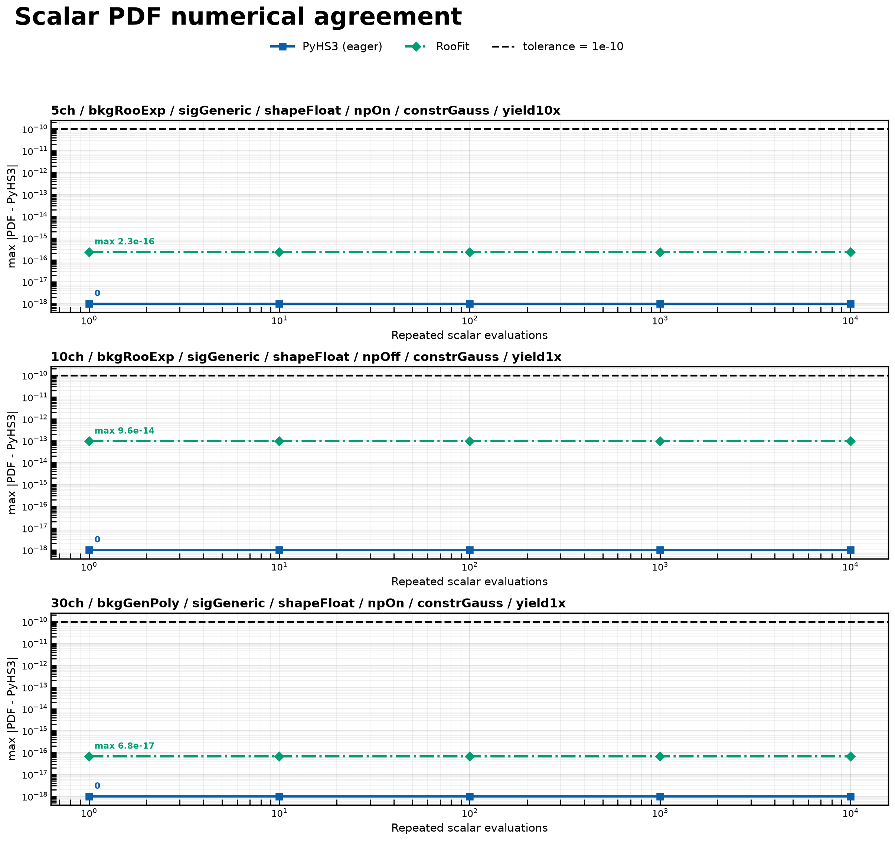

# Cross-framework Scalar PDF Evaluation

The `cross_scalar_pdf_evaluation` benchmark compares repeated scalar probability density function (PDF) evaluation between **PyHS3 (eager execution)** and **ROOT RooFit** using matching HS3 and RooFit workspaces.

Unlike the compiled evaluation benchmark, this benchmark measures **only normalized scalar PDF evaluation**. Compiled PyHS3 graph evaluation is intentionally excluded because it represents a different execution path and therefore would not constitute an apples-to-apples comparison.

### Workspaces

The benchmark was executed on three representative workspace pairs:

- `5ch_bkgRooExp_sigGeneric_shapeFloat_npOn_constrGauss_yield10x`
- `10ch_bkgRooExp_sigGeneric_shapeFloat_npOff_constrGauss_yield1x`
- `30ch_bkgGenPoly_sigGeneric_shapeFloat_npOn_constrGauss_yield1x`

Each benchmark measures:

1. Cold-start latency
2. Warm (repeated) scalar PDF evaluation latency
3. Throughput
4. RSS memory usage
5. Numerical agreement

---

## Apples-to-apples comparison

To ensure that both frameworks perform the same computation, the benchmark uses the following methodology:

- PyHS3 evaluates the scalar PDF using `model.pdf(...)`;
- RooFit evaluates the corresponding normalized PDF using `pdf.getVal(norm_set)`;
- the RooFit normalization set contains only the observable (`x`) and excludes floating model parameters;
- both frameworks evaluate matching workspaces initialized with identical parameter values.

Consequently, both implementations evaluate the same normalized scalar probability density function, making this benchmark an apples-to-apples comparison of scalar PDF evaluation performance.

---

## Cold-start and warm evaluation latency

Cold-start latency measures the one-time initialization required before the first scalar PDF evaluation. Warm latency measures the average runtime of repeated PDF evaluations after initialization has completed.

Across all tested workspaces, RooFit exhibits a substantially larger cold-start latency than PyHS3 because additional initialization is required before repeated evaluations can begin.

After initialization, both frameworks perform scalar PDF evaluation very efficiently. RooFit consistently achieves lower warm evaluation latency, while PyHS3 maintains stable execution times of only a few microseconds per evaluation.

---

## Throughput scaling

This benchmark measures how throughput changes as the number of repeated scalar PDF evaluations increases.

Throughput increases rapidly once initialization costs are amortized. RooFit reaches approximately one million scalar PDF evaluations per second for the tested workspaces, whereas PyHS3 consistently achieves several hundred thousand evaluations per second.

Both implementations exhibit stable throughput once warm execution dominates the benchmark runtime.

---

## Evaluation cost

This metric reports the average execution time required for a single scalar PDF evaluation.

The average evaluation cost decreases rapidly as initialization overhead becomes negligible.

For large numbers of repeated evaluations, RooFit requires less than one microsecond per evaluation, while PyHS3 consistently evaluates scalar PDFs in only a few microseconds.

---

## Memory footprint

This benchmark records both the current RSS increase and the peak RSS increase observed during execution.

PyHS3 consistently requires considerably less resident memory than RooFit for all tested workspaces.

Memory usage remains nearly constant as the number of repeated evaluations increases, indicating that the majority of memory allocation occurs during initialization rather than during repeated scalar PDF evaluation.

---

## Numerical agreement

Numerical agreement is evaluated relative to the PyHS3 reference implementation.

The observed numerical differences remain close to machine precision for all benchmark configurations.

Maximum absolute differences are approximately:

- **2.3 × 10⁻¹⁶** for the 5-channel workspace,
- **9.6 × 10⁻¹⁴** for the 10-channel workspace,
- **6.8 × 10⁻¹⁷** for the 30-channel workspace.

All measured differences remain several orders of magnitude below the validation tolerance (`1 × 10⁻¹⁰`), confirming that both frameworks evaluate numerically equivalent normalized scalar PDF values.

---

## Summary

The benchmark demonstrates several important characteristics of the current implementations:

- PyHS3 and RooFit evaluate numerically equivalent normalized scalar PDFs;
- RooFit incurs a larger one-time initialization cost;
- RooFit achieves higher steady-state scalar PDF throughput;
- PyHS3 consistently requires substantially less resident memory;
- both implementations exhibit stable performance across representative workspace sizes.

Overall, this benchmark provides an apples-to-apples comparison of normalized scalar PDF evaluation between PyHS3 eager execution and RooFit while intentionally excluding compiled graph execution, which is benchmarked separately.
