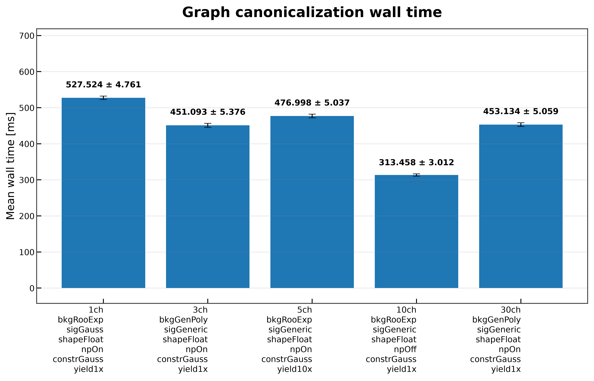
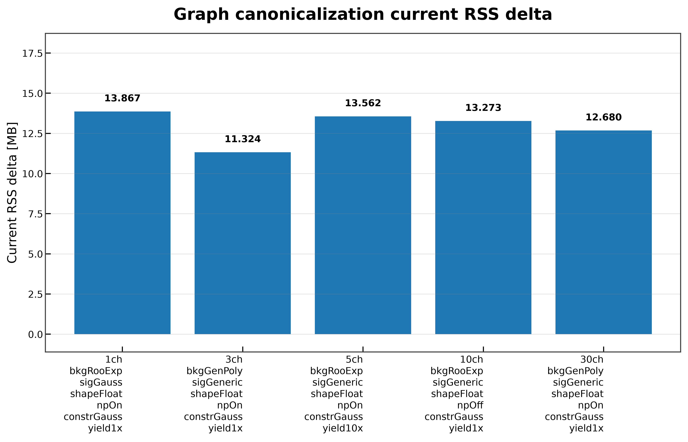
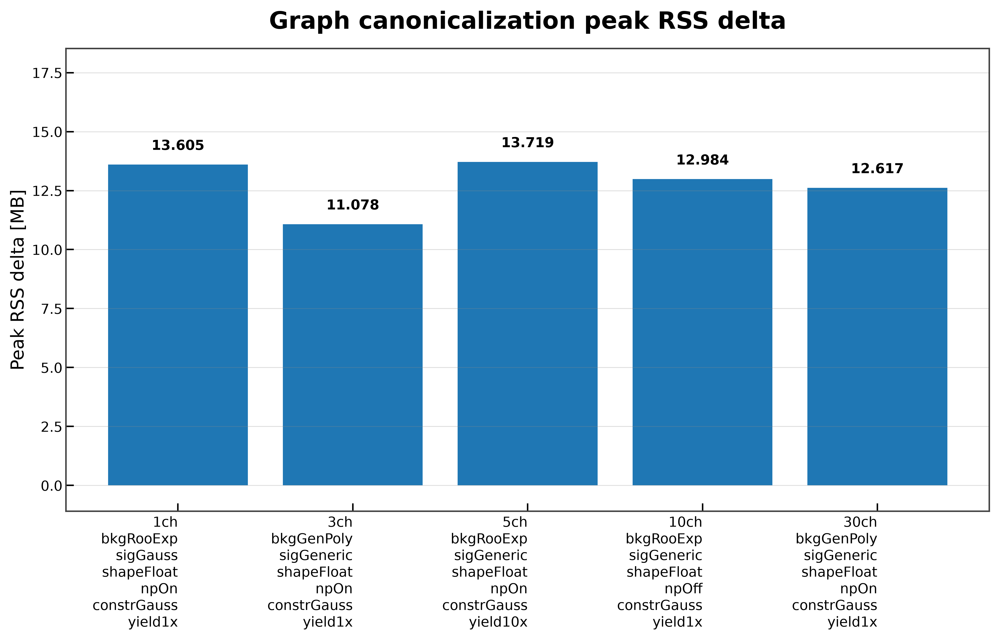

# Graph Canonicalization

On this page, you will learn what the **Graph Canonicalization** benchmark measures, how to run it, and how to interpret its results.

The **Graph Canonicalization** benchmark measures the time and memory required to apply PyTensor's canonicalization rewrites to a symbolic `FunctionGraph`.

Workspace loading, model creation, symbolic log-probability construction, and `FunctionGraph` creation are treated as setup steps and are excluded from the reported measurements. Later optimization passes and JAX compilation are benchmarked separately.

---

## What This Benchmark Measures

The benchmark measures only the execution of the PyTensor `canonicalize` rewrite database.

For each benchmark configuration, it reports

- mean wall time;
- median wall time;
- standard deviation;
- current RSS memory increase;
- peak RSS memory increase;
- graph simplification statistics.

During validation, the benchmark records

- graph inputs;
- graph outputs;
- ApplyNodes before canonicalization;
- ApplyNodes after canonicalization.

Only the canonicalization pass contributes to the reported timings.

Details of the measurement methodology are described in **Benchmark Methodology**.

---

## Benchmark Workflow

```text
Workspace
      │
      ▼
Workspace.load(...)
      │
      ▼
Workspace.model(...)
      │
      ▼
model.log_prob
      │
      ▼
FunctionGraph(...)
      │
      ▼
Canonicalization
      │
      ├────────► Graph Validation
      ├────────► Timing Statistics
      └────────► Memory Statistics
      │
      ▼
JSON Report
      │
      ▼
Comparison Plots (optional)
```

Only graph canonicalization contributes to the reported benchmark results.

---

## When to Use This Benchmark

This benchmark is useful for

- measuring canonicalization overhead;
- comparing canonicalization across benchmark workspaces;
- evaluating memory usage during graph normalization;
- detecting canonicalization regressions;
- measuring graph simplification before later optimization stages.

---

## Running the Benchmark

### Run directly

```bash
pixi run python -m src.run_graph_canonicalization \
    --workspaces \
        inputs/1ch_bkgRooExp_sigGauss_shapeFloat_npOn_constrGauss_yield1x.json \
        inputs/3ch_bkgGenPoly_sigGeneric_shapeFloat_npOn_constrGauss_yield1x.json \
        inputs/5ch_bkgRooExp_sigGeneric_shapeFloat_npOn_constrGauss_yield10x.json \
        inputs/10ch_bkgRooExp_sigGeneric_shapeFloat_npOff_constrGauss_yield1x.json \
        inputs/30ch_bkgGenPoly_sigGeneric_shapeFloat_npOn_constrGauss_yield1x.json \
    --targets L_ch0 \
    --modes FAST_RUN \
    --n-runs 30 \
    --output-dir results/docs_examples/graph_canonicalization \
    --plot \
    --plot-dir docs/assets/plots/graph_canonicalization
```

### Run through the Benchmark Matrix Runner

```bash
pixi run python -m src.run_all_benchmarks \
    --workspaces \
        inputs/1ch_bkgRooExp_sigGauss_shapeFloat_npOn_constrGauss_yield1x.json \
        inputs/3ch_bkgGenPoly_sigGeneric_shapeFloat_npOn_constrGauss_yield1x.json \
        inputs/5ch_bkgRooExp_sigGeneric_shapeFloat_npOn_constrGauss_yield10x.json \
        inputs/10ch_bkgRooExp_sigGeneric_shapeFloat_npOff_constrGauss_yield1x.json \
        inputs/30ch_bkgGenPoly_sigGeneric_shapeFloat_npOn_constrGauss_yield1x.json \
    --benchmarks graph_canonicalization \
    --targets L_ch0 \
    --modes FAST_RUN \
    --n-runs 30 \
    --plot
```

---

## Command-line Arguments

| Argument | Description |
|----------|-------------|
| `--workspaces` | Workspace files to benchmark. |
| `--targets` | Model targets passed to `Workspace.model(...)`. |
| `--modes` | PyTensor compilation modes. |
| `--n-runs` | Number of repeated canonicalization measurements. |
| `--output-dir` | Directory for benchmark reports. |
| `--output-name` | Output JSON filename. |
| `--plot` | Generate comparison plots. |
| `--plot-dir` | Directory for generated figures. |

Common benchmark arguments and execution behavior are described in **Benchmark Methodology**.

---

## Generated Outputs

The benchmark produces

```text
results/
└── graph_canonicalization/
    └── graph_canonicalization_result.json
```

and, when plotting is enabled,

```text
docs/
└── assets/
    └── plots/
        └── graph_canonicalization/
            ├── graph_canonicalization_wall_time.png
            ├── graph_canonicalization_current_rss_delta.png
            └── graph_canonicalization_peak_rss_delta.png
```

The report structure and output conventions are documented in **Benchmark Results**.

---

## Results

### Wall-Time Comparison



Canonicalization completes in approximately **313–528 ms** across the benchmark workspace collection.

The **10-channel** workspace is the fastest because disabling nuisance parameters produces a smaller symbolic graph. Overall, canonicalization contributes only a few hundred milliseconds to the compilation pipeline.

---

### Current RSS Memory



Canonicalization increases resident memory by approximately **12–14 MB** across all benchmark workspaces.

The memory footprint remains stable regardless of workspace complexity.

---

### Peak RSS Memory



Peak RSS closely follows current RSS.

The benchmark shows very little temporary memory allocation during canonicalization, indicating that the rewrite pass is memory efficient.

---

### Graph Simplification

Canonicalization also validates that the symbolic graph becomes substantially simpler after applying the rewrite rules.

| Workspace | ApplyNodes Before | ApplyNodes After | Reduction |
|-----------|------------------:|-----------------:|----------:|
| 1 channel | 101 | 51 | **−50** |
| 3 channels | 94 | 48 | **−46** |
| 5 channels | 97 | 48 | **−49** |
| 10 channels | 80 | 29 | **−51** |
| 30 channels | 94 | 48 | **−46** |

Across the benchmark dataset, approximately **half of the ApplyNodes** are removed during canonicalization, demonstrating that the rewrite pass effectively simplifies the symbolic computation graph before later optimization and compilation stages.

---

## Implementation Notes

The benchmark includes several implementation choices that improve measurement quality.

- Workspace loading is excluded from the reported timings.
- Model creation, symbolic graph construction, and `FunctionGraph` creation are treated as setup.
- Each benchmark canonicalizes a freshly constructed graph.
- Graph validation is performed before results are recorded.

The general benchmark methodology is documented in **Benchmark Methodology**.

---

## Limitations

This benchmark measures only symbolic graph canonicalization.

It does **not** measure

- workspace loading;
- model creation;
- symbolic graph construction;
- graph optimization;
- graph compilation;
- compiled evaluation;
- PDF evaluation;
- likelihood evaluation.

These workflow stages are benchmarked separately.

---

## Related Documentation

See also

- **Log-Probability Construction**
- **Graph Optimization**
- **Log-Probability Compilation**
- **Compiled Evaluation**
- **Benchmark Methodology**
- **Benchmark Results**
- **Workspace Lifecycle**
