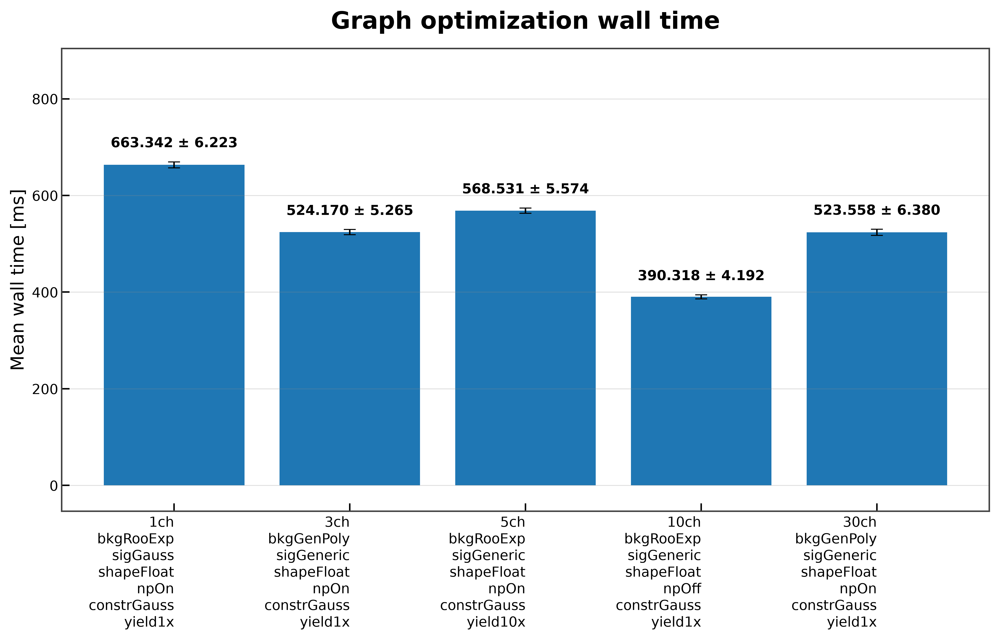
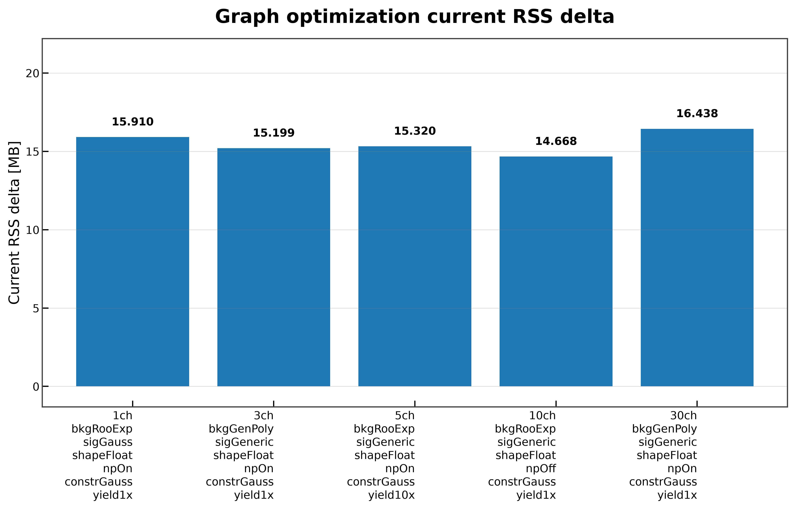
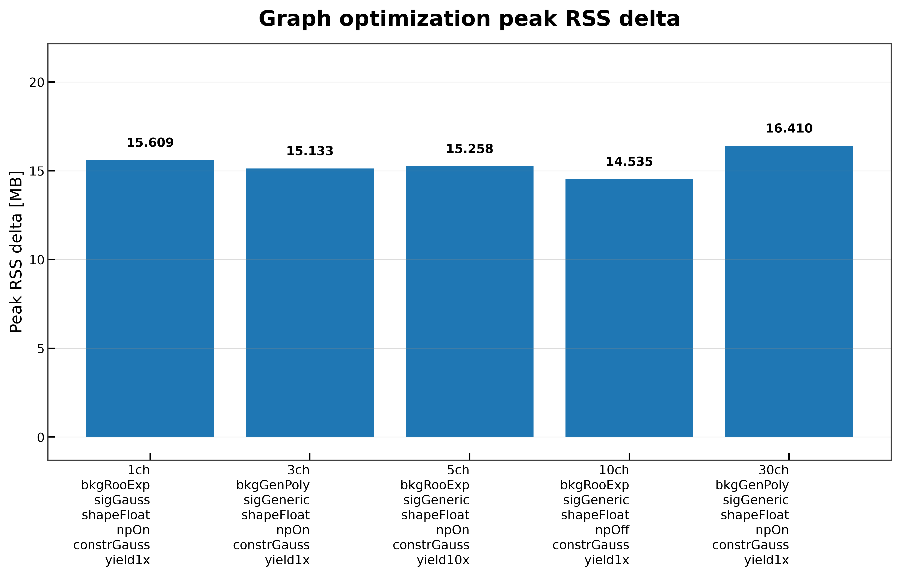

# Graph Optimization

The **graph optimization** benchmark measures the time and memory required to optimize a PyTensor `FunctionGraph` using the JAX optimizer. During this stage, graph rewrite passes simplify the symbolic computation graph before it is compiled into an executable function.

## What is measured

For each benchmark run the benchmark:

1. Constructs the symbolic log-probability graph.
2. Builds a PyTensor `FunctionGraph`.
3. Applies the JAX graph optimizer.
4. Measures:
   - wall time,
   - current RSS increase,
   - peak RSS increase.
5. Validates the optimized graph by reporting:
   - graph inputs,
   - graph outputs,
   - ApplyNodes before optimization,
   - ApplyNodes after optimization.

Wall time is measured over **200 benchmark iterations**, while memory statistics are collected once in a fresh subprocess.

---

## Benchmark Results

### Wall time

Graph optimization completes in approximately **390–663 ms** across the benchmark workspaces.

| Workspace | Mean wall time |
|-----------|---------------:|
| 1-channel | **663.342 ± 6.223 ms** |
| 3-channel | **524.170 ± 5.265 ms** |
| 5-channel | **568.531 ± 5.574 ms** |
| 10-channel | **390.318 ± 4.192 ms** |
| 30-channel | **523.558 ± 6.380 ms** |

The optimization stage remains well below one second for every tested workspace.

---

### Current RSS increase

Graph optimization increases resident memory by approximately **15–16 MB**.

| Workspace | Current RSS increase |
|-----------|---------------------:|
| 1-channel | **15.910 MB** |
| 3-channel | **15.199 MB** |
| 5-channel | **15.320 MB** |
| 10-channel | **14.668 MB** |
| 30-channel | **16.438 MB** |

Memory usage is highly consistent across all benchmark configurations.

---

### Peak RSS increase

Peak RSS closely matches the current RSS increase, indicating that graph optimization introduces almost no temporary memory overhead.

| Workspace | Peak RSS increase |
|-----------|------------------:|
| 1-channel | **15.609 MB** |
| 3-channel | **15.133 MB** |
| 5-channel | **15.258 MB** |
| 10-channel | **14.535 MB** |
| 30-channel | **16.410 MB** |

The difference between current and peak RSS remains below **0.4 MB** for every benchmark.

---

## Graph validation

Besides timing and memory, the benchmark validates that optimization successfully rewrites the symbolic graph.

For every workspace it reports:

- graph inputs,
- graph outputs,
- ApplyNodes before optimization,
- ApplyNodes after optimization,
- reduction in ApplyNodes.

Across the benchmark suite, optimization consistently removes a substantial number of ApplyNodes before compilation, demonstrating that the optimizer effectively simplifies the computation graph.

---

## Summary

The graph optimization benchmark shows that PyTensor efficiently simplifies symbolic computation graphs while introducing only moderate memory overhead.

Across all benchmark workspaces:

- graph optimization completes in **390–663 ms**;
- current RSS increases by approximately **15–16 MB**;
- peak RSS is nearly identical to current RSS;
- optimization consistently reduces graph complexity before compilation.

These results indicate that graph optimization is an inexpensive preprocessing stage that prepares the computation graph for efficient compilation.
