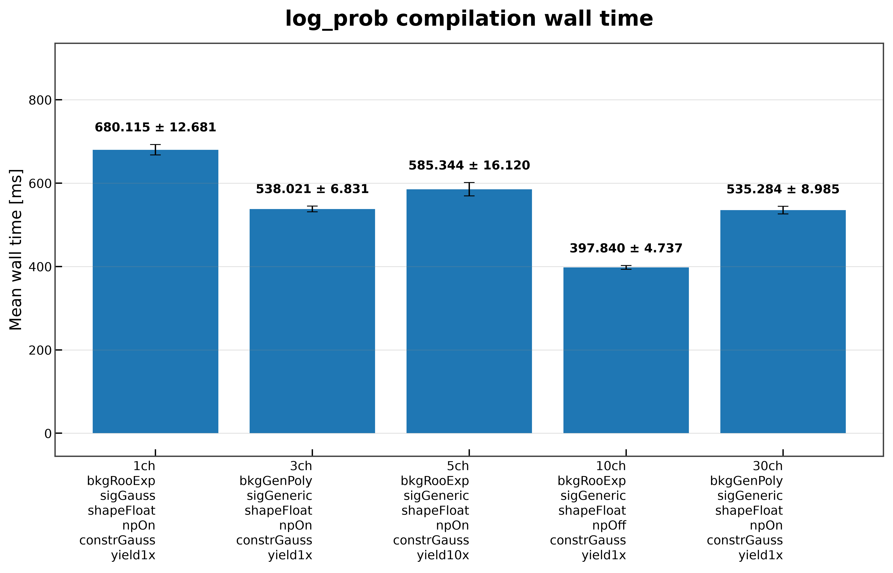
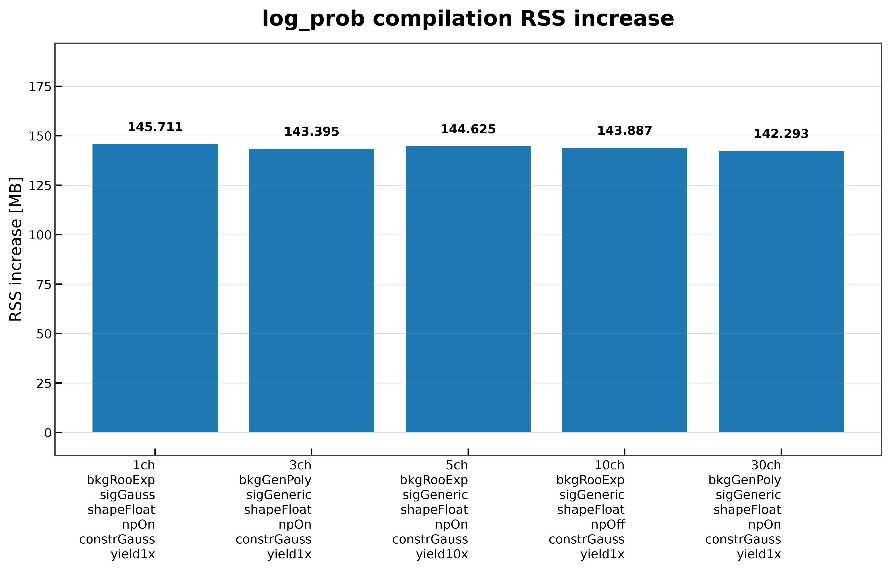
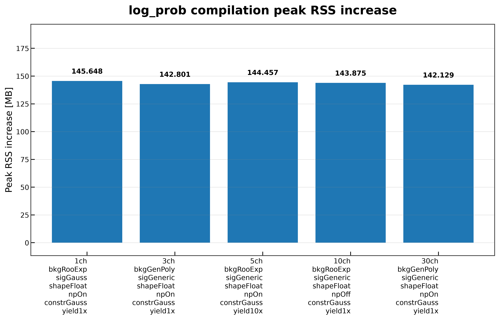

# Log Probability Compilation

This benchmark measures the cost of compiling an already constructed `log_prob` graph into an executable JAX function. Unlike the log probability construction benchmark, model creation and graph construction are performed beforehand and are excluded from the measured region.

The benchmark reports:

- Wall time required to compile the computation graph.
- Current RSS increase during compilation.
- Peak RSS increase during compilation.
- Validation that the compiled graph executes successfully.

---

## What is measured?

The measured operation is equivalent to:

```python
compiled = compile_log_prob(log_prob)
```

The following steps are **not** included in the measured time:

- loading the workspace,
- creating the statistical model,
- constructing `model.log_prob`.

Each timing iteration rebuilds the model and `log_prob` before starting the timer, ensuring that only compilation is measured. The implementation also validates that the compiled graph executes successfully and returns a finite value after compilation.

---

## Running the benchmark

Run the benchmark directly:

```bash
pixi run python -m src.run_log_prob_compilation \
    --workspaces \
        inputs/1ch_bkgRooExp_sigGauss_shapeFloat_npOn_constrGauss_yield1x.json \
        inputs/3ch_bkgGenPoly_sigGeneric_shapeFloat_npOn_constrGauss_yield1x.json \
        inputs/5ch_bkgRooExp_sigGeneric_shapeFloat_npOn_constrGauss_yield10x.json \
        inputs/10ch_bkgRooExp_sigGeneric_shapeFloat_npOff_constrGauss_yield1x.json \
        inputs/30ch_bkgGenPoly_sigGeneric_shapeFloat_npOn_constrGauss_yield1x.json \
    --targets L_ch0 \
    --modes FAST_RUN \
    --n-runs 30 \
    --output-dir results/docs_examples/log_prob_compilation \
    --plot \
    --plot-dir docs/assets/plots/log_prob_compilation
```

or execute it together with the benchmark runner:

```bash
pixi run python -m src.run_all_benchmarks \
    --workspaces \
        inputs/1ch_bkgRooExp_sigGauss_shapeFloat_npOn_constrGauss_yield1x.json \
        inputs/3ch_bkgGenPoly_sigGeneric_shapeFloat_npOn_constrGauss_yield1x.json \
        inputs/5ch_bkgRooExp_sigGeneric_shapeFloat_npOn_constrGauss_yield10x.json \
        inputs/10ch_bkgRooExp_sigGeneric_shapeFloat_npOff_constrGauss_yield1x.json \
        inputs/30ch_bkgGenPoly_sigGeneric_shapeFloat_npOn_constrGauss_yield1x.json \
    --benchmarks log_prob_compilation \
    --targets L_ch0 \
    --modes FAST_RUN \
    --n-runs 30 \
    --plot
```

---

## Results

### Wall time



Compilation requires several hundred milliseconds depending on the workspace. The fastest observed configuration is the 10-channel model without nuisance parameters (~398 ms), while the 1-channel workspace requires about 680 ms. The remaining workspaces compile in approximately 535–585 ms.

---

### Current RSS increase



Compilation consistently allocates roughly **143–146 MB** of additional resident memory regardless of workspace complexity.

---

### Peak RSS increase



Peak memory follows the same pattern as current RSS, remaining close to **143–146 MB** for every tested workspace.

---

## Summary

The benchmark shows that JAX compilation has an almost constant memory footprint across the tested workspaces. Around **145 MB** of temporary memory is required during compilation independent of the statistical model size.

Compilation latency varies between roughly **0.40 s** and **0.68 s**. The fastest configuration is the 10-channel model without nuisance parameters, while the smallest workspace requires the longest compilation time. Overall, compilation cost is dominated more by graph structure than by workspace size, and memory usage remains stable across all tested configurations. The benchmark also verifies that every compiled graph executes successfully and produces a finite result.
