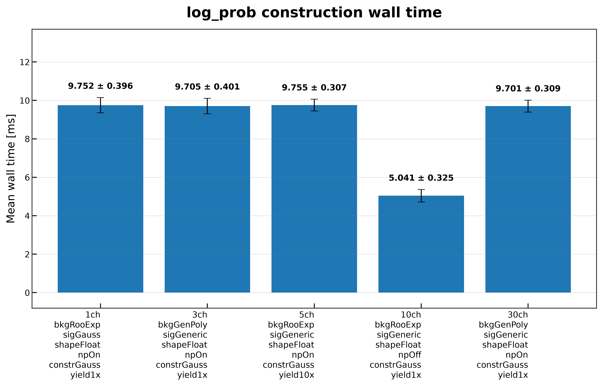
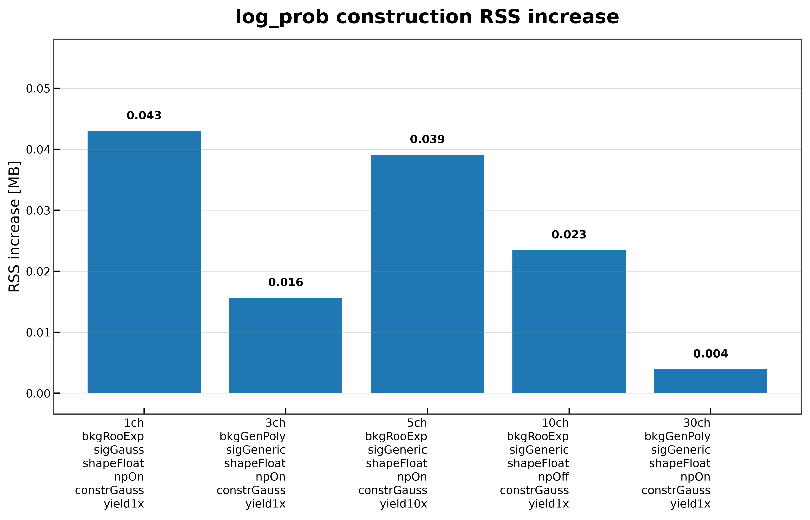
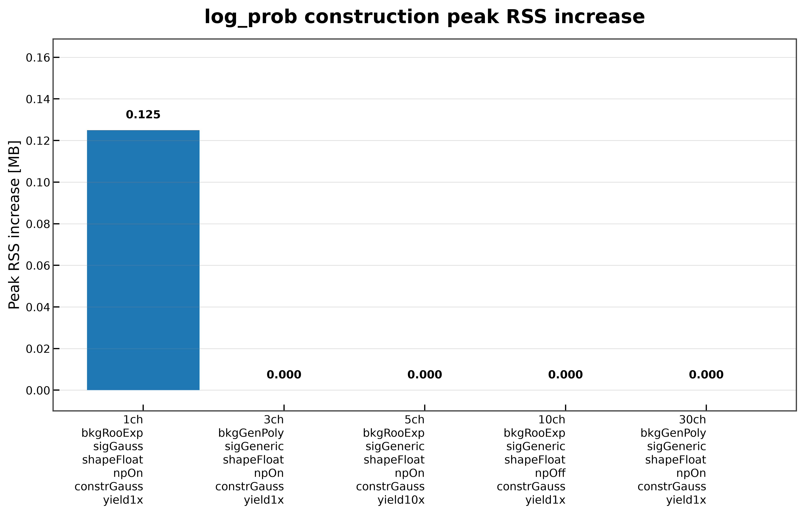

# Log-Probability Construction

On this page, you will learn what the **Log-Probability Construction** benchmark measures, how to run it, and how to interpret its results.

The **Log-Probability Construction** benchmark measures the time and memory required to construct the symbolic PyTensor log-probability graph from an already created statistical model.

Workspace loading and model creation are treated as setup steps and are excluded from the reported measurements. Likewise, graph compilation and numerical evaluation are benchmarked separately.

---

# What This Benchmark Measures

The benchmark measures only the execution of

```python
log_prob = model.log_prob
```

For each benchmark configuration, it reports

- mean wall time;
- median wall time;
- standard deviation;
- current RSS memory increase;
- peak RSS memory increase;
- graph validation status.

The benchmark measures symbolic graph construction only. Compilation and numerical execution are intentionally excluded.

Details of the measurement methodology are described in **Benchmark Methodology**.

---

# Benchmark Workflow

```text
Workspace
      │
      ▼
Workspace.load(...)
      │
      ▼
Workspace.model(...)
      │
      ▼
model.log_prob
      │
      ├────────► Graph Validation
      ├────────► Timing Statistics
      └────────► Memory Statistics
      │
      ▼
JSON Report
      │
      ▼
Comparison Plots (optional)
```

Only symbolic graph construction contributes to the reported benchmark results.

---

# When to Use This Benchmark

This benchmark is useful for

- measuring symbolic graph construction overhead;
- comparing graph construction across benchmark workspaces;
- evaluating memory consumption before compilation;
- detecting graph-construction regressions;
- separating graph construction from compilation costs.

---

# Running the Benchmark

## Run directly

```bash
pixi run python -m src.run_log_prob_construction \
    --workspaces \
        inputs/1ch_bkgRooExp_sigGauss_shapeFloat_npOn_constrGauss_yield1x.json \
        inputs/3ch_bkgGenPoly_sigGeneric_shapeFloat_npOn_constrGauss_yield1x.json \
        inputs/5ch_bkgRooExp_sigGeneric_shapeFloat_npOn_constrGauss_yield10x.json \
        inputs/10ch_bkgRooExp_sigGeneric_shapeFloat_npOff_constrGauss_yield1x.json \
        inputs/30ch_bkgGenPoly_sigGeneric_shapeFloat_npOn_constrGauss_yield1x.json \
    --targets L_ch0 \
    --modes FAST_RUN \
    --n-runs 30 \
    --output-dir results/log_prob_construction \
    --plot \
    --plot-dir docs/assets/plots/log_prob_construction
```

## Run through the Benchmark Matrix Runner

```bash
pixi run python -m src.run_all_benchmarks \
    --workspaces \
        inputs/1ch_bkgRooExp_sigGauss_shapeFloat_npOn_constrGauss_yield1x.json \
        inputs/3ch_bkgGenPoly_sigGeneric_shapeFloat_npOn_constrGauss_yield1x.json \
        inputs/5ch_bkgRooExp_sigGeneric_shapeFloat_npOn_constrGauss_yield10x.json \
        inputs/10ch_bkgRooExp_sigGeneric_shapeFloat_npOff_constrGauss_yield1x.json \
        inputs/30ch_bkgGenPoly_sigGeneric_shapeFloat_npOn_constrGauss_yield1x.json \
    --benchmarks log_prob_construction \
    --targets L_ch0 \
    --modes FAST_RUN \
    --n-runs 30 \
    --plot
```

---

# Command-line Arguments

| Argument | Description |
|----------|-------------|
| `--workspaces` | Workspace files to benchmark. |
| `--targets` | Model targets passed to `Workspace.model(...)`. |
| `--modes` | PyTensor compilation modes. |
| `--n-runs` | Number of repeated timing measurements. |
| `--output-dir` | Directory for benchmark reports. |
| `--output-name` | Output JSON filename. |
| `--plot` | Generate comparison plots. |
| `--plot-dir` | Directory for generated figures. |

Common benchmark arguments and execution behavior are described in **Benchmark Methodology**.

---

# Generated Outputs

The benchmark produces

```text
results/
└── log_prob_construction/
    └── log_prob_construction_result.json
```

and, when plotting is enabled,

```text
docs/
└── assets/
    └── plots/
        └── log_prob_construction/
            ├── log_prob_construction_wall_time.png
            ├── log_prob_construction_current_rss_delta.png
            └── log_prob_construction_peak_rss_delta.png
```

The report structure and output conventions are documented in **Benchmark Results**.

---

# Results

## Wall-Time Comparison



Constructing the symbolic log-probability graph requires approximately **5–10 ms** across the benchmark workspace collection.

The observed runtime varies only modestly with workspace complexity, indicating that graph construction is inexpensive compared with later workflow stages such as compilation.

---

## Current RSS Memory



Current RSS remains below **0.05 MB** for every benchmark workspace.

The benchmark demonstrates that symbolic graph construction introduces almost no persistent memory overhead.

---

## Peak RSS Memory



Peak RSS is effectively unchanged during graph construction.

Only the smallest benchmark workspace exhibits a measurable temporary allocation, while the remaining workspaces show negligible peak memory growth.

---

# Implementation Notes

The benchmark includes several implementation choices that improve measurement quality.

- Workspace loading is excluded from the reported timings.
- Model creation is treated as a setup step.
- Each benchmark constructs a fresh symbolic graph.
- Graph validation is performed before results are recorded.

The general benchmark methodology is documented in **Benchmark Methodology**.

---

# Limitations

This benchmark measures only symbolic graph construction.

It does **not** measure

- workspace loading;
- model creation;
- graph compilation;
- graph optimization;
- compiled evaluation;
- PDF evaluation;
- likelihood evaluation.

These workflow stages are benchmarked separately.

---

# Related Documentation

See also

- **Workspace Lifecycle**
- **Log-Probability Compilation**
- **Model Creation**
- **Benchmark Methodology**
- **Benchmark Results**
