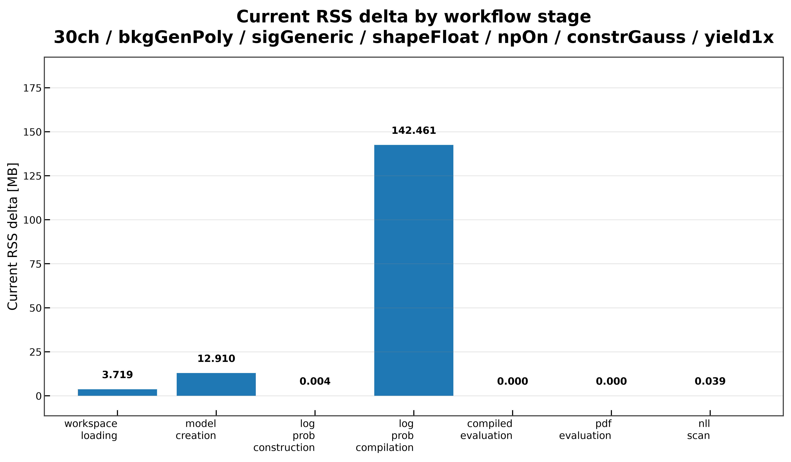
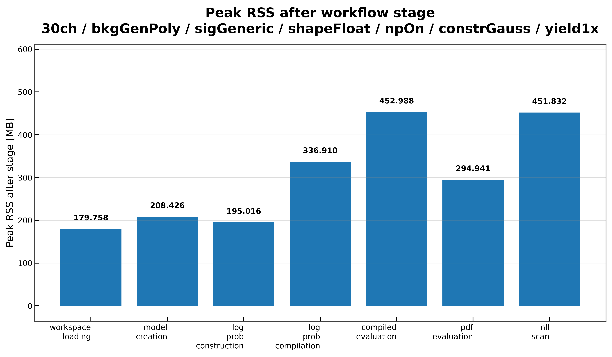

# Memory Scaling

The memory scaling benchmark measures the memory footprint of the complete PyHS3 workflow.

Unlike the runtime benchmarks, this benchmark isolates each major workflow stage in a separate process, allowing memory usage to be attributed to individual stages without interference from previous allocations.

For each stage, the benchmark measures

- current RSS before execution;
- current RSS after execution;
- current RSS increase;
- peak RSS before execution;
- peak RSS after execution;
- peak RSS increase.

---

# What is measured

Each workflow stage is executed independently:

1. workspace loading;
2. model creation;
3. log-probability construction;
4. log-probability compilation;
5. compiled log-probability evaluation;
6. PDF evaluation;
7. NLL scan.

Running each stage in an isolated process ensures that memory measurements reflect only the allocations introduced by that stage.

---

# Running the benchmark

## Individual benchmark

```bash
pixi run python -m src.run_memory_scaling \
    --workspaces \
        inputs/30ch_bkgGenPoly_sigGeneric_shapeFloat_npOn_constrGauss_yield1x.json \
    --targets L_ch0 \
    --modes FAST_RUN \
    --distribution sig_ch0 \
    --n-evaluations 100 \
    --scan-parameter mu_sig \
    --scan-min 0.0 \
    --scan-max 5.0 \
    --n-scan-points 101 \
    --plot \
    --plot-dir docs/assets/plots/memory_scaling
```

## Using the benchmark runner

```bash
pixi run python -m src.run_all_benchmarks \
    --workspaces \
        inputs/30ch_bkgGenPoly_sigGeneric_shapeFloat_npOn_constrGauss_yield1x.json \
    --benchmarks memory_scaling \
    --targets L_ch0 \
    --modes FAST_RUN \
    --distribution sig_ch0 \
    --n-evaluations 100 \
    --scan-parameter mu_sig \
    --scan-min 0.0 \
    --scan-max 5.0 \
    --n-scan-points 101 \
    --plot
```

---

# Benchmark outputs

The benchmark produces

- current RSS increase for each workflow stage;
- peak RSS increase for each workflow stage;
- peak RSS after each workflow stage;
- per-stage timing information when available;
- JSON result file;
- optional plots.

---

# Validation

Each benchmark run verifies that

- every workflow stage completes successfully;
- all RSS measurements are collected;
- memory statistics are available for every stage;
- benchmark-specific validation passes for each stage;
- all results are written to the output JSON.

---

# Example results

## Current RSS increase



The current RSS increase is negligible for most workflow stages.

The dominant allocation occurs during log-probability compilation, where the JAX compilation pipeline allocates approximately 140 MB of additional memory. Workspace loading and model creation introduce only modest memory growth, while compiled evaluation, PDF evaluation, and NLL scanning require almost no additional memory.

---

## Peak RSS increase


Peak RSS closely follows the current RSS measurements.

Again, nearly all additional memory is allocated during log-probability compilation, while the remaining workflow stages contribute only small or negligible increases.

---

## Peak RSS after each workflow stage



The highest peak RSS is observed immediately after log-probability compilation.

Subsequent compiled evaluations and NLL scans reuse the compiled representation without introducing significant additional allocations, demonstrating that the compilation cost is largely a one-time overhead.

---

# Interpretation

The benchmark shows that memory consumption is concentrated almost entirely in the log-probability compilation stage.

Workspace loading, model construction, PDF evaluation, and NLL scanning have relatively small memory footprints. Once compilation has completed, subsequent evaluations reuse the compiled graph with essentially no additional memory growth.

This behavior indicates that the primary memory cost of the workflow is the initial JAX compilation, while repeated likelihood evaluations remain memory efficient.
