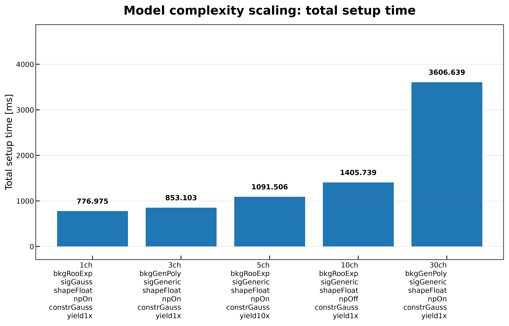
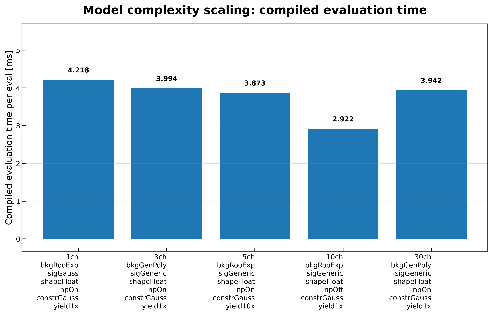
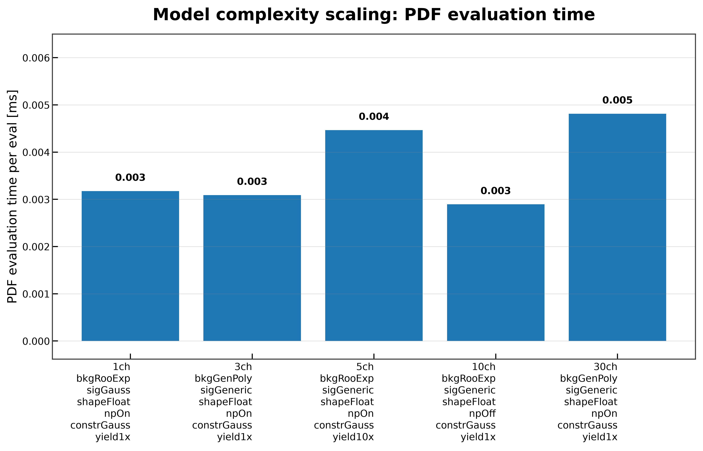
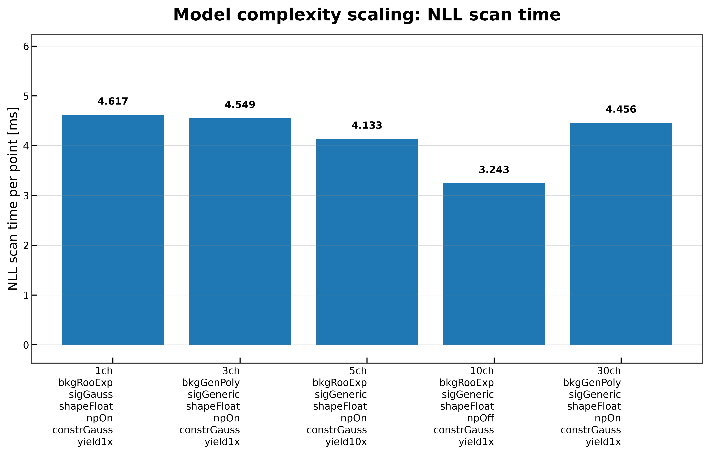
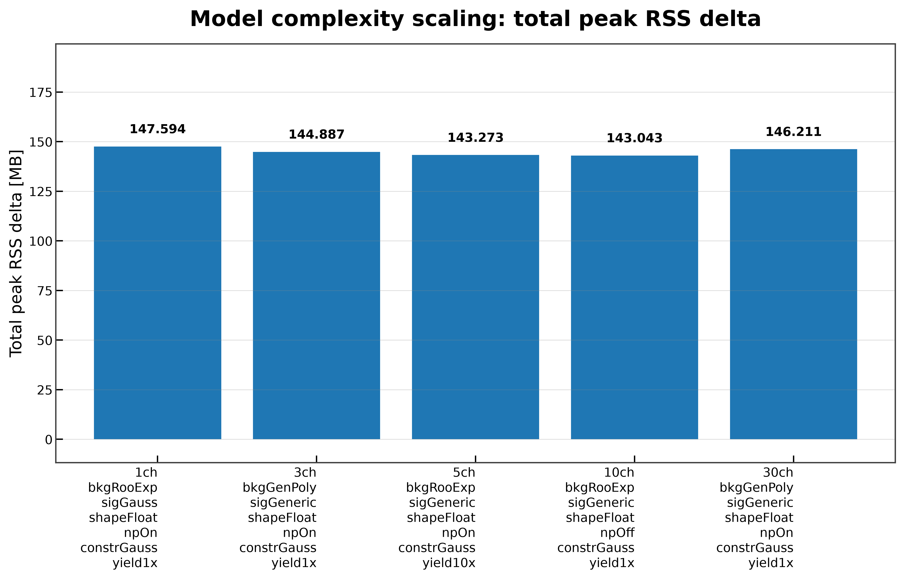

# Model Complexity Scaling

On this page, you will learn how benchmark performance changes as the complexity of the statistical model increases.

The **Model Complexity Scaling** benchmark compares representative benchmark workspaces of increasing complexity to evaluate how setup time, evaluation performance, and memory usage scale across the complete PyHS3 workflow.

Unlike the individual benchmark pages, this benchmark focuses on overall scaling trends rather than the performance of a single workflow stage.

---

## Benchmark Dataset

The benchmark uses the nominal benchmark workspace collection.

| Workspace | Description |
|-----------|-------------|
| `1ch_bkgRooExp_sigGauss_shapeFloat_npOn_constrGauss_yield1x` | Single-channel baseline model |
| `3ch_bkgGenPoly_sigGeneric_shapeFloat_npOn_constrGauss_yield1x` | Medium-complexity generic model |
| `5ch_bkgRooExp_sigGeneric_shapeFloat_npOn_constrGauss_yield10x` | Increased signal-yield configuration |
| `10ch_bkgRooExp_sigGeneric_shapeFloat_npOff_constrGauss_yield1x` | Larger model without nuisance parameter |
| `30ch_bkgGenPoly_sigGeneric_shapeFloat_npOn_constrGauss_yield1x` | Largest benchmark workspace |

The benchmark executes the complete workflow

1. Workspace Loading
2. Model Creation
3. Log-Probability Construction
4. Log-Probability Compilation
5. Compiled Evaluation
6. PDF Evaluation
7. NLL Scan

---

## What This Benchmark Measures

For each workspace, the benchmark compares

- total workflow setup time;
- compiled evaluation latency;
- PDF evaluation latency;
- NLL scan performance;
- peak memory usage.

The measurement methodology is described in **Benchmark Methodology**.

---

## Running the Benchmark

```bash
pixi run python -m src.run_model_complexity_scaling \
    --workspaces \
        inputs/1ch_bkgRooExp_sigGauss_shapeFloat_npOn_constrGauss_yield1x.json \
        inputs/3ch_bkgGenPoly_sigGeneric_shapeFloat_npOn_constrGauss_yield1x.json \
        inputs/5ch_bkgRooExp_sigGeneric_shapeFloat_npOn_constrGauss_yield10x.json \
        inputs/10ch_bkgRooExp_sigGeneric_shapeFloat_npOff_constrGauss_yield1x.json \
        inputs/30ch_bkgGenPoly_sigGeneric_shapeFloat_npOn_constrGauss_yield1x.json \
    --plot
```

---

## Command-line Arguments

| Argument | Description |
|----------|-------------|
| `--workspaces` | Benchmark workspaces to compare. |
| `--targets` | Model targets. |
| `--modes` | PyTensor compilation modes. |
| `--stages` | Workflow stages to benchmark. |
| `--n-runs` | Number of repeated timing measurements. |
| `--n-evaluations` | Number of repeated evaluations. |
| `--distribution` | Distribution used for PDF evaluation. |
| `--scan-parameter` | Parameter scanned during the NLL benchmark. |
| `--scan-min` | Lower scan bound. |
| `--scan-max` | Upper scan bound. |
| `--n-scan-points` | Number of scan points. |
| `--output-dir` | Directory for benchmark reports. |
| `--report-dir` | Directory for CSV summaries. |
| `--plot` | Generate comparison figures. |
| `--plot-dir` | Directory for generated plots. |

Common benchmark arguments are documented in **Benchmark Methodology**.

---

## Results

### Total Setup Time



Total setup time combines

- workspace loading;
- model creation;
- log-probability construction;
- log-probability compilation.

Initialization cost increases steadily with workspace complexity because larger statistical models require more symbolic processing before evaluation.

---

### Compiled Evaluation Time



Compiled evaluation remains close to **3–4 ms** across the benchmark workspaces.

This indicates that, once compilation has completed, evaluation performance is only weakly affected by model complexity.

---

### PDF Evaluation Time



PDF evaluation remains consistently fast across all benchmark workspaces, with runtimes on the order of only a few microseconds.

The small variation indicates that individual PDF evaluations contribute little to overall workflow execution time.

---

### NLL Scan Time



Runtime per scan point remains approximately **3–5 ms** across the benchmark dataset.

The benchmark shows that likelihood evaluation scales well after model compilation.

---

### Peak Memory Usage



Peak RSS changes only modestly across the benchmark workspaces.

Most memory allocation occurs during graph compilation, while increasing workspace complexity has a comparatively smaller effect on runtime memory usage.

---

## Key Observations

The benchmark highlights several important characteristics of the current implementation.

- Initialization cost grows with model complexity.
- Compiled evaluation performance remains relatively stable.
- PDF evaluation contributes only a small fraction of total runtime.
- NLL scan performance is largely independent of workspace size after compilation.
- Peak memory usage is dominated by compilation rather than evaluation.

---

## Limitations

This benchmark summarizes scaling trends across representative benchmark workspaces.

It is intended for comparative analysis rather than detailed investigation of individual workflow stages.

For stage-specific performance measurements, see the corresponding benchmark pages.

---

## Related Documentation

See also

- **Benchmark Methodology**
- **Benchmark Results**
- **Workspace Loading**
- **Model Creation**
- **Log-Probability Construction**
- **Compiled Evaluation**
- **PDF Evaluation**
- **NLL Scan**
