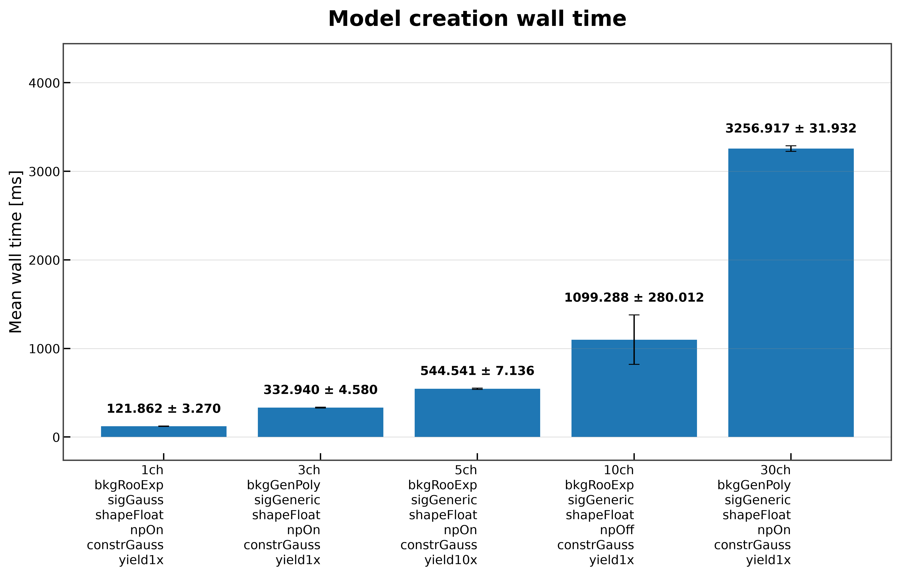
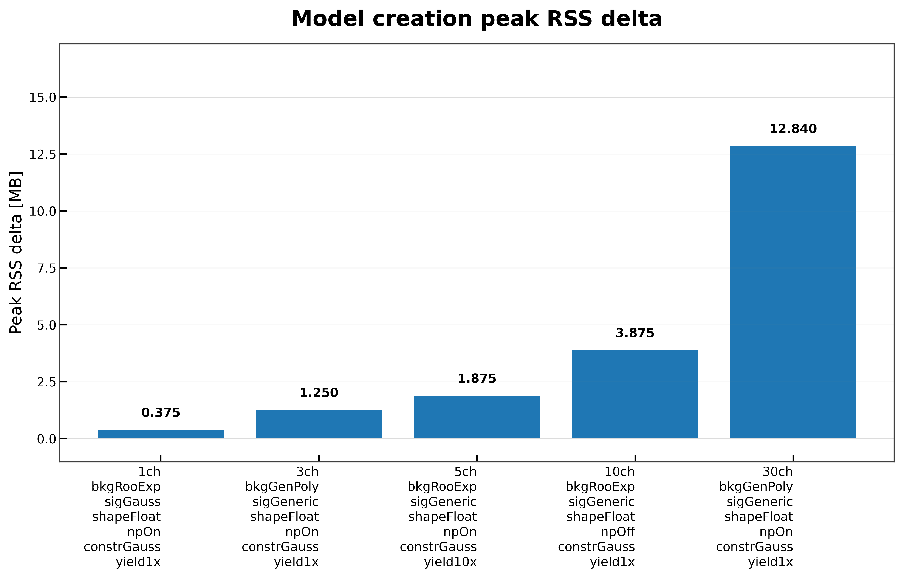
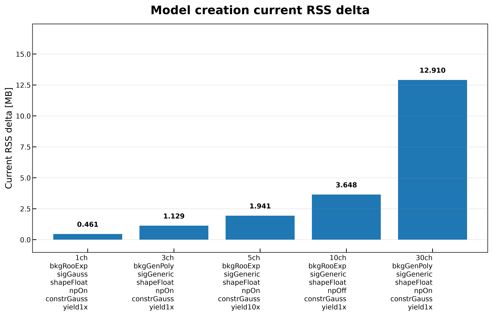

# Model Creation

The **Model Creation** benchmark measures the time and memory required to construct a PyHS3 `Model` object from an already loaded HS3 workspace.

Unlike the Workspace Loading benchmark, this benchmark excludes workspace deserialization and measures only the cost of calling `Workspace.model(...)`. This stage constructs the statistical model that is subsequently used for graph construction, compilation, likelihood evaluation, and fitting.

Model creation is one of the most important initialization steps in the PyHS3 workflow because every subsequent operation depends on the generated model.

---

# What is Measured?

For each benchmark workspace, the benchmark reports

- mean wall time;
- median wall time;
- standard deviation across repeated measurements;
- current RSS memory increase;
- peak RSS memory increase;
- basic model validation.

Workspace loading is intentionally excluded from all measurements.

---

# Benchmark Workflow

For every workspace, the benchmark performs the following steps.

```text
HS3 Workspace
      │
      ▼
Workspace.load(...)
      │
      ▼
Workspace.model(...)
      │
      ├────────► Model Validation
      │
      ├────────► Timing Statistics
      │
      └────────► Memory Statistics
      │
      ▼
JSON Report
      │
      ▼
Comparison Plots (optional)
```

The workspace is loaded once before benchmarking begins. Repeated timing measurements include only model creation.

Memory measurements are collected from a single isolated model creation to avoid reporting accumulated memory from multiple PyTensor graphs.

---

# When Should This Benchmark Be Used?

This benchmark is useful for

- measuring statistical model construction overhead;
- comparing model initialization across different workspaces;
- evaluating scaling with model complexity;
- detecting regressions in model creation performance;
- estimating memory consumption before graph construction.

---

# Running the Benchmark

## Run the benchmark directly

```bash
pixi run python -m src.run_model_creation \
    --workspaces \
        inputs/1ch_bkgRooExp_sigGauss_shapeFloat_npOn_constrGauss_yield1x.json \
        inputs/3ch_bkgGenPoly_sigGeneric_shapeFloat_npOn_constrGauss_yield1x.json \
        inputs/5ch_bkgRooExp_sigGeneric_shapeFloat_npOn_constrGauss_yield10x.json \
        inputs/10ch_bkgRooExp_sigGeneric_shapeFloat_npOff_constrGauss_yield1x.json \
        inputs/30ch_bkgGenPoly_sigGeneric_shapeFloat_npOn_constrGauss_yield1x.json \
    --targets L_ch0 \
    --modes FAST_RUN \
    --n-runs 30 \
    --output-dir results/docs_examples/model_creation \
    --plot \
    --plot-dir docs/assets/plots/model_creation
```

## Run through the benchmark runner

```bash
pixi run python -m src.run_all_benchmarks \
    --workspaces \
        inputs/1ch_bkgRooExp_sigGauss_shapeFloat_npOn_constrGauss_yield1x.json \
        inputs/3ch_bkgGenPoly_sigGeneric_shapeFloat_npOn_constrGauss_yield1x.json \
        inputs/5ch_bkgRooExp_sigGeneric_shapeFloat_npOn_constrGauss_yield10x.json \
        inputs/10ch_bkgRooExp_sigGeneric_shapeFloat_npOff_constrGauss_yield1x.json \
        inputs/30ch_bkgGenPoly_sigGeneric_shapeFloat_npOn_constrGauss_yield1x.json \
    --benchmarks model_creation \
    --targets L_ch0 \
    --modes FAST_RUN \
    --n-runs 30 \
    --plot
```

---

# Generated Outputs

The benchmark produces

```text
results/
└── model_creation/
    └── model_creation_result.json
```

and, when plotting is enabled,

```text
docs/
└── assets/
    └── plots/
        └── model_creation/
            ├── model_creation_wall_time.png
            ├── model_creation_current_rss_delta.png
            └── model_creation_peak_rss_delta.png
```

---

# JSON Output

Each benchmark result contains

| Field | Description |
|---------|-------------|
| `workspace` | Input workspace filename |
| `target` | Requested model target |
| `mode` | PyTensor compilation mode |
| `status` | Benchmark execution status |
| `wall_time_seconds_mean` | Mean model creation time |
| `wall_time_seconds_median` | Median model creation time |
| `wall_time_seconds_std` | Standard deviation |
| `current_rss_delta_mb` | Resident memory increase |
| `peak_rss_delta_mb` | Peak resident memory increase |
| `model_type` | Constructed model type |

---

# Wall-Time Comparison



The wall-time benchmark measures the time required to construct a `Model` object from an already loaded workspace.

For the benchmark workspaces, model creation scales approximately as follows:

| Workspace | Mean wall time |
|-----------|---------------:|
| 1-channel | ~122 ms |
| 3-channel | ~333 ms |
| 5-channel | ~545 ms |
| 10-channel | ~1.10 s |
| 30-channel | ~3.26 s |

The benchmark demonstrates that model creation is substantially more expensive than workspace loading because PyHS3 constructs the complete symbolic statistical model during this stage.

The growth is approximately proportional to workspace complexity, although larger workspaces require disproportionately more computation as the computational graph becomes increasingly complex.

The 10-channel workspace exhibits noticeably larger timing variability than the other benchmark workspaces. Inspection of the timing samples shows several unusually slow executions that increase the measured standard deviation, while the median remains close to the typical execution time. The 30-channel workspace, despite requiring substantially longer execution time, shows relatively stable measurements across repeated runs.

---

# Peak RSS Memory



Peak RSS measures the maximum resident memory reached during model construction.

Memory usage increases steadily with workspace complexity:

| Workspace | Peak RSS delta |
|-----------|---------------:|
| 1-channel | ~0.38 MB |
| 3-channel | ~1.25 MB |
| 5-channel | ~1.88 MB |
| 10-channel | ~3.88 MB |
| 30-channel | ~12.84 MB |

Compared with workspace loading, model creation requires substantially more temporary memory because symbolic graphs, parameters, and intermediate computational structures are constructed during this stage.

---

# Current RSS Memory



Current RSS measures the resident memory immediately after model creation has completed.

The measurements closely follow the peak RSS values:

| Workspace | Current RSS delta |
|-----------|------------------:|
| 1-channel | ~0.46 MB |
| 3-channel | ~1.13 MB |
| 5-channel | ~1.94 MB |
| 10-channel | ~3.65 MB |
| 30-channel | ~12.91 MB |

The similarity between current and peak RSS indicates that most allocated memory belongs to the constructed statistical model rather than temporary allocations that are released immediately after construction.

---

# Implementation Details

Several implementation choices improve measurement reproducibility.

- Workspace loading is excluded from all measurements.
- Memory is measured using a single isolated model construction.
- Timing statistics are collected independently from memory measurements.
- Each timing measurement creates a fresh model.
- Garbage collection is performed between timing iterations.
- Every benchmark is executed in a separate Python process.
- Successfully created models are validated before benchmark results are recorded.
- Comparison plots are generated only when multiple successful benchmark results are available.

These design choices minimize interference between repeated runs and produce stable benchmark results across different systems.

---

# Limitations

This benchmark measures only statistical model construction.

It does **not** include

- workspace loading;
- log-probability graph construction;
- graph canonicalization;
- graph optimization;
- graph compilation;
- likelihood evaluation;
- PDF evaluation;
- fitting.

These workflow stages are measured by dedicated benchmarks documented elsewhere in this guide.

---

# Related Documentation

See also

- **Workspace Loading**
- **Log-Probability Construction**
- **Benchmark Methodology**
- **Benchmark Results**
