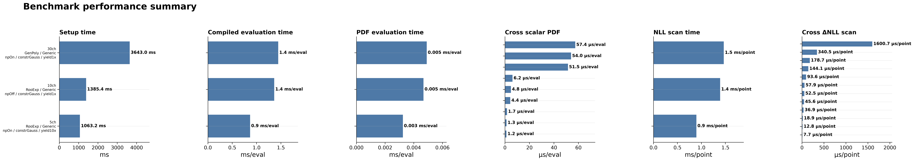
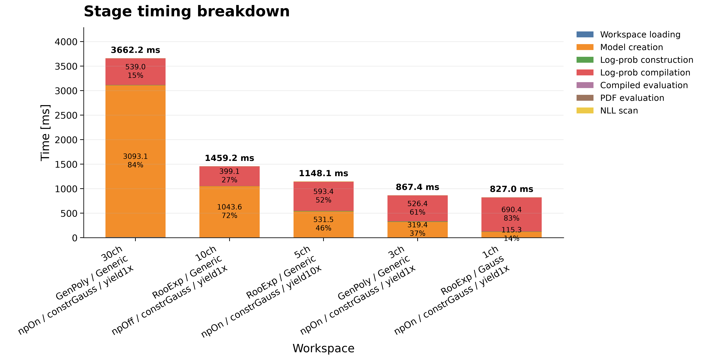
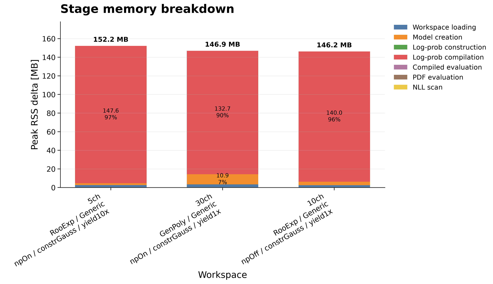
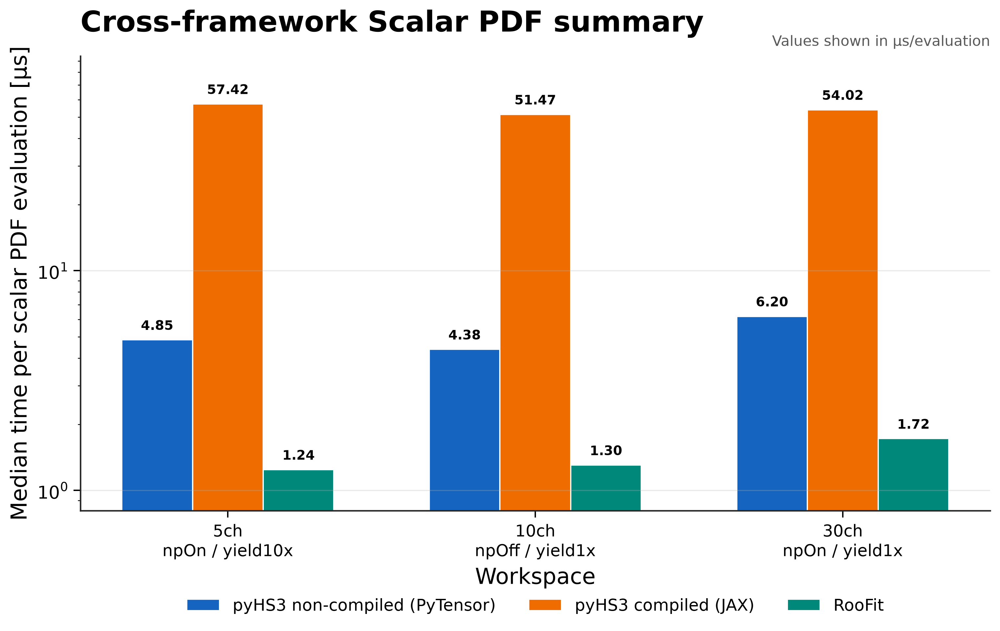
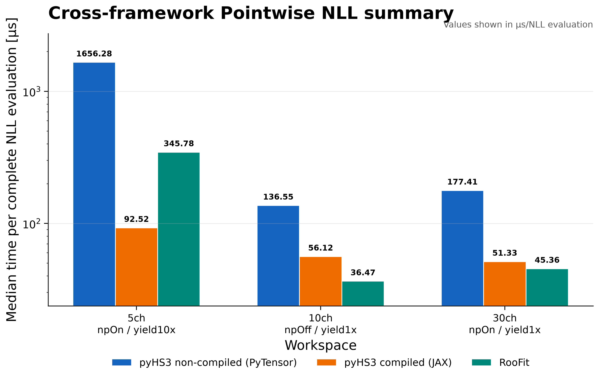
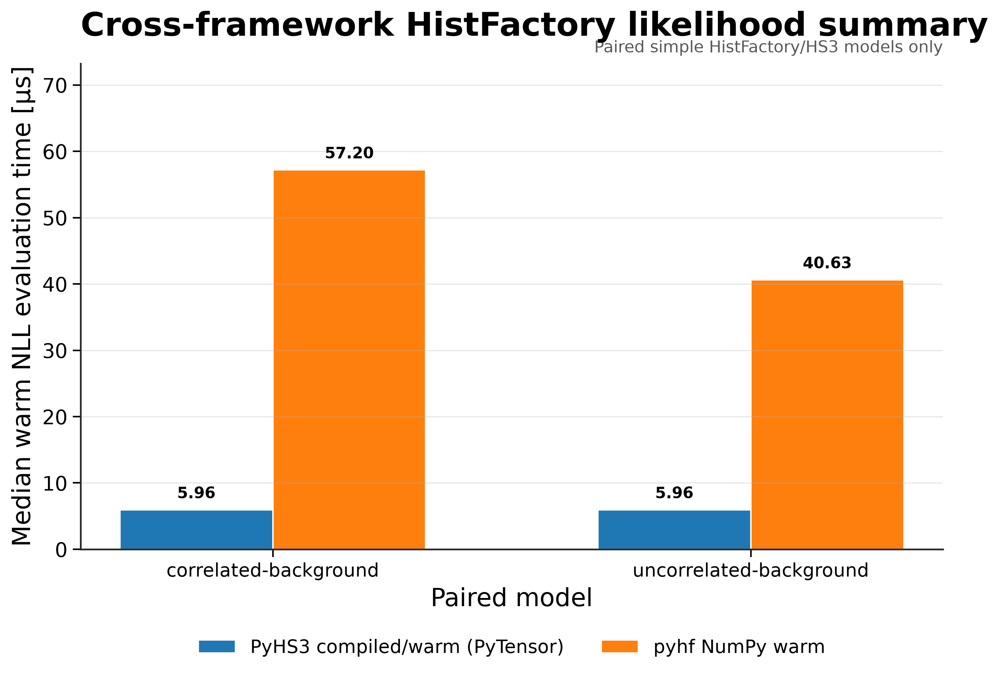

# Benchmark Overview

On this page, you will learn how to generate high-level summary figures that combine results from multiple benchmark suites into a single performance overview.

Unlike individual benchmark pages, the Benchmark Overview does not execute benchmarks. Instead, it collects existing benchmark reports and generates publication-ready summary figures for comparing workflow stages, memory usage, and cross-framework performance.

---

# Overview

The overview generator reads benchmark reports produced by the benchmark suite and creates a unified collection of summary plots.

The generated figures provide

- overall benchmark performance;
- timing breakdown by workflow stage;
- memory usage by workflow stage;
- cross-framework scalar PDF comparisons;
- cross-framework pointwise ΔNLL comparisons;
- cross-framework HistFactory likelihood comparisons.

---

# Workflow

```text
run_all_benchmarks.py
        │
        ▼
results/benchmark_matrix/
        │
        ▼
plot_benchmark_overview.py
        │
        ▼
docs/assets/plots/benchmark_overview/
```

The overview generator uses existing benchmark reports and never reruns benchmark measurements.

---

# Running the Overview Generator

```bash
pixi run python -m src.plot_benchmark_overview \
    --results-dir results/benchmark_matrix \
    --plot-dir docs/assets/plots/benchmark_overview \
    --plots all
```

---

# Command-line Arguments

| Argument | Description |
|----------|-------------|
| `--results-dir` | Directory containing benchmark reports. |
| `--plot-dir` | Directory where generated figures are written. |
| `--plots` | Comma-separated list of overview plot groups to generate. |

---

# Supported Plot Groups

The overview generator supports the following plot groups.

- `performance_summary`
- `stage_timing`
- `stage_memory`
- `cross_framework_summary`

The `cross_framework_summary` group produces

1. Cross-Framework Scalar PDF Summary
2. Cross-Framework Pointwise ΔNLL Summary
3. Cross-Framework HistFactory Likelihood Summary

---

# Results

## Benchmark Performance Summary



This dashboard provides a high-level comparison of the principal performance metrics across the benchmark suite.

It summarizes

- workflow setup time;
- compiled evaluation latency;
- PDF evaluation latency;
- scalar cross-framework PDF evaluation;
- NLL scan latency;
- cross-framework ΔNLL evaluation.

This figure is intended as the primary overview of benchmark performance.

---

## Stage Timing Breakdown



This figure compares execution time across the principal workflow stages:

- workspace loading;
- model creation;
- log-probability construction;
- log-probability compilation;
- compiled evaluation;
- PDF evaluation;
- NLL scan.

It highlights which stages contribute most to the total execution time.

---

## Stage Memory Breakdown



This figure compares peak RSS memory usage across workflow stages.

Compilation is typically the largest contributor to memory consumption.

---

## Cross-Framework Scalar PDF Summary



This figure compares scalar PDF evaluation latency across supported statistical frameworks.

It focuses on individual PDF evaluations and does not include likelihood scans.

---

## Cross-Framework Pointwise ΔNLL Summary



This figure compares complete pointwise negative log-likelihood evaluations for a single parameter point.

Unlike scalar PDF evaluation, it measures the complete likelihood computation.

---

## Cross-Framework HistFactory Likelihood Summary



This figure summarizes paired HistFactory benchmarks comparing equivalent statistical models implemented in PyHS3 and pyhf.

The benchmark uses

- identical statistical models;
- identical expected event counts;
- validated numerical agreement;
- warm steady-state evaluation.

Because these benchmarks use simplified paired HistFactory models, they should not be interpreted as replacements for the RooFit-based cross-framework benchmarks.

---

# When to Use the Benchmark Overview

The overview figures are particularly useful for

- summarizing benchmark campaigns;
- comparing workflow stages;
- identifying performance bottlenecks;
- presenting benchmark results;
- tracking performance changes over time.

---

# Limitations

The overview generator aggregates existing benchmark reports and never executes benchmarks itself.

If benchmark reports are unavailable, the corresponding figures are skipped automatically.

Cross-framework figures summarize different benchmark families and should therefore be interpreted within their respective benchmarking contexts rather than as a single overall framework ranking.

---

# Related Documentation

See also

- **Benchmark Results**
- **Benchmark Matrix Runner**
- **Benchmark Methodology**
- **Workspace Loading**
- **PDF Evaluation**
- **Cross-Framework Benchmarks**
