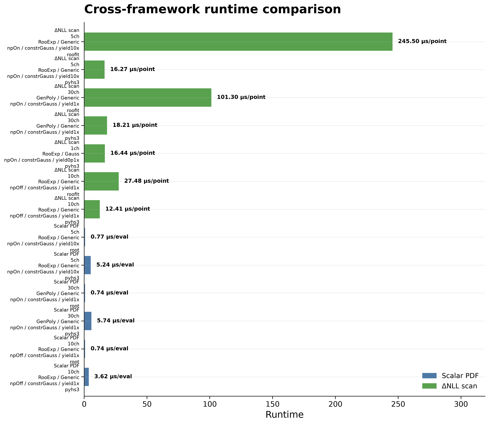

# Benchmark Overview

This benchmark overview summarizes PyHS3 performance measurements on generated workspaces and the available cross-framework comparisons.

Run:

```bash
pixi run python -m src.plot_benchmark_overview \
    --results-dir results/docs_examples \
    --plot-dir docs/assets/plots/benchmark_overview \
    --plots all
```

---

---

## Command-line Arguments

The benchmark overview script supports the following command-line arguments.

| Argument | Type | Default | Description |
|----------|------|---------|-------------|
| `--results-dir` | `Path` | `results/` | Root directory containing benchmark result JSON files. The script recursively searches for files ending with `_result.json`. |
| `--plot-dir` | `Path` | `docs/assets/plots/benchmark_overview/` | Directory where the generated overview plots will be saved. |
| `--plots` | `str ...` | `all` | Overview plots to generate. Supported values are `performance_summary`, `setup_summary`, `evaluation_summary`, `scan_summary`, `stage_timing`, `stage_memory`, `diagnostics`, `cross_framework_summary`, or `all` (the default report plots). |
| `--benchmarks` | `str ...` | all benchmarks | Restrict the overview to specific benchmark names. |
| `--workspaces` | `str ...` | all workspaces | Include only results corresponding to the specified workspaces. |
| `--targets` | `str ...` | all targets | Include only results generated for the selected model targets. |
| `--modes` | `str ...` | all modes | Include only results for the specified PyTensor compilation modes. |
| `--n-runs` | `int ...` | all | Filter results by the number of timing repetitions. |
| `--n-evaluations` | `int ...` | all | Filter results by the number of repeated evaluations used in evaluation benchmarks. |
| `--n-scan-points` | `int ...` | all | Filter results by the number of scan points used in NLL scan benchmarks. |
| `--include-failed` | flag | disabled | Include failed benchmark runs in the collected results instead of showing only successful benchmarks. |
| `--strict` | flag | disabled | Stop immediately if malformed result files or plotting errors are encountered. By default, invalid files are skipped and plotting continues. |

## Notes

- The script automatically discovers benchmark result files by recursively searching `--results-dir` for files ending in `_result.json`.
- By default, only successful benchmark results are included in the generated overview plots. Use `--include-failed` to include unsuccessful runs.
- When `--plots all` is specified, the script generates the default overview report consisting of:
  - benchmark performance summary,
  - stage timing breakdown,
  - stage memory breakdown,
  - cross-framework runtime comparison.
- Additional plots such as `setup_summary`, `evaluation_summary`, `scan_summary`, and `diagnostics` can be generated individually.
- Filters (`--benchmarks`, `--workspaces`, `--targets`, etc.) may be combined to generate overview plots for specific subsets of benchmark results.
- Cross-framework summary plots include only successful apples-to-apples benchmark results with valid numerical agreement.
- Unless `--strict` is enabled, malformed or unreadable result files are skipped automatically so that a single invalid benchmark does not prevent generation of the remaining overview plots.

---

## Benchmark performance summary


## Stage timing breakdown


## Stage memory breakdown


## Cross-framework runtime comparison



## Interpretation

The overview shows that PyHS3 setup time is mostly dominated by model creation and log-probability compilation. Once the model is built, repeated warm evaluation is much faster.

The memory breakdown shows that peak RSS is also dominated by the compilation stage.

The cross-framework plots include only successful and numerically validated apples-to-apples comparisons.

## Notes on xRooFit

A dedicated xRooFit benchmark was investigated, but for the current generated ROOT workspaces, `xRooNode(...).nll(...)` returned a null NLL object. Therefore, a fully apples-to-apples benchmark against xRooFit’s own NLL machinery could not yet be constructed.

A pointwise ROOT/RooFit comparison is possible, but it should not be presented as benchmarking xRooFit-specific NLL algorithms.
