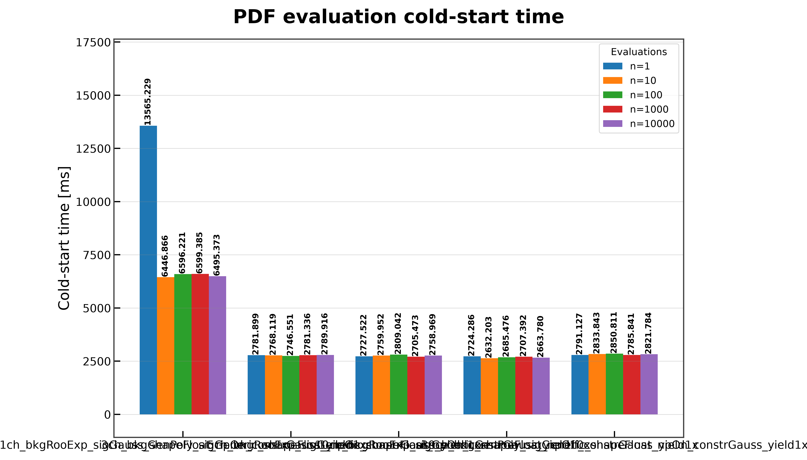
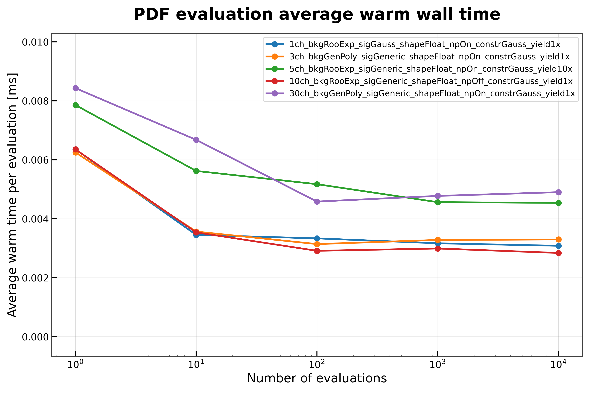
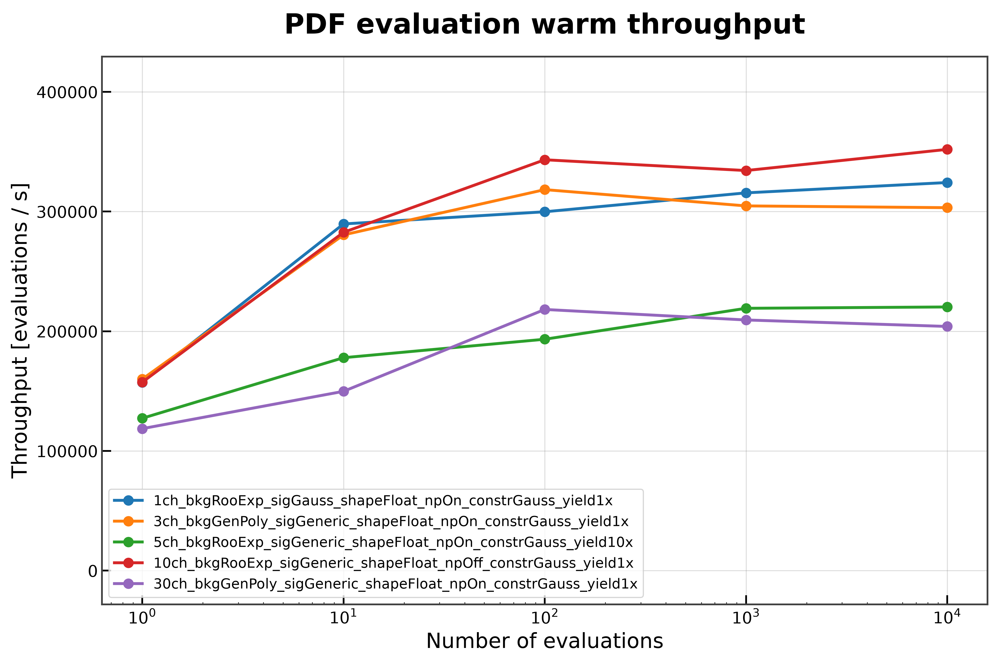
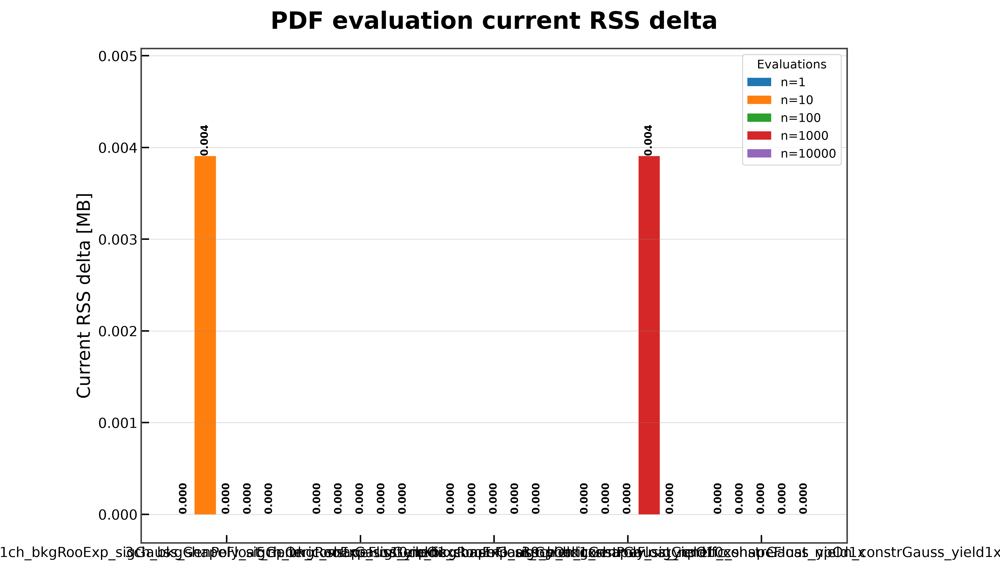

# PDF Evaluation

On this page, you will learn what the **PDF Evaluation** benchmark measures, how to run it, and how to interpret its results.

The **PDF Evaluation** benchmark measures the performance of repeated `model.pdf(...)` evaluation for a selected probability distribution.

Unlike earlier workflow benchmarks, this benchmark evaluates an already constructed and compiled model. Workspace loading, model creation, and graph compilation are treated as setup steps and are excluded from the reported timing measurements.

---

## What This Benchmark Measures

For every benchmark configuration, the benchmark reports

- cold-start evaluation time;
- average warm evaluation time;
- warm throughput;
- current RSS memory increase;
- peak RSS memory increase;
- numerical validation status.

The benchmark also verifies that

- every PDF value is finite;
- repeated evaluations remain numerically stable.

Details of the measurement methodology are described in **Benchmark Methodology**.

---

## Benchmark Workflow

```text
Workspace
      │
      ▼
Load Workspace
      │
      ▼
Create Model
      │
      ▼
Compile Graph
      │
      ▼
First PDF Evaluation
      │
      ├────────► Cold-start Time
      │
      ▼
Repeated PDF Evaluation
      │
      ├────────► Average Time
      ├────────► Throughput
      ├────────► Memory
      └────────► Validation
      │
      ▼
JSON Report
      │
      ▼
Comparison Plots (optional)
```

---

## When to Use This Benchmark

This benchmark is useful for

- measuring steady-state PDF evaluation performance;
- separating initialization overhead from repeated execution;
- comparing evaluation throughput across workspaces;
- detecting performance regressions;
- evaluating memory consumption during repeated inference.

---

## Running the Benchmark

### Run directly

```bash
pixi run python -m src.run_pdf_evaluation \
    --workspaces \
        inputs/1ch_bkgRooExp_sigGauss_shapeFloat_npOn_constrGauss_yield1x.json \
        inputs/3ch_bkgGenPoly_sigGeneric_shapeFloat_npOn_constrGauss_yield1x.json \
        inputs/5ch_bkgRooExp_sigGeneric_shapeFloat_npOn_constrGauss_yield10x.json \
        inputs/10ch_bkgRooExp_sigGeneric_shapeFloat_npOff_constrGauss_yield1x.json \
        inputs/30ch_bkgGenPoly_sigGeneric_shapeFloat_npOn_constrGauss_yield1x.json \
    --targets L_ch0 \
    --modes FAST_RUN \
    --distributions sig_ch0 \
    --n-evaluations 1 10 100 1000 10000 \
    --output-dir results/docs_examples/pdf_evaluation \
    --plot \
    --plot-dir docs/assets/plots/pdf_evaluation
```

### Run through the Benchmark Matrix Runner

```bash
pixi run python -m src.run_all_benchmarks \
    --workspaces \
        inputs/1ch_bkgRooExp_sigGauss_shapeFloat_npOn_constrGauss_yield1x.json \
        inputs/3ch_bkgGenPoly_sigGeneric_shapeFloat_npOn_constrGauss_yield1x.json \
        inputs/5ch_bkgRooExp_sigGeneric_shapeFloat_npOn_constrGauss_yield10x.json \
        inputs/10ch_bkgRooExp_sigGeneric_shapeFloat_npOff_constrGauss_yield1x.json \
        inputs/30ch_bkgGenPoly_sigGeneric_shapeFloat_npOn_constrGauss_yield1x.json \
    --benchmarks pdf_evaluation \
    --plot
```

---

## Command-line Arguments

| Argument | Description |
|----------|-------------|
| `--workspaces` | Workspace files to benchmark. |
| `--targets` | Model targets used during evaluation. |
| `--modes` | PyTensor compilation modes. |
| `--distributions` | Probability distributions evaluated with `model.pdf(...)`. |
| `--n-evaluations` | Numbers of repeated PDF evaluations. |
| `--output-dir` | Directory for benchmark reports. |
| `--output-name` | Output JSON filename. |
| `--plot` | Generate comparison plots. |
| `--plot-dir` | Directory for generated figures. |

Common benchmark arguments and execution behavior are described in **Benchmark Methodology**.

---

## Generated Outputs

The benchmark produces

```text
results/
└── pdf_evaluation/
    └── pdf_evaluation_result.json
```

and, when plotting is enabled,

```text
docs/
└── assets/
    └── plots/
        └── pdf_evaluation/
```

The report structure and output conventions are documented in **Benchmark Results**.

---

## Results

### Cold-Start Time

Shows the execution time of the first `model.pdf(...)` evaluation.



The first evaluation includes initialization overhead that is not present during subsequent evaluations.

---

### Average Warm Evaluation Time



This plot reports the average execution time after the initial evaluation, providing a representative measure of steady-state performance.

---

### Warm Throughput



Throughput measures the number of PDF evaluations completed per second during repeated execution.

Higher throughput indicates more efficient repeated inference.

---

### Current RSS Memory



Current RSS reports resident memory growth after repeated evaluation.

The figure is generated only when at least one benchmark exhibits a measurable RSS increase.

---

## Implementation Notes

The benchmark includes several implementation choices that improve measurement quality.

- Workspace loading is excluded from the reported timings.
- Model construction and compilation are treated as setup.
- Cold-start and warm evaluations are measured independently.
- Numerical stability is validated before results are recorded.

The general benchmark methodology is documented in **Benchmark Methodology**.

---

## Limitations

This benchmark measures only repeated PDF evaluation.

It does **not** measure

- workspace loading;
- model creation;
- graph construction;
- graph optimization;
- graph compilation;
- likelihood evaluation.

These stages are benchmarked separately.

---

## Related Documentation

See also

- **Benchmark Methodology**
- **Benchmark Results**
- **Benchmark Matrix Runner**
- **Workspace Lifecycle**
- **Compiled Evaluation**
- **NLL Scan**
