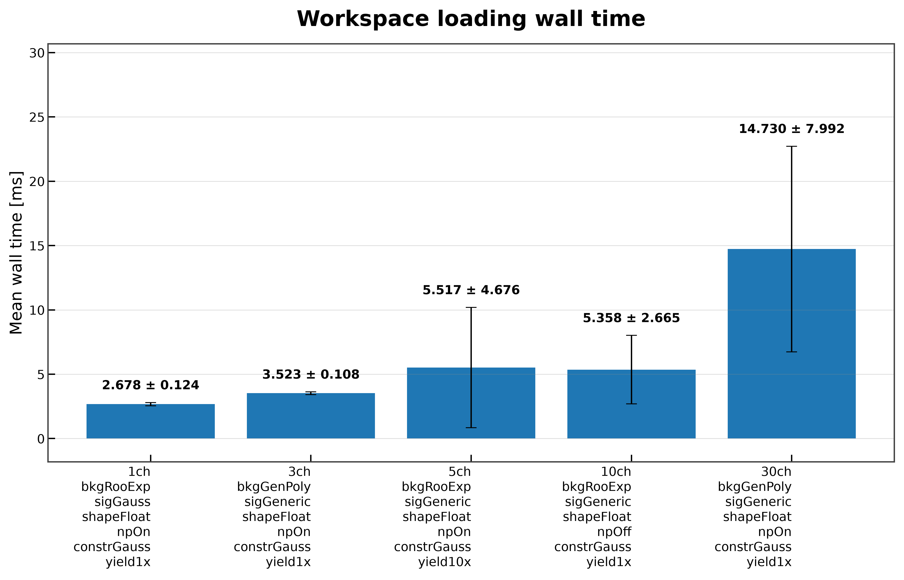
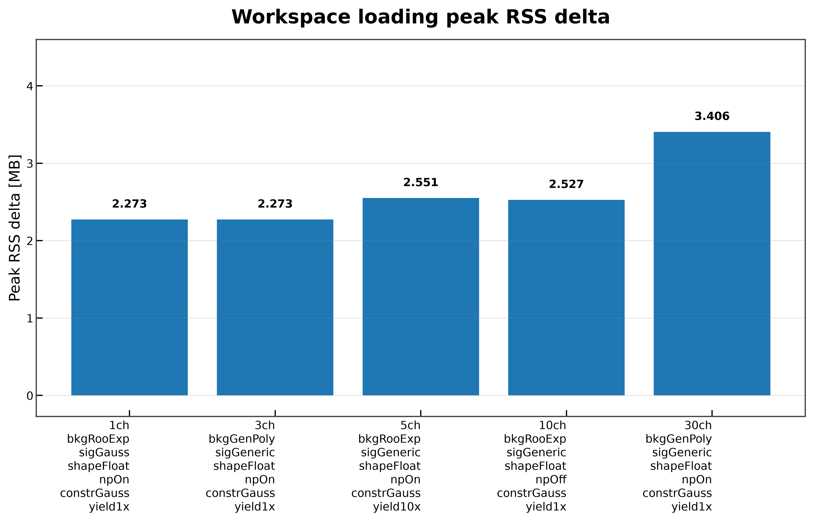
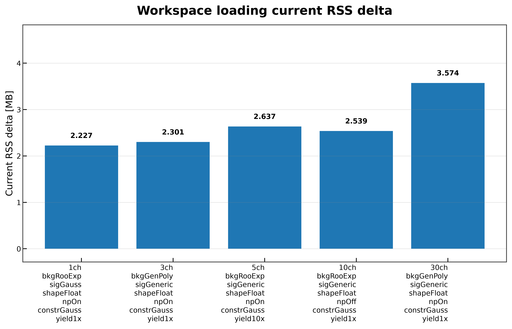

# Workspace Loading

The **Workspace Loading** benchmark measures the time and memory required to deserialize an HS3 workspace into an in-memory `Workspace` object.

Unlike the subsequent workflow benchmarks, this benchmark isolates only the workspace loading stage. It does **not** include model creation, graph construction, graph optimization, compilation, likelihood evaluation, or fitting.

This benchmark is particularly useful for measuring startup overhead, comparing workspace designs, and detecting performance regressions in HS3 deserialization.

---

# What is Measured?

For each workspace, the benchmark reports

- mean wall time;
- median wall time;
- standard deviation of repeated measurements;
- current RSS memory increase;
- peak RSS memory increase;
- workspace validation summary.

Wall-time measurements are obtained from repeated executions, while memory measurements are collected from a single clean workspace load.

---

# Benchmark Workflow

For every workspace, the benchmark performs the following steps.

```text
Workspace JSON
       │
       ▼
Validate Input
       │
       ▼
Measure Initial Memory
       │
       ▼
Workspace.load(...)
       │
       ├────────► Validation
       │
       ├────────► Timing Statistics
       │
       └────────► Memory Statistics
       │
       ▼
JSON Report
       │
       ▼
Comparison Plots (optional)
```

Each workspace is benchmarked in an independent Python process to minimize interference from previous executions and improve measurement reproducibility.

---

# When Should This Benchmark Be Used?

This benchmark is appropriate when you want to

- compare loading performance across multiple HS3 workspaces;
- evaluate workspace startup overhead;
- measure memory consumption during deserialization;
- detect loading performance regressions;
- compare workspaces of different complexity.

---

# Running the Benchmark

## Run the benchmark directly

```bash
pixi run python -m src.run_workspace_loading \
    --workspaces \
        inputs/1ch_bkgRooExp_sigGauss_shapeFloat_npOn_constrGauss_yield1x.json \
        inputs/3ch_bkgGenPoly_sigGeneric_shapeFloat_npOn_constrGauss_yield1x.json \
        inputs/5ch_bkgRooExp_sigGeneric_shapeFloat_npOn_constrGauss_yield10x.json \
        inputs/10ch_bkgRooExp_sigGeneric_shapeFloat_npOff_constrGauss_yield1x.json \
        inputs/30ch_bkgGenPoly_sigGeneric_shapeFloat_npOn_constrGauss_yield1x.json \
    --n-runs 30 \
    --output-dir results/docs_examples/workspace_loading \
    --plot \
    --plot-dir docs/assets/plots/workspace_loading
```

## Run through the benchmark runner

```bash
pixi run python -m src.run_all_benchmarks \
    --workspaces \
        inputs/1ch_bkgRooExp_sigGauss_shapeFloat_npOn_constrGauss_yield1x.json \
        inputs/3ch_bkgGenPoly_sigGeneric_shapeFloat_npOn_constrGauss_yield1x.json \
        inputs/5ch_bkgRooExp_sigGeneric_shapeFloat_npOn_constrGauss_yield10x.json \
        inputs/10ch_bkgRooExp_sigGeneric_shapeFloat_npOff_constrGauss_yield1x.json \
        inputs/30ch_bkgGenPoly_sigGeneric_shapeFloat_npOn_constrGauss_yield1x.json \
    --benchmarks workspace_loading \
    --n-runs 30 \
    --plot
```

---

# Generated Outputs

The benchmark generates

```text
results/
└── workspace_loading/
    └── workspace_loading_result.json
```

and, when plotting is enabled,

```text
docs/
└── assets/
    └── plots/
        └── workspace_loading/
            ├── workspace_loading_wall_time.png
            ├── workspace_loading_current_rss_delta.png
            └── workspace_loading_peak_rss_delta.png
```

---

# JSON Output

Each workspace entry contains benchmark metadata together with timing, memory, and validation information.

Typical fields include

| Field | Description |
|---------|-------------|
| `workspace` | Input workspace filename |
| `status` | Benchmark execution status |
| `wall_time_seconds_mean` | Mean loading time |
| `wall_time_seconds_median` | Median loading time |
| `wall_time_seconds_std` | Standard deviation of repeated measurements |
| `current_rss_delta_mb` | Increase in resident memory after loading |
| `peak_rss_delta_mb` | Maximum resident memory increase during loading |
| `validation` | Workspace validation summary |

---

# Wall-Time Comparison



The wall-time comparison plot shows the average workspace loading time for each benchmark workspace.

Error bars represent one standard deviation across repeated measurements.

For the example benchmark workspaces:

- the single-channel workspace loads in approximately **2.6 ms**;
- the 3-channel workspace loads in approximately **3.4 ms**;
- the 5- and 10-channel workspaces require approximately **5–6 ms**;
- the 30-channel workspace requires approximately **15 ms**.

As expected, loading time increases with workspace complexity because larger workspaces contain more statistical objects that must be reconstructed during deserialization.

Although the larger workspaces exhibit higher standard deviations, their median execution times remain considerably lower, indicating that occasional slow executions dominate the observed variability.

---

# Peak RSS Memory



Peak RSS measures the maximum resident memory reached while loading each workspace.

The benchmark shows a gradual increase from approximately **2.3 MB** for the smallest workspaces to roughly **3.5 MB** for the largest benchmark workspace.

This increase reflects the temporary memory required while reconstructing larger statistical models.

---

# Current RSS Memory



Current RSS measures the resident memory immediately after the workspace has been loaded successfully.

The values closely follow the peak RSS measurements, indicating that most allocated memory remains associated with the loaded workspace rather than temporary intermediate allocations.

---

# Implementation Details

Several implementation decisions improve benchmark reproducibility.

- Timing measurements are separated from memory measurements.
- Memory usage is measured from a single clean workspace load.
- Timing statistics are collected over repeated executions.
- Garbage collection is performed before measuring memory.
- Each workspace is benchmarked in a fresh Python process.
- Loaded workspaces are validated before benchmark results are recorded.
- Comparison plots are generated only when at least two benchmark results are available.

These design choices minimize measurement noise and improve reproducibility across benchmark campaigns.

---

# Limitations

This benchmark measures only HS3 workspace deserialization.

It does **not** measure

- model creation;
- computational graph construction;
- graph optimization;
- compilation;
- probability density evaluation;
- likelihood evaluation;
- fitting.

These workflow stages are covered by dedicated benchmarks documented elsewhere in the repository.

---

# Related Documentation

See also

- **Benchmark Methodology**
- **Benchmark Suite**
- **Benchmark Results**
- **Model Creation**
