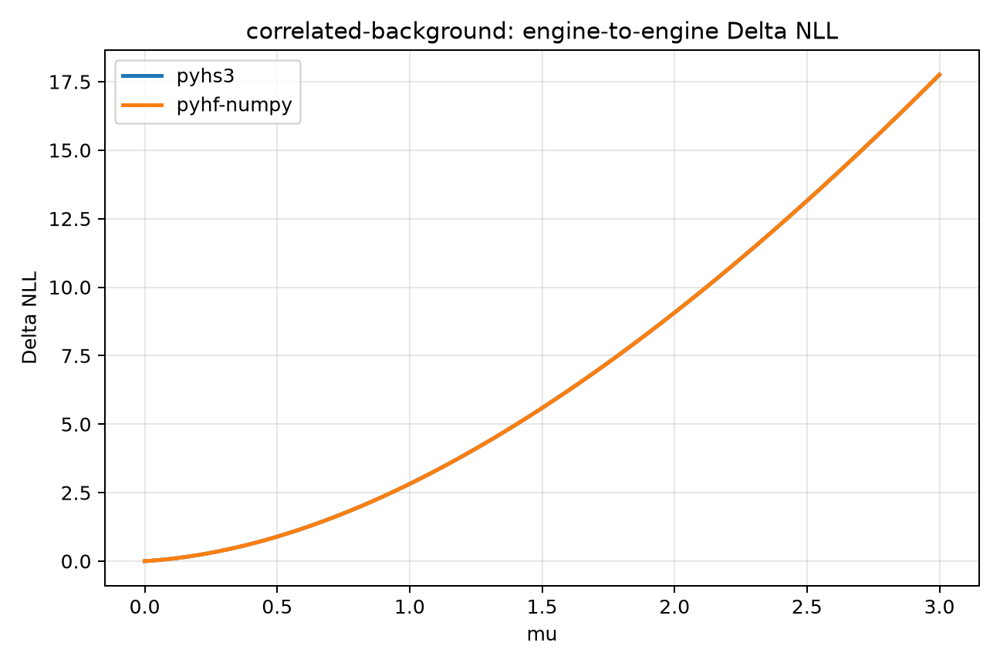
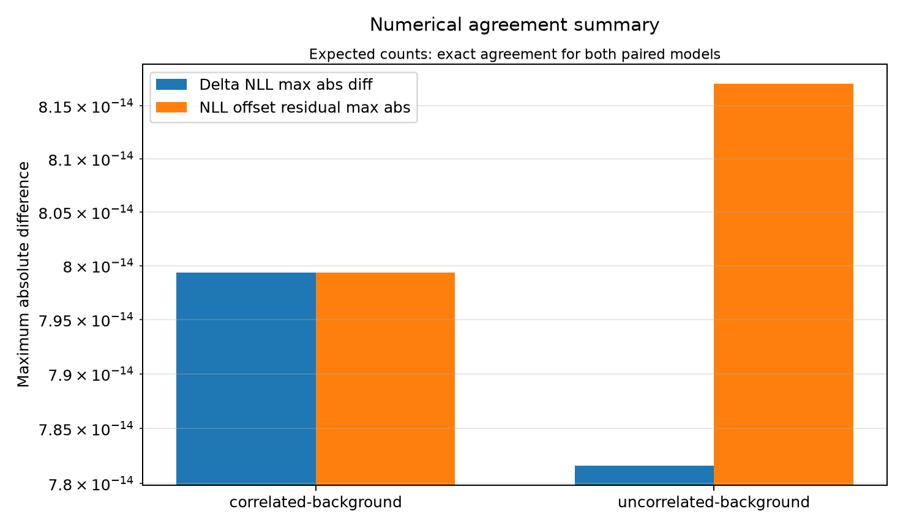
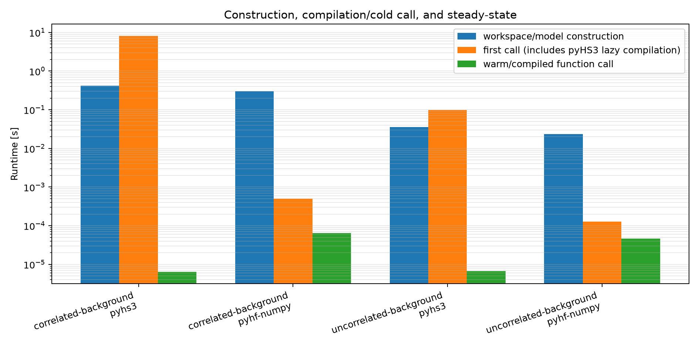
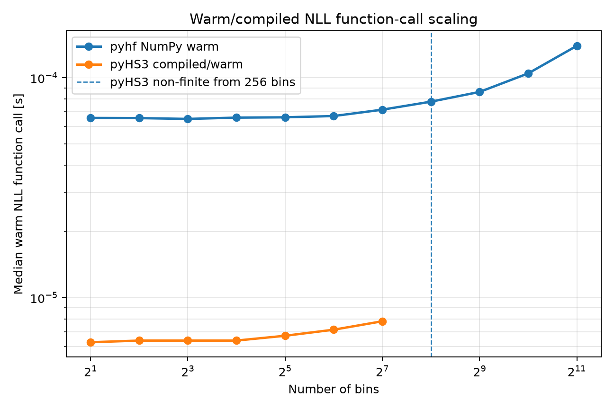

# Cross-Framework Binned Likelihood Benchmark

On this page, you will learn how PyHS3 and pyhf are compared using statistically equivalent HistFactory models and how to interpret the benchmark results.

The **Cross-Framework Binned Likelihood** benchmark compares equivalent HistFactory likelihood models implemented in **PyHS3** and **pyhf**.

Unlike the RooFit and xRooFit benchmarks, which evaluate complex analysis workspaces, this benchmark uses paired HistFactory models that both frameworks can represent identically. This enables a direct engine-to-engine comparison with validated numerical agreement.

---

## Benchmark Philosophy

The benchmark follows four principles.

- Both frameworks evaluate the same statistical model.
- The same parameter values are evaluated in both frameworks.
- Numerical agreement is verified before performance is compared.
- Construction, first evaluation, and warm evaluation are measured independently.

These principles ensure that observed performance differences reflect implementation rather than benchmark setup.

---

## Benchmark Dataset

The benchmark uses two paired HistFactory models generated from equivalent statistical configurations.

| Workspace | Description |
|-----------|-------------|
| `correlated-background` | Background normalization uncertainty shared across the model |
| `uncorrelated-background` | Independent background normalization uncertainties |

Each benchmark dataset includes

- a HistFactory JSON workspace for **pyhf**;
- an equivalent HS3 workspace for **PyHS3**.

The benchmark workspace collection is documented in **Benchmark Workspaces**.

---

## Benchmark Workflow

```text
HistFactory Workspace
        │
        ▼
Workspace / Model Construction
        │
        ▼
Numerical Validation
        │
        ▼
First Evaluation
        │
        ▼
Repeated Evaluation
        │
        ├── Timing
        ├── Memory
        └── Scaling
        │
        ▼
Comparison Plots
```

Construction, cold-start execution, and warm execution are benchmarked independently.

---

## Numerical Validation

Performance comparisons are interpreted only after numerical agreement has been verified.

The benchmark compares

- expected event counts;
- ΔNLL profiles;
- likelihood minima;
- residual constant offsets.

---

## Results

### Representative ΔNLL Profile

This figure shows a representative ΔNLL profile for one benchmark workspace.

The two curves overlap throughout the scan, demonstrating that PyHS3 and pyhf evaluate the same statistical likelihood.



---

### Numerical Agreement Summary

This figure summarizes the largest observed numerical differences across both benchmark workspaces.

Expected event counts agree exactly, while ΔNLL differences remain at floating-point precision.



---

### Timing Breakdown

Construction, first evaluation, and warm evaluation are reported separately.

This separation avoids conflating initialization costs with steady-state likelihood evaluation.



---

### Scaling with Histogram Size

The benchmark evaluates warm likelihood performance while increasing the number of histogram bins.

For the current benchmark configuration, PyHS3 reaches non-finite likelihood values beginning at **256 bins**, producing the termination point shown below.

This behavior is reported explicitly rather than omitted from the benchmark results.



---

## Key Findings

The benchmark demonstrates that

- PyHS3 and pyhf evaluate statistically equivalent HistFactory models;
- ΔNLL agreement is maintained at floating-point precision;
- construction, initialization, and steady-state execution exhibit different performance characteristics;
- scaling with histogram size can be studied independently of model complexity.

---

## Relation to RooFit Benchmarks

This benchmark should not be interpreted as a direct ranking against the RooFit or xRooFit benchmarks.

The RooFit benchmarks evaluate complex analysis workspaces and complete statistical workflows.

By contrast, the Cross-Framework Binned Likelihood benchmark focuses on simple paired HistFactory models that both PyHS3 and pyhf can represent identically.

The two benchmark families therefore answer different performance questions and should be interpreted independently.

---

## Limitations

Current limitations include

- pyhf NumPy backend only;
- no minimization benchmark;
- no fitting benchmark;
- no JAX backend comparison;
- numerical underflow in PyHS3 for extremely large replicated models.

Despite these limitations, the benchmark provides a reproducible, numerically validated engine-to-engine comparison between PyHS3 and pyhf.

---

## Related Documentation

See also

- **Cross-Framework Benchmarks**
- **Benchmark Methodology**
- **Benchmark Workspaces**
- **Benchmark Results**
