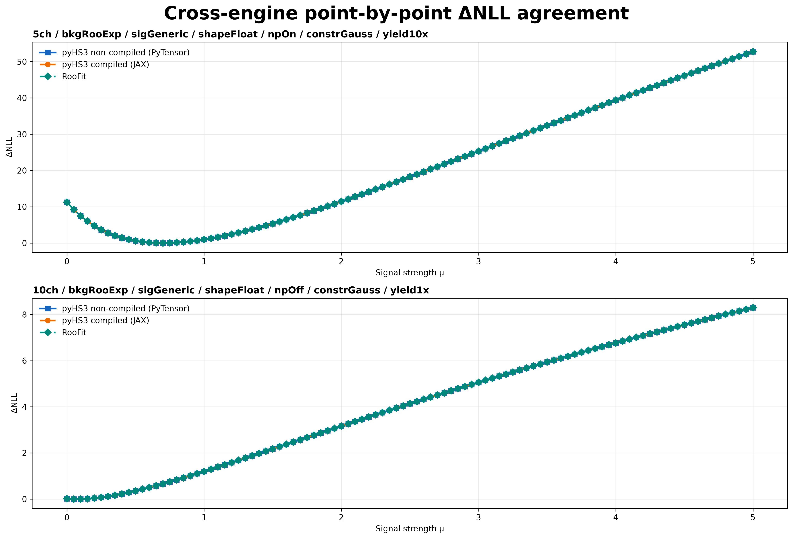
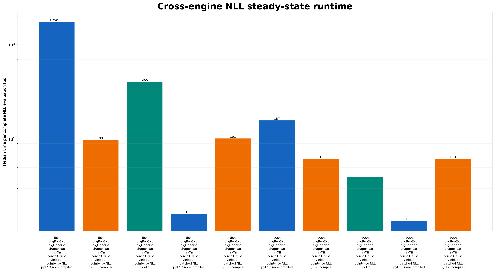
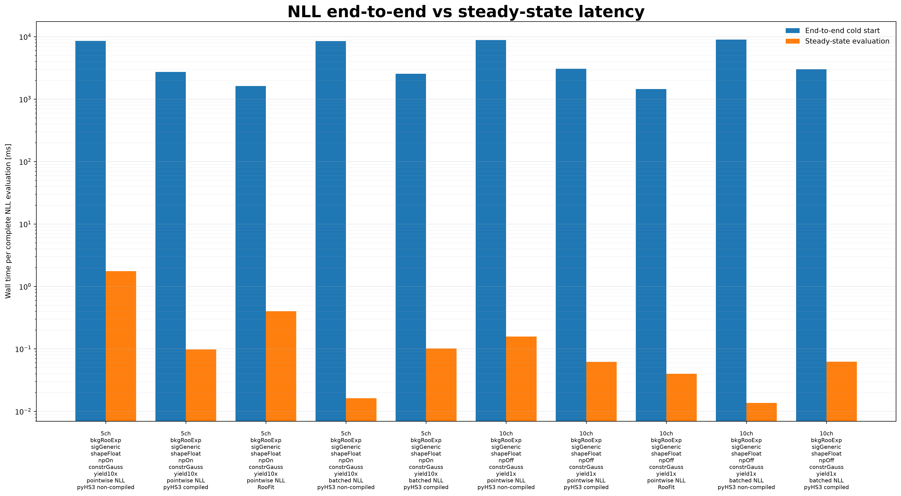
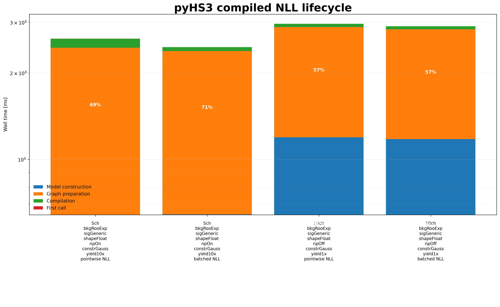
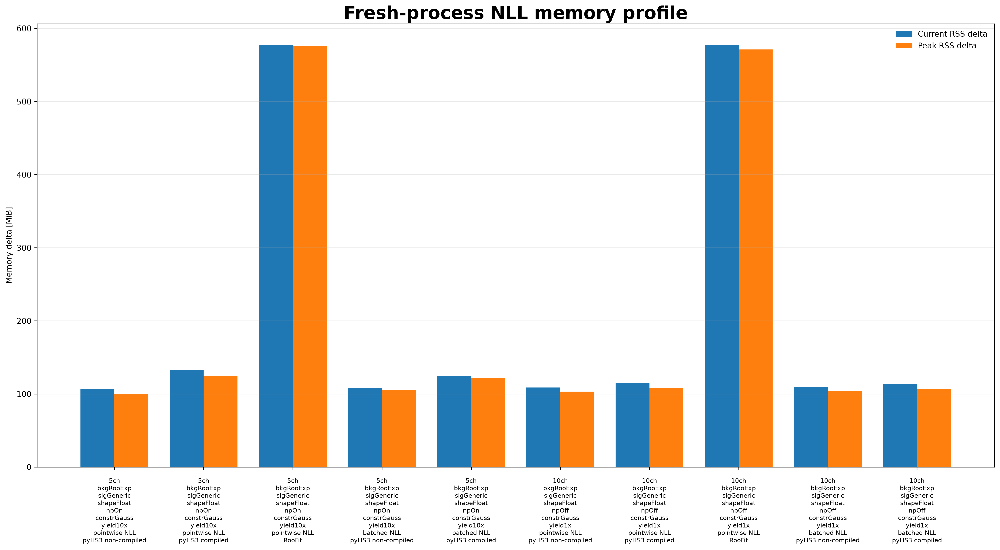

# Cross-Framework ΔNLL Benchmark

On this page, you will learn how PyHS3 and RooFit are compared using statistically equivalent likelihood models and how to interpret the benchmark results.

The **Cross-Framework ΔNLL Benchmark** compares complete negative log-likelihood evaluation across **PyHS3** and **ROOT RooFit** using statistically equivalent HS3 and ROOT workspaces.

Unlike the **Scalar PDF Evaluation** benchmark, which isolates evaluation of a single probability density function, this benchmark measures complete likelihood evaluation while verifying numerical agreement before any performance comparisons are made.

---

# Benchmark Goals

The benchmark is designed to

- validate numerical agreement between PyHS3 and RooFit;
- compare complete likelihood evaluation performance;
- separate initialization costs from steady-state execution;
- compare compiled and non-compiled PyHS3 execution;
- evaluate the benefits of vectorized execution.

The benchmark provides an engine-to-engine comparison whenever equivalent statistical computations are available.

---

# Statistical Quantity

For every scan point

\[
\mu_i
\]

the benchmark evaluates

\[
\mathrm{NLL}(\mu_i)
=
-\sum_k \log p(x_k|\mu_i)
\]

using the same observed dataset in every framework.

Performance comparisons use

\[
\Delta\mathrm{NLL}
=
\mathrm{NLL}
-
\min(\mathrm{NLL})
\]

rather than the absolute NLL value, removing constant normalization offsets and enabling direct comparison between implementations.

---

# Execution Engines

The benchmark compares the following execution engines.

| Engine | Description |
|---------|-------------|
| **PyHS3 (PyTensor)** | Non-compiled execution. |
| **PyHS3 (JAX)** | Compiled execution with separate cold-start and steady-state measurements. |
| **ROOT RooFit** | Equivalent likelihood evaluation using statistically matched ROOT workspaces. |

Whenever possible, all engines use

- identical statistical models;
- identical observed datasets;
- identical parameter values;
- identical scan grids.

---

# Benchmark Categories

Two complementary benchmark strategies are provided.

## Point-by-Point ΔNLL Evaluation

Each framework evaluates one complete likelihood value for every parameter point.

This benchmark represents workloads such as

- likelihood scans;
- profile likelihood evaluation;
- minimization;
- repeated objective-function evaluation.

It provides the primary apples-to-apples comparison across execution engines.

---

## Batched Full-Dataset Evaluation

PyHS3 additionally evaluates the complete observable array using its native vectorized execution model.

Because RooFit does not provide an equivalent execution strategy, this benchmark demonstrates workflow-level performance rather than a strict engine-to-engine comparison.

---

# Benchmark Workflow

```text
Workspace
      │
      ▼
Workspace / Model Construction
      │
      ▼
Numerical Validation
      │
      ▼
Cold-Start Evaluation
      │
      ▼
Repeated Evaluation
      │
      ├── Timing
      ├── Memory
      └── ΔNLL Agreement
      │
      ▼
Comparison Plots
```

Each execution engine runs in an isolated subprocess to ensure reproducible timing and memory measurements.

---

# Numerical Validation

Performance comparisons are interpreted only after numerical agreement has been verified.

The benchmark validates

- identical ΔNLL minima;
- ΔNLL profile agreement;
- point-by-point numerical agreement;
- configurable numerical tolerances.

Only validated benchmark runs should be interpreted as meaningful performance comparisons.

---

# Results

## Point-by-Point ΔNLL Agreement



The ΔNLL profiles produced by every execution engine overlap within numerical tolerance, demonstrating statistically equivalent likelihood evaluation.

---

## Steady-State Runtime



This figure reports the median execution time for repeated likelihood evaluation after initialization has completed.

Both point-by-point and batched execution are shown separately.

---

## Cold-Start versus Steady-State



Cold-start includes model preparation, graph construction, compilation, and the first successful likelihood evaluation.

Steady-state measures only repeated likelihood evaluation after initialization.

---

## Compiled Execution Lifecycle



This figure separates the compiled execution pipeline into

- model construction;
- graph preparation;
- JAX compilation;
- first function call.

It illustrates where startup time is spent before compiled execution reaches steady-state performance.

---

## Memory Profile



Current RSS and peak RSS are measured inside isolated subprocesses to provide directly comparable memory measurements across execution engines.

---

# Key Findings

The benchmark demonstrates that

- PyHS3 and RooFit produce statistically equivalent ΔNLL profiles;
- compiled and non-compiled execution exhibit different performance characteristics;
- initialization costs are clearly separated from repeated execution;
- batched execution illustrates the performance benefits of vectorized likelihood evaluation.

---

# Limitations

The benchmark intentionally reports two complementary execution strategies.

- Point-by-point ΔNLL provides the primary engine-to-engine comparison.
- Batched full-dataset evaluation demonstrates the native vectorized execution model of PyHS3 and should be interpreted as a workflow comparison rather than a direct RooFit comparison.

---

# Related Documentation

See also

- **Cross-Framework Benchmarks**
- **Scalar PDF Evaluation**
- **Benchmark Methodology**
- **Benchmark Workspaces**
- **Benchmark Results**
