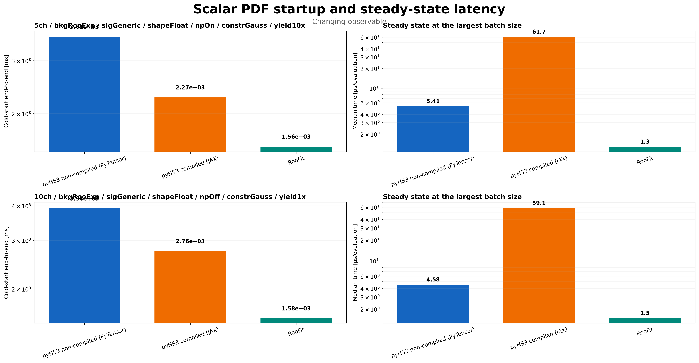
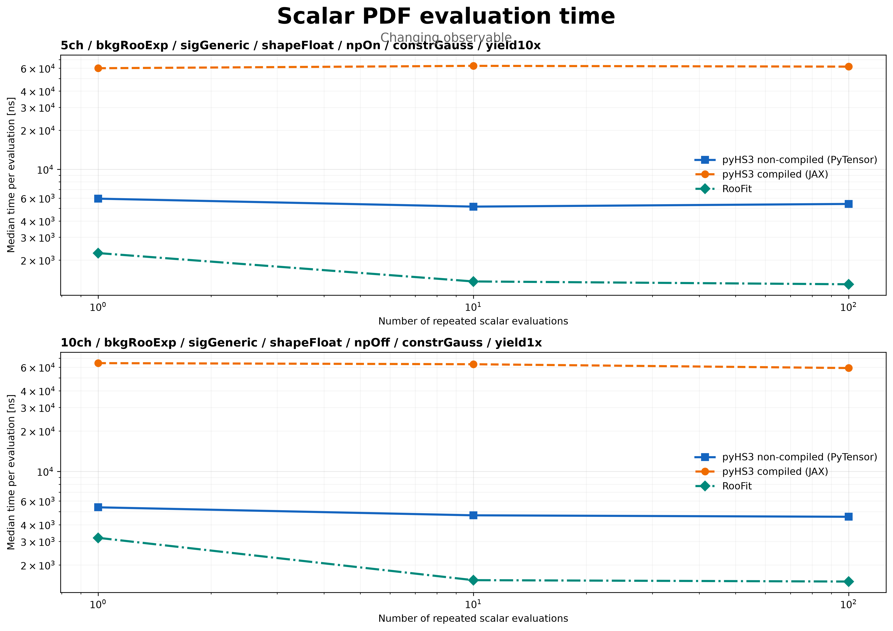
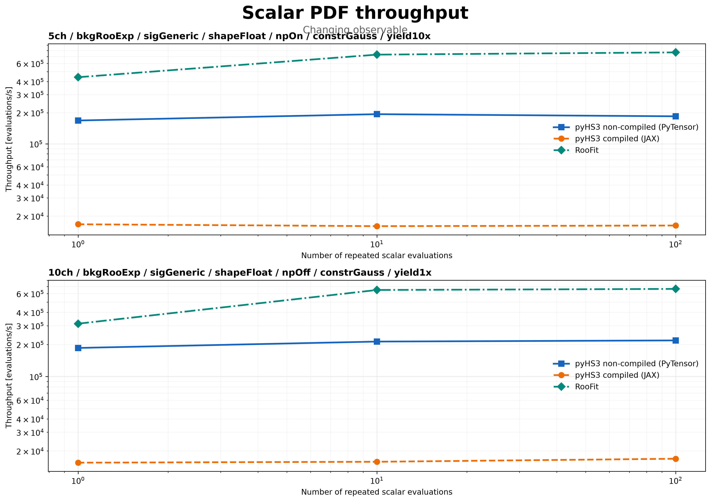
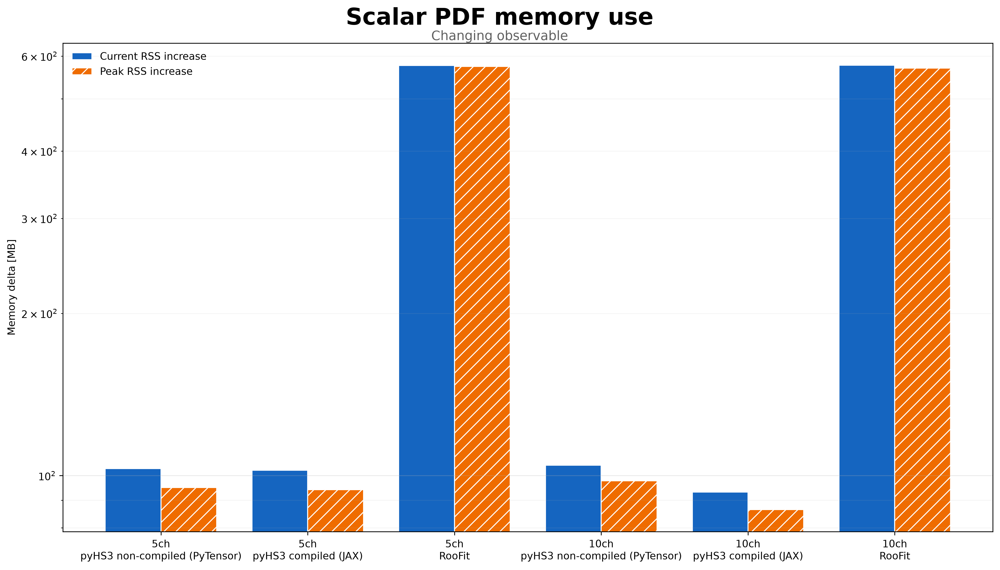
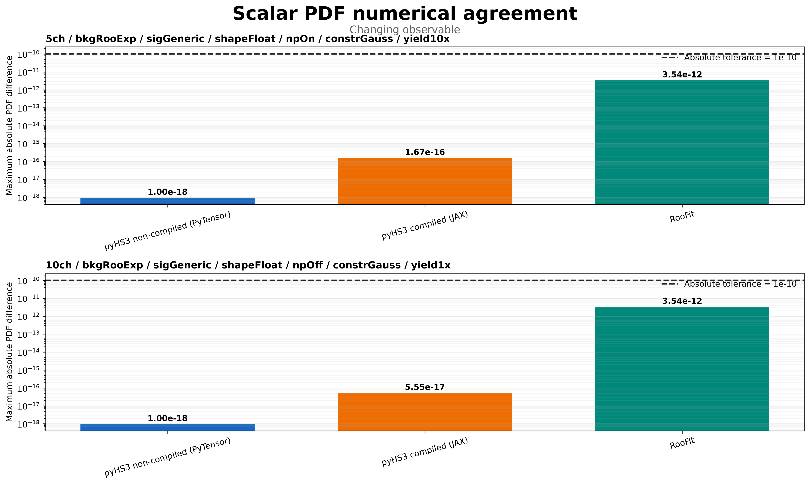
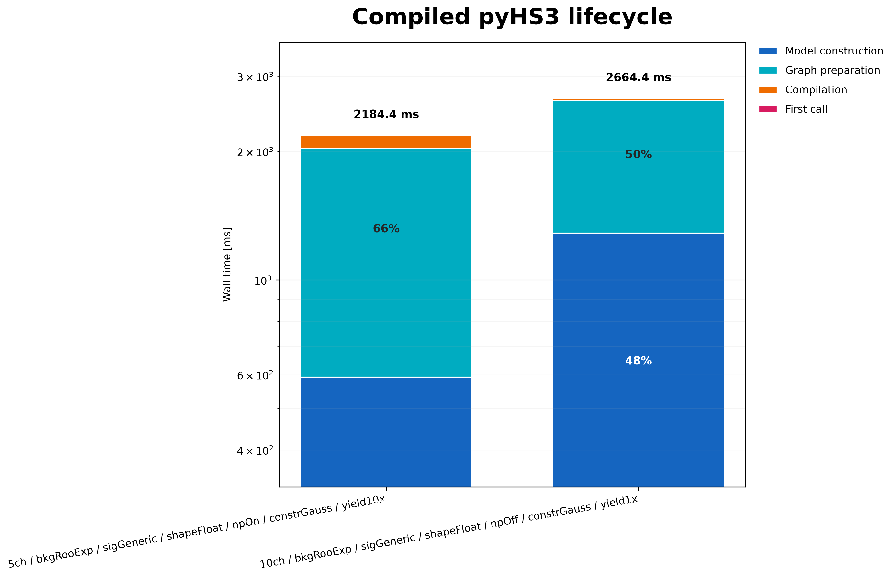

# Cross-Framework Scalar PDF Evaluation

On this page, you will learn how PyHS3 and RooFit are compared using equivalent scalar probability density evaluations and how to interpret the benchmark results.

The **Cross-Framework Scalar PDF Evaluation** benchmark compares the cost of evaluating a **single normalized probability density function (PDF)** across **PyHS3** and **ROOT RooFit**.

Unlike the **Cross-Framework ΔNLL Benchmark**, which measures complete likelihood evaluation, this benchmark isolates scalar PDF evaluation to compare execution engines independently of model fitting, minimization, or likelihood construction.

---

## Benchmark Goals

The benchmark is designed to

- validate numerical agreement between all execution engines;
- measure the cost of a single scalar PDF evaluation;
- separate initialization costs from repeated execution;
- compare compiled and non-compiled PyHS3 execution.

Because only a single PDF evaluation is measured, this benchmark provides the lowest-level comparison in the cross-framework benchmark suite.

---

## Execution Engines

The benchmark compares the following execution engines.

| Engine | Description |
|---------|-------------|
| **PyHS3 (PyTensor)** | Non-compiled execution. |
| **PyHS3 (JAX)** | Compiled execution with separate cold-start and steady-state measurements. |
| **ROOT RooFit** | Scalar normalized PDF evaluation using statistically equivalent ROOT workspaces. |

All execution engines evaluate

- the same statistical model;
- the same observable;
- the same parameter values;
- the same normalization.

---

## Benchmark Workflow

```text
Workspace
      │
      ▼
Workspace / Model Construction
      │
      ▼
Numerical Validation
      │
      ▼
Cold-Start Evaluation
      │
      ▼
Repeated Scalar Evaluation
      │
      ├── Timing
      ├── Throughput
      ├── Memory
      └── Numerical Agreement
      │
      ▼
Comparison Plots
```

Each execution engine runs in an isolated subprocess to ensure reproducible timing and memory measurements.

---

## Input Modes

Two observable input modes are supported.

### Varying Observable

The observable changes before every scalar PDF evaluation.

This mode represents the typical workload encountered during likelihood scans and repeated inference, and all primary performance comparisons use this configuration.

---

### Fixed Observable

The observable remains unchanged throughout the benchmark.

This mode is intended only for investigating framework-specific caching behaviour and should not be interpreted as representative likelihood evaluation performance.

---

## Numerical Validation

Performance comparisons are interpreted only after numerical agreement has been verified.

The benchmark validates

- maximum absolute difference;
- maximum relative difference;
- configurable absolute tolerance;
- configurable relative tolerance.

Only benchmark runs satisfying these tolerances should be interpreted as meaningful performance comparisons.

---

## Results

### Startup versus Steady-State Latency



Cold-start includes model preparation, graph construction, compilation, and the first successful PDF evaluation.

Steady-state measures only repeated scalar PDF evaluation after initialization.

---

### Scalar PDF Execution Time



This figure reports the median execution time for a single scalar PDF evaluation as the number of repeated evaluations increases.

---

### Evaluation Throughput



Throughput measures the sustained number of scalar PDF evaluations performed per second during repeated execution.

---

### Memory Profile



Current RSS and peak RSS are measured inside isolated subprocesses to provide directly comparable memory measurements across execution engines.

---

### Numerical Agreement



The benchmark compares the numerical output of every execution engine with the PyHS3 non-compiled reference implementation.

Successful validation confirms that all reported performance measurements correspond to statistically equivalent computations.

---

### Compiled Execution Lifecycle



This figure separates the compiled execution pipeline into

- model construction;
- graph preparation;
- JAX compilation;
- first evaluation.

It illustrates where startup time is spent before compiled execution reaches steady-state performance.

---

## Cache Diagnostic

Equivalent benchmark figures are also generated for the fixed observable mode.

These results are intended only for investigating framework-specific caching behaviour and should not be interpreted as representative scalar PDF performance.

---

## Key Findings

The benchmark demonstrates that

- PyHS3 and RooFit produce numerically equivalent scalar PDF values;
- initialization costs are clearly separated from repeated execution;
- compiled execution reaches substantially higher steady-state performance after startup costs have been amortized;
- scalar PDF evaluation provides the lowest-level comparison between execution engines.

---

## Limitations

This benchmark intentionally isolates scalar PDF evaluation.

It does **not** measure

- likelihood evaluation;
- minimization;
- parameter estimation;
- fitting workflows.

For workflow-level comparisons, see the **Cross-Framework ΔNLL Benchmark**.

---

## Related Documentation

See also

- **Cross-Framework Benchmarks**
- **Cross-Framework ΔNLL Benchmark**
- **Benchmark Methodology**
- **Benchmark Workspaces**
- **Benchmark Results**
