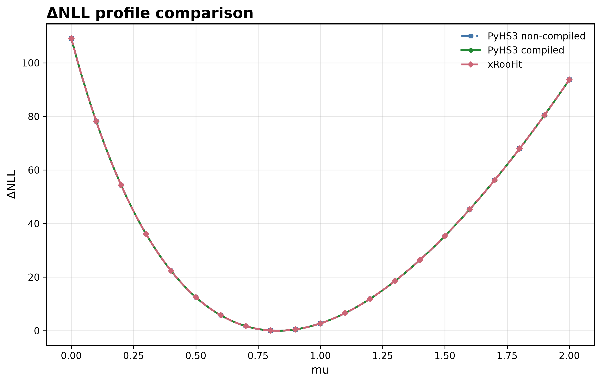
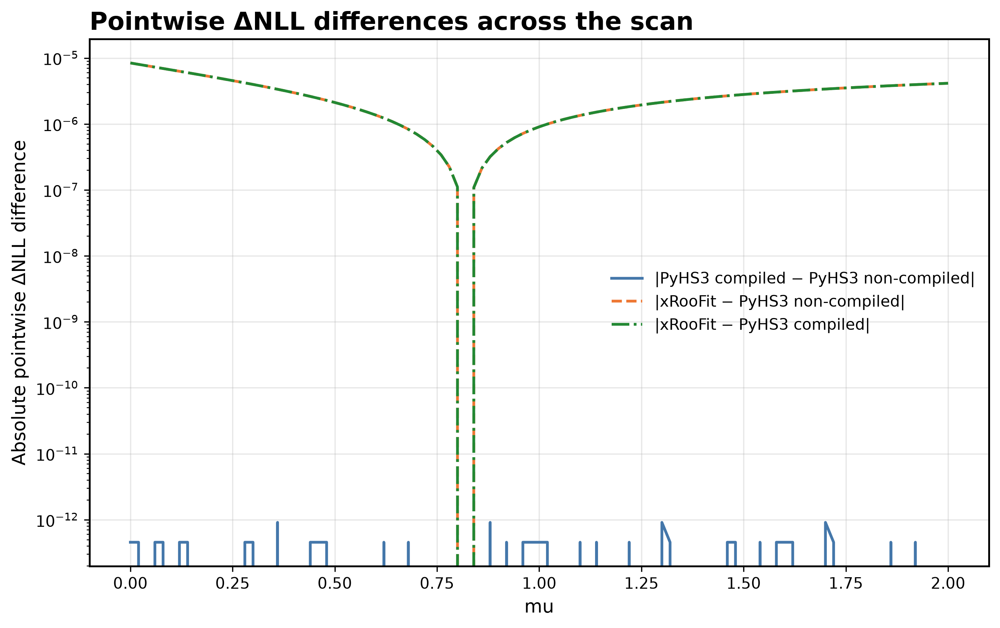
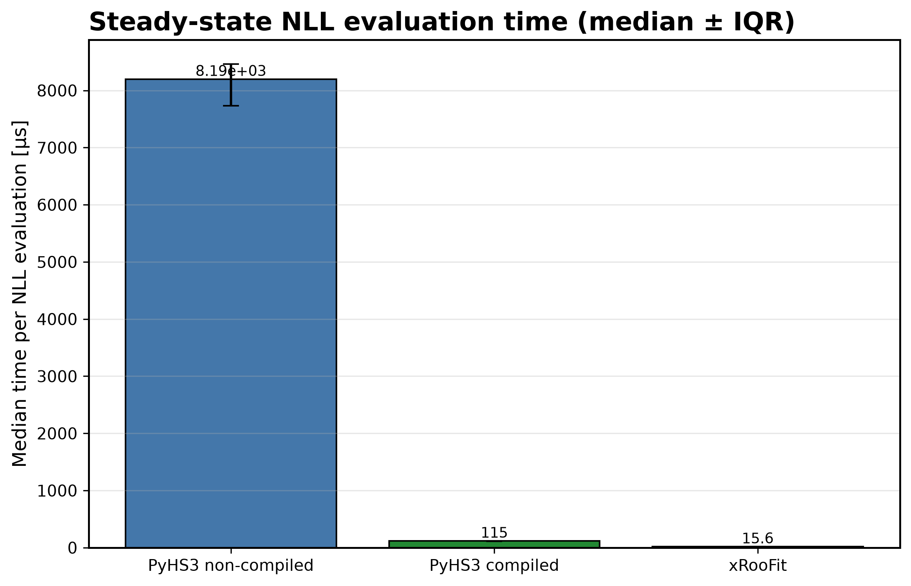
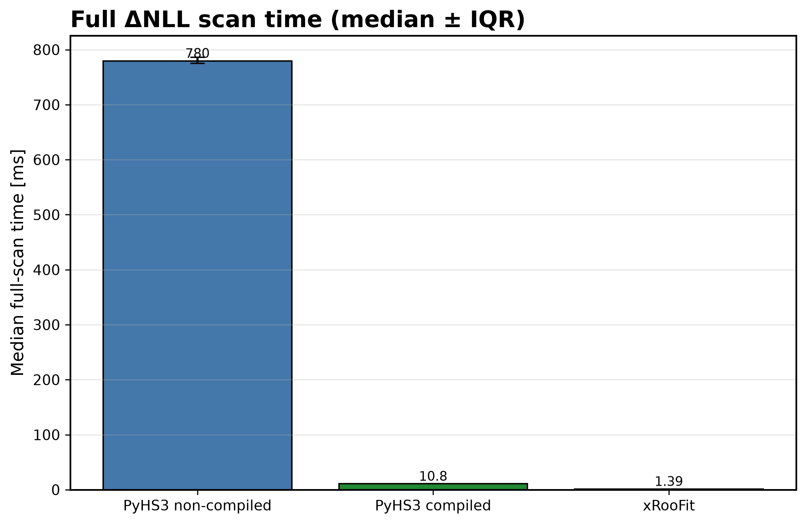
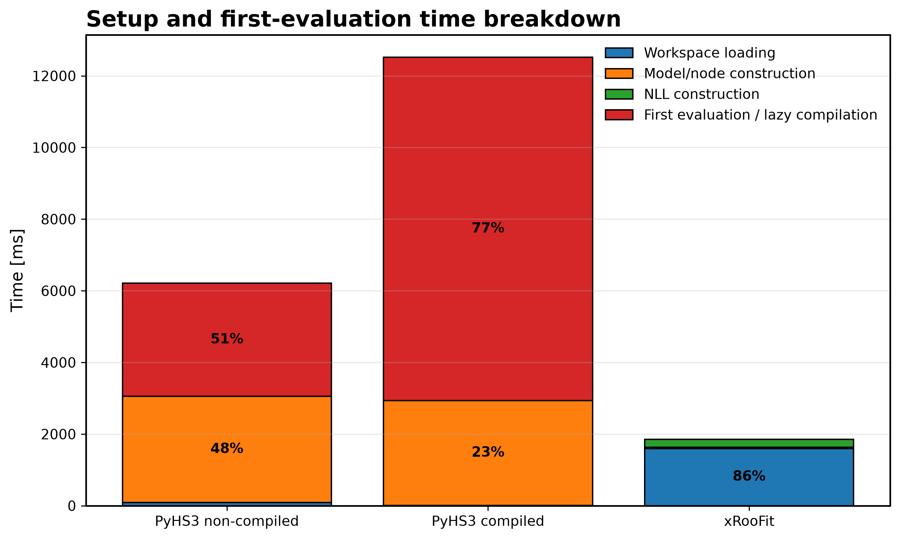
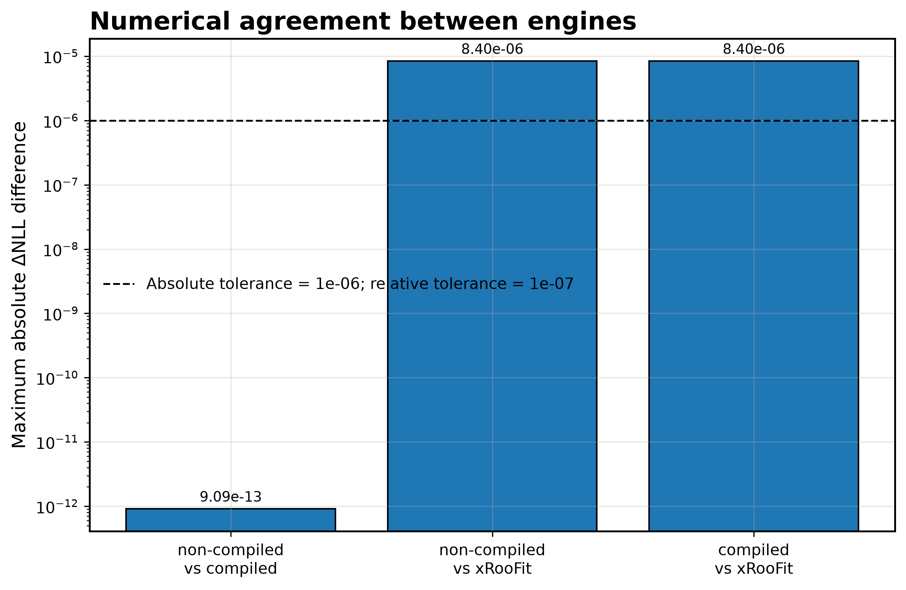

# xRooFit Benchmark

## Overview

The xRooFit benchmark compares complete negative log-likelihood (NLL) evaluation workflows between **PyHS3** and **xRooFit**.

Unlike the scalar PDF benchmark, which measures repeated probability density function evaluations, this benchmark measures the complete workflow required to construct and evaluate a statistical likelihood. In addition to performance measurements, it verifies that all compared implementations produce numerically equivalent results.

The benchmark evaluates three execution modes:

- **PyHS3 (non-compiled)** using the `FAST_COMPILE` PyTensor mode;
- **PyHS3 (compiled)** using the `FAST_RUN` PyTensor mode;
- **xRooFit**, evaluating the corresponding ROOT workspace through the xRooFit API.

The benchmark reports both **performance** and **numerical agreement**, making it suitable for validating PyHS3 against an independent implementation while simultaneously evaluating the impact of graph compilation.

---

## Benchmark Workflow

The benchmark compares equivalent statistical workflows rather than isolated mathematical kernels.

```text
                 HS3 Workspace
                       │
          ┌────────────┴────────────┐
          │                         │
          ▼                         ▼
 PyHS3 FAST_COMPILE          PyHS3 FAST_RUN

                 ROOT Workspace
                       │
                       ▼
                  xRooFit API

                       │
                       ▼

           Complete NLL Evaluation

                       │
                       ▼

      ΔNLL Profiles + Performance Metrics
```

Each engine evaluates the same statistical model, the same observed data, and the same parameter scan. The benchmark then compares both the resulting ΔNLL profiles and the execution times.

---

# Why xRooFit?

xRooFit is a high-level statistical interface built on top of RooFit that simplifies common statistical workflows such as likelihood construction, parameter scans, minimization, and model inspection.

Instead of interacting directly with RooFit objects, users work through the `xRooNode` interface, which provides a more convenient abstraction for modern statistical analyses.

The benchmark intentionally evaluates the **public xRooFit API** rather than calling RooFit directly.

Official repository:

https://gitlab.cern.ch/will/xroofit

---

# Benchmark Goals

This benchmark has four primary objectives.

1. Validate that PyHS3 reproduces the same ΔNLL profile as xRooFit.
2. Verify that compiled and non-compiled PyHS3 produce identical statistical results.
3. Compare the runtime of equivalent likelihood evaluation workflows.
4. Identify which phases of likelihood evaluation dominate the total execution time.

Unlike synthetic microbenchmarks, this benchmark measures realistic statistical workloads similar to those encountered in High Energy Physics analyses.

---

# Apples-to-Apples Methodology

Cross-framework benchmarking is meaningful only when every framework evaluates **the same statistical problem**.

For this reason, every benchmark run uses

- the same statistical model;
- the same observed events;
- the same parameter of interest;
- the same nuisance parameters;
- the same scan range;
- the same scan grid;
- the same number of scan repetitions.

The benchmark intentionally avoids comparing different statistical formulations.

Only the execution engine changes.

---

# Compared Engines

The benchmark evaluates three independent execution paths.

## PyHS3 (non-compiled)

PyHS3 executes the likelihood using the `FAST_COMPILE` PyTensor mode.

No graph optimization is performed beyond the minimum required for execution, making this mode representative of eager evaluation.

---

## PyHS3 (compiled)

PyHS3 executes the identical likelihood using the `FAST_RUN` PyTensor mode.

Graph compilation and optimization are performed before repeated evaluation, allowing the benchmark to quantify the performance benefit of compilation without changing the underlying statistical model.

---

## xRooFit

The ROOT workspace is evaluated through the xRooFit API.

The benchmark constructs the likelihood using

```python
ROOT.xRooNode(workspace)[model].nll(dataset)
```

rather than calling `RooAbsPdf::createNLL()` directly.

During execution, the benchmark verifies that the runtime objects originate from the xRooFit API and records the corresponding runtime metadata in the benchmark output.

---

# Installing xRooFit

Clone the xRooFit repository inside the benchmark project.

```bash
git clone https://gitlab.cern.ch/will/xroofit.git external/xroofit
```

Create a build directory.

```bash
cd external/xroofit

mkdir build
cd build
```

Configure the project.

```bash
cmake ..
```

Compile xRooFit.

```bash
make -j$(nproc)
```

Compilation produces the shared library together with the environment setup script used by the benchmark.

---

# Activating xRooFit

Before executing the benchmark, the xRooFit environment must be activated.

```bash
source external/xroofit/build/setup.sh
```

> **Important**
>
> This command must be executed **every time a new terminal session is opened** before running the benchmark.
>
> If the environment is not activated, the benchmark will not be able to load the xRooFit library.

---

# Running the Benchmark

The benchmark can be executed using

```bash
pixi run python -m src.run_pyhs3_xroofit_benchmark \
  --json-workspace inputs/5ch_bkgRooExp_sigGeneric_shapeFloat_npOn_constrGauss_yield10x.json \
  --root-workspace inputs/5ch_bkgRooExp_sigGeneric_shapeFloat_npOn_constrGauss_yield10x.root \
  --root-workspace-name combWS \
  --xroofit-model-name pdfs/sim_pdf \
  --xroofit-dataset-name combData \
  --poi mu \
  --pyhs3-combined \
  --pyhs3-channels ch0,ch1,ch2,ch3,ch4 \
  --pyhs3-noncompiled-mode FAST_COMPILE \
  --pyhs3-compiled-mode FAST_RUN \
  --pyhs3-nll-mode extended-mixture \
  --scan-min 0.0 \
  --scan-max 2.0 \
  --n-scan-points 101 \
  --n-warmup-evaluations 3 \
  --n-evaluation-runs 20 \
  --n-scan-runs 10 \
  --delta-tolerance 1e-6 \
  --delta-relative-tolerance 1e-7 \
  --absolute-pyhs3-tolerance 1e-10 \
  --minimum-tolerance 1e-12 \
  --plot
```

The benchmark automatically

- constructs the likelihoods;
- executes repeated evaluations;
- performs the complete ΔNLL scan;
- validates numerical agreement;
- generates plots;
- stores all benchmark metadata and timing results.

# Benchmark Methodology

The benchmark is designed to compare **equivalent statistical workflows** across different execution engines rather than comparing isolated implementation details.

Although PyHS3 and xRooFit use different internal implementations, both engines evaluate statistically equivalent models generated from the same benchmark workspace.

The benchmark therefore focuses on validating that equivalent inputs produce equivalent statistical results before comparing execution time.

---

## Statistical Inputs

Every benchmark run uses

- the same five-channel statistical model;
- the same observed dataset;
- the same parameter of interest (POI);
- the same nuisance parameter values;
- the same scan range;
- the same ordered scan grid.

The benchmark workspaces are generated once and then converted into both

- HS3 JSON workspaces used by PyHS3;
- ROOT workspaces used by xRooFit.

Consequently, every engine evaluates an equivalent statistical model rather than an independently constructed one.

---

## Parameter of Interest

The benchmark scans a single parameter of interest (POI).

For the benchmark workspaces included in the repository, the user-facing POI is

```text
mu
```

Internally, the benchmark automatically resolves the corresponding framework-specific parameter names.

For example,

```text
PyHS3:
mu
      ↓
mu_sig
```

and

```text
xRooFit:
mu
      ↓
mu_sig
```

This allows the same command-line interface to be used regardless of the underlying framework.

---

## Scan Procedure

For every engine the benchmark performs the identical ordered scan

```text
μ₀
μ₁
μ₂
...
μₙ
```

using

- identical scan minimum;
- identical scan maximum;
- identical number of scan points.

For each scan point,

1. the POI is updated;
2. the complete NLL is evaluated;
3. the resulting value is recorded.

The benchmark stores the complete NLL profile before converting it into a ΔNLL profile.

---

## ΔNLL Computation

The benchmark compares

\[
\Delta\mathrm{NLL}(\mu)
=
\mathrm{NLL}(\mu)
-
\min_{\mu}\mathrm{NLL}(\mu).
\]

rather than the raw NLL values.

This choice is intentional.

Different statistical frameworks may include different additive constants arising from normalization terms, internal parameter conventions, or implementation-specific bookkeeping.

Such constants do not change the statistical interpretation of the likelihood.

Subtracting the minimum removes these framework-dependent offsets while preserving

- the likelihood shape;
- the best-fit parameter;
- confidence interval construction.

Consequently, ΔNLL provides the appropriate quantity for cross-framework validation.

---

## Numerical Validation

The benchmark validates numerical agreement at several levels.

### Compiled versus non-compiled PyHS3

The benchmark first verifies that the two PyHS3 execution modes produce identical results.

Because both execution modes evaluate exactly the same mathematical likelihood, agreement is checked directly on the raw NLL values.

Successful validation demonstrates that graph compilation changes only execution speed and does not modify the statistical result.

---

### PyHS3 versus xRooFit

Cross-framework validation is performed using the ΔNLL profiles.

For every scan point the benchmark computes

- the pointwise ΔNLL difference;
- the maximum absolute difference;
- the maximum relative difference;
- the RMS difference.

In addition, the benchmark verifies that all engines identify the same best-fit scan point.

The comparison succeeds only when the configured numerical tolerances are satisfied.

---

## Numerical Tolerances

The benchmark uses both

- an absolute tolerance;
- a relative tolerance.

This approach is more robust than relying on a single absolute threshold.

Small ΔNLL values are primarily governed by the absolute tolerance, while larger values are validated using the relative tolerance.

This avoids rejecting statistically equivalent likelihood profiles solely because of floating-point rounding differences.

---

## Engine-to-Engine Timing

The benchmark measures equivalent workflow stages for every engine.

The measured phases are

1. workspace loading;
2. model construction;
3. NLL construction;
4. first (cold) evaluation;
5. repeated steady-state evaluation;
6. complete ΔNLL scan.

These phases are reported separately so that initialization costs are not mixed with steady-state performance.

---

## Steady-State Evaluation

Steady-state evaluation measures the runtime of one complete NLL evaluation after initialization has finished.

The timed operation consists of

1. changing the POI;
2. evaluating the complete likelihood;
3. recording the elapsed time.

Importantly, the POI changes between consecutive evaluations.

Earlier versions of the benchmark repeatedly evaluated the same POI value, allowing internal caching mechanisms to influence the measured runtime.

The current implementation intentionally changes the POI before every timed evaluation to ensure that every engine performs a genuine likelihood computation.

This produces a fairer engine-to-engine comparison.

---

## Full ΔNLL Scan

The benchmark also measures the execution time of the complete ΔNLL scan.

Each engine

- evaluates the same ordered scan grid;
- performs the same number of repeated scans;
- reports the median runtime;
- reports the interquartile range (IQR).

Unlike the steady-state benchmark, this measurement reflects the runtime of an entire statistical scan and is therefore representative of realistic analysis workflows.

---

## xRooFit Execution Path

The benchmark evaluates the ROOT workspace through the xRooFit API.

Specifically, the likelihood is constructed using

```python
ROOT.xRooNode(workspace)[model].nll(dataset)
```

rather than calling

```python
RooAbsPdf.createNLL(...)
```

directly.

During execution the benchmark verifies that the runtime objects originate from xRooFit and records the corresponding runtime metadata in the benchmark output.

This prevents the benchmark from accidentally falling back to a direct RooFit execution path.

---

## Apples-to-Apples Scope

The benchmark provides an apples-to-apples comparison at the level of the **statistical workflow**.

The following quantities are identical across engines:

- benchmark model;
- observed dataset;
- POI scan;
- scan ordering;
- repeated scan configuration;
- benchmark parameters.

However, the internal implementation of each framework remains different.

For example,

- PyHS3 evaluates a PyTensor computational graph;
- xRooFit evaluates the corresponding ROOT statistical model.

Consequently, the benchmark does **not** attempt to compare identical internal kernels.

Instead, it compares equivalent statistical computations performed through different execution engines.

This distinction is important when interpreting initialization costs while still allowing meaningful comparison of steady-state likelihood evaluation and complete ΔNLL scans.

# Generated Plots

When the benchmark is executed with the `--plot` option, it generates a collection of figures summarizing both numerical agreement and performance.

All plots are written to

```text
docs/assets/plots/pyhs3_xroofit_benchmark/
```

The figures complement the JSON benchmark output by providing a visual interpretation of the numerical validation and timing measurements.

---

# ΔNLL Profile Comparison



This figure compares the complete ΔNLL profiles produced by

- PyHS3 (non-compiled),
- PyHS3 (compiled),
- xRooFit.

Using ΔNLL removes framework-dependent additive constants while preserving the statistical properties of the likelihood.

Ideally, the three curves should overlap throughout the entire scan.

Agreement in this figure demonstrates that

- all engines reproduce the same likelihood profile;
- all engines identify the same best-fit parameter;
- the compiled PyHS3 implementation remains numerically identical to the non-compiled implementation.

---

# Pointwise ΔNLL Differences



This figure visualizes the absolute pointwise ΔNLL differences between every pair of engines.

The plotted quantities are

- |PyHS3 compiled − PyHS3 non-compiled|;
- |xRooFit − PyHS3 non-compiled|;
- |xRooFit − PyHS3 compiled|.

Absolute differences are shown instead of signed residuals because the magnitude of the disagreement is more informative than its direction.

The PyHS3 compiled and non-compiled curves are expected to agree up to floating-point precision.

The xRooFit comparisons may exhibit slightly larger differences due to framework-specific implementation details such as normalization conventions or additive likelihood constants.

If the differences span several orders of magnitude, the benchmark automatically switches to a logarithmic vertical axis.

This figure provides a direct visualization of the numerical agreement validated by the benchmark.

---

# Steady-State NLL Evaluation Time



This figure compares the runtime of repeated NLL evaluations after initialization has completed.

The timed operation consists of

1. updating the parameter of interest;
2. evaluating the complete likelihood;
3. recording the execution time.

To avoid benchmarking cached evaluations, the POI changes before every timed evaluation.

The reported runtime therefore represents a genuine likelihood evaluation rather than repeated evaluation of an unchanged parameter state.

Each bar shows

- the median execution time;
- the interquartile range (IQR).

This figure should be interpreted as the primary **steady-state engine-to-engine performance comparison**.

---

# Full ΔNLL Scan Runtime



This figure compares the runtime required to evaluate the complete ΔNLL scan.

Every engine performs

- the same ordered scan;
- the same number of scan points;
- the same number of repeated scans.

The benchmark reports

- the median scan runtime;
- the interquartile range.

Unlike the steady-state benchmark, this measurement represents the runtime of an entire statistical workflow and therefore more closely resembles practical analysis workloads.

---

# Setup and First-Evaluation Breakdown



This figure separates the initialization process into individual phases.

The reported phases are

- workspace loading;
- model (or node) construction;
- NLL construction;
- first evaluation.

Each stacked bar represents the total setup cost for one engine.

Percentages are displayed only for phases contributing a substantial fraction of the total runtime in order to avoid clutter.

This figure should **not** be interpreted as a comparison of identical internal operations.

For example,

- PyHS3 loads an HS3 workspace and constructs PyTensor computational graphs;
- xRooFit loads an existing ROOT workspace and constructs an xRooFit likelihood from RooFit objects.

Consequently, this plot compares end-to-end initialization costs rather than identical implementation kernels.

The steady-state and full-scan plots provide the strongest engine-to-engine comparison.

---

# Numerical Agreement Summary



This figure summarizes the maximum ΔNLL differences observed between engine pairs.

The benchmark reports

- maximum absolute ΔNLL difference;
- maximum relative ΔNLL difference;
- RMS ΔNLL difference;
- best-fit POI agreement.

The dashed horizontal line indicates the configured **absolute tolerance**.

Final validation, however, uses **both**

- the configured absolute tolerance;
- the configured relative tolerance.

Consequently, a comparison may still pass validation even if the maximum absolute difference slightly exceeds the absolute threshold.

This combined validation strategy provides a more robust criterion for comparing likelihood profiles over a wide numerical range.

---

# Generated Files

A successful benchmark produces the following figures.

```text
docs/assets/plots/pyhs3_xroofit_benchmark/
├── delta_nll_absolute_differences.png
├── delta_nll_profile.png
├── full_scan_runtime.png
├── numerical_agreement.png
├── steady_state_runtime.png
└── timing_phase_breakdown.png
```

Only PNG figures are generated.

The benchmark intentionally does not create PDF copies in order to reduce unnecessary binary artifacts in the repository.

# Benchmark Output

Each benchmark execution produces both machine-readable results and visualization figures.

The benchmark stores all numerical measurements in

```text
results/pyhs3_xroofit_benchmark/
```

The output directory contains a JSON file with the complete benchmark results, including

- benchmark configuration;
- timing measurements for every engine;
- ΔNLL scan values;
- steady-state timing statistics;
- full-scan timing statistics;
- memory usage;
- numerical agreement metrics;
- runtime metadata.

The generated figures are written to

```text
docs/assets/plots/pyhs3_xroofit_benchmark/
```

and summarize both numerical agreement and performance.

---

# Benchmark Interpretation

The benchmark is considered successful when all compared engines satisfy the configured numerical validation criteria.

A successful benchmark demonstrates that

- PyHS3 compiled and non-compiled execution produce numerically identical likelihood values;
- xRooFit reproduces the same ΔNLL profile as PyHS3 within the configured numerical tolerances;
- all engines identify the same best-fit parameter of interest;
- performance measurements correspond to equivalent likelihood evaluation workflows.

For cross-framework comparisons, ΔNLL agreement is significantly more important than agreement of the raw NLL values because additive framework-dependent constants do not affect the statistical interpretation of the likelihood.

Consequently, the primary indicators of successful validation are

- agreement of the ΔNLL profiles;
- agreement of the best-fit POI;
- small pointwise ΔNLL differences;
- successful numerical validation reported by the benchmark.

---

# Benchmark Limitations

The benchmark compares equivalent statistical workflows rather than identical internal implementations.

Although PyHS3 and xRooFit evaluate statistically equivalent models, their internal execution differs.

PyHS3 evaluates likelihoods using computational graphs generated from HS3 workspaces, while xRooFit constructs likelihoods from the corresponding ROOT workspace through the xRooFit API.

Consequently,

- internal initialization procedures differ;
- workspace loading mechanisms differ;
- graph construction differs;
- raw NLL values may differ by framework-dependent additive constants.

These implementation differences do **not** invalidate the benchmark because cross-framework validation is performed using ΔNLL profiles and best-fit parameter agreement rather than raw likelihood values.

Similarly, the setup and initialization timings should be interpreted as end-to-end workflow costs rather than comparisons of identical internal operations.

The benchmark therefore provides the strongest engine-to-engine comparison during

- repeated steady-state likelihood evaluation;
- complete ΔNLL scans.

---

# Runtime Verification

To ensure that the ROOT implementation is evaluated through the intended interface, the benchmark verifies the runtime execution path.

The benchmark constructs the likelihood using

```python
ROOT.xRooNode(workspace)[model].nll(dataset)
```

and records the corresponding runtime metadata in the benchmark output.

This verification confirms that the benchmark evaluates the public xRooFit API rather than falling back to a direct RooFit `createNLL()` implementation.

The recorded runtime metadata includes

- the xRooFit node type;
- the xRooFit NLL object type;
- the underlying C++ class name;
- the verified execution path.

---

# Command-Line Arguments

The benchmark exposes command-line options for configuring

- benchmark workspaces;
- ROOT workspaces;
- model and dataset names;
- parameter of interest;
- scan range;
- number of scan points;
- warm-up evaluations;
- steady-state repetitions;
- repeated full scans;
- compilation modes;
- numerical validation tolerances;
- plot generation.

The complete list of supported arguments can be displayed using

```bash
pixi run python -m src.run_pyhs3_xroofit_benchmark --help
```

---

# Summary

The xRooFit benchmark extends the PyHS3 benchmark suite with a comprehensive cross-framework comparison of complete likelihood evaluation workflows.

Unlike the scalar PDF benchmark, it evaluates realistic statistical analyses by constructing and scanning full negative log-likelihoods over matching HS3 and ROOT workspaces.

By combining numerical validation with detailed timing measurements, the benchmark demonstrates both the statistical correctness of PyHS3 and the performance characteristics of compiled and non-compiled execution relative to xRooFit.

Together with the Scalar PDF Evaluation and ΔNLL Scan benchmarks, this benchmark provides a comprehensive framework for validating correctness and measuring performance across modern statistical inference engines.
